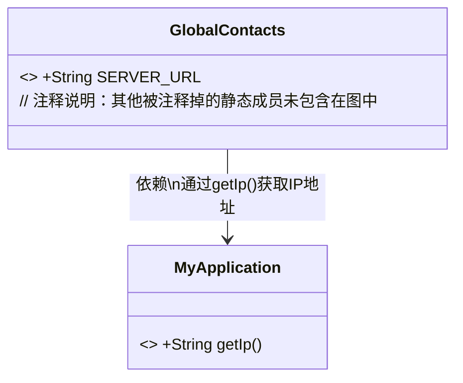
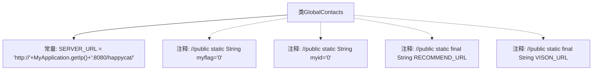

# 基础信息

|      |      |
|------|------|
| 名称 | GlobalContacts |
| 编码语言 | .java |
| 代码路径 | happycat/src/com/happycat/global/GlobalContacts.java |
| 包名 | com.happycat.global |
| 依赖项 | ['android.view.ViewDebug.FlagToString', 'com.happycat.util.MyApplication'] |
| 概述说明 | GlobalContacts类定义了服务器URL，基于MyApplication.getIp()动态生成，端口8080，路径为happycat。其他注释掉的变量和方法未启用。 |

# 说明

该代码定义了一个名为GlobalContacts的公共类，包含一个静态常量SERVER_URL，其值由MyApplication.getIp()方法获取的IP地址与固定端口8080及路径"/happycat/"拼接而成。注释显示该类可能曾包含其他静态变量（myflag、myid）和URL常量（RECOMMEND_URL、VISON_URL），但当前已被注释掉。整体结构用于集中管理全局网络配置参数。

# 类列表 Class Summary

| 名称   | 类型  | 说明 |
|-------|------|-------------|
| GlobalContacts | class | GlobalContacts类定义服务器URL，基于MyApplication的IP动态生成地址。 |

## 类 GlobalContacts

|      |      |
|------|------|
| 访问范围 | public |
| 类型 | class |
| 名称 | GlobalContacts |
| 说明 | GlobalContacts类定义服务器URL，基于MyApplication的IP动态生成地址。 |

### UML类图

这段类图展示了GlobalContacts类与MyApplication类之间的依赖关系。GlobalContacts包含一个final常量SERVER_URL，其值通过拼接字符串和调用MyApplication.getIp()方法动态生成。图中省略了被注释掉的静态成员，清晰地呈现了核心功能——通过MyApplication获取IP地址来构建服务器URL的基础结构。这种设计模式常用于集中管理全局配置参数。

### 内部方法调用关系图

该流程图展示了GlobalContacts类的结构，主要包含一个公开的静态常量SERVER_URL和多个被注释掉的静态变量。SERVER_URL通过拼接MyApplication.getIp()方法的结果构建基础服务地址，其余被注释的变量包括标志位(myflag)、ID(myid)以及两个备用URL常量。所有被注释的代码均以灰色虚线连接表示未激活状态，突出显示当前有效配置。

### 字段列表 Field List

| 名称  | 类型  | 说明 |
|-------|-------|------|
| SERVER_URL = "http://"+MyApplication.getIp()+":8080/happycat/" | String | 定义静态常量SERVER_URL，值为基于MyApplication.getIp()动态拼接的服务器地址，端口8080，路径为happycat。 |

### 方法列表 Method List

| 名称  | 类型  | 说明 |
|-------|-------|------|

