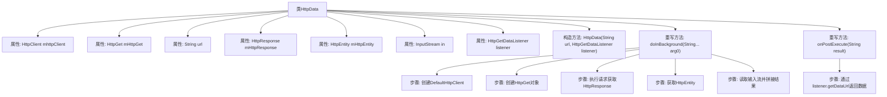

# 基础信息

|      |      |
|------|------|
| 名称 | HttpData |
| 编码语言 | .java |
| 代码路径 | happycat/src/com/happycat/tuling/HttpData.java |
| 包名 | com.happycat.tuling |
| 依赖项 | ['java.io.BufferedReader', 'java.io.InputStream', 'java.io.InputStreamReader', 'org.apache.http.HttpEntity', 'org.apache.http.HttpResponse', 'org.apache.http.client.HttpClient', 'org.apache.http.client.methods.HttpGet', 'org.apache.http.impl.client.DefaultHttpClient', 'android.os.AsyncTask'] |
| 概述说明 | HttpData类继承AsyncTask，通过HttpGet异步请求URL数据，使用BufferedReader读取响应内容，通过接口返回结果。 |

# 说明

该代码定义了一个名为HttpData的类，继承自AsyncTask，用于异步执行HTTP GET请求。类中包含HttpClient、HttpGet等成员变量，通过构造函数接收URL和监听器。doInBackground方法执行网络请求，读取响应数据并返回字符串。onPostExecute方法通过接口回调返回结果。整个过程实现了异步网络请求和数据回调功能。

# 类列表 Class Summary

| 名称   | 类型  | 说明 |
|-------|------|-------------|
| HttpData | class | HttpData类继承AsyncTask，通过HttpGet请求URL数据，使用BufferedReader读取响应内容，通过接口返回结果。 |


## 类 HttpData

|      |      |
|------|------|
| 访问范围 | public |
| 类型 | class |
| 名称 | HttpData |
| 说明 | HttpData类继承AsyncTask，通过HttpGet请求URL数据，使用BufferedReader读取响应内容，通过接口返回结果。 |


### UML类图

```mermaid
classDiagram
    class HttpData {
        -HttpClient mhttpClient
        -HttpGet mHttpGet
        -String url
        -HttpResponse mHttpResponse
        -HttpEntity mHttpEntity
        -InputStream in
        -HttpGetDataListener listener
        +HttpData(String url, HttpGetDataListener listener)
        +String doInBackground(String... arg0)
        +void onPostExecute(String result)
    }

    class <<Interface>> HttpGetDataListener {
        <<Interface>>
        +getDataUrl(String result) void
    }

    HttpData --> HttpGetDataListener : 依赖
```

该代码展示了一个Android异步HTTP请求处理类HttpData，它继承自AsyncTask，用于在后台线程执行GET请求并通过接口回调返回结果。类中包含HTTP请求相关组件（HttpClient/HttpGet）和数据处理流（InputStream/BufferedReader），通过实现HttpGetDataListener接口实现异步回调。流程图清晰地呈现了类结构、私有成员和公有方法，以及类与接口之间的依赖关系，体现了Android网络请求的典型封装模式。


### 内部方法调用关系图



流程图描述：该流程图展示了HttpData类的结构和执行流程。HttpData继承自AsyncTask，用于异步HTTP GET请求处理。主要流程包括初始化HTTP客户端、创建GET请求、执行网络请求、处理响应数据流，最后通过回调接口返回结果。图中清晰呈现了属性、构造方法和关键重写方法的关系，以及doInBackground方法内部的数据获取步骤和onPostExecute的结果回调过程。

### 字段列表 Field List

| 名称  | 类型  | 说明 |
|-------|-------|------|
| in | InputStream | 私有输入流变量in |
| mHttpEntity | HttpEntity | 私有HTTP实体变量mHttpEntity。 |
| url | String | 私有字符串变量url |
| mHttpGet | HttpGet | 声明了一个私有HttpGet类型的变量mHttpGet。 |
| mHttpResponse | HttpResponse | 声明一个私有HttpResponse类型变量mHttpResponse。 |
| listener | HttpGetDataListener | 私有HttpGetDataListener监听器实例。 |
| mhttpClient | HttpClient | 私有HttpClient成员变量mhttpClient。 |

### 方法列表 Method List

| 名称  | 类型  | 说明 |
|-------|-------|------|
| doInBackground | String | 异步任务中通过HTTP客户端获取URL内容，读取响应数据并返回字符串，异常时返回空。 |
| onPostExecute | void | 异步任务完成后通过接口返回结果数据。 |


