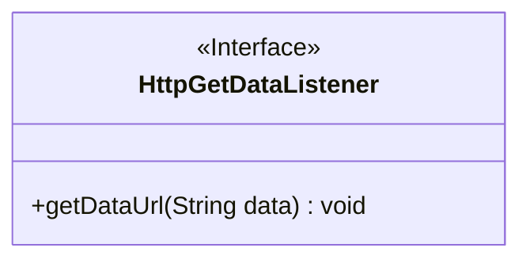
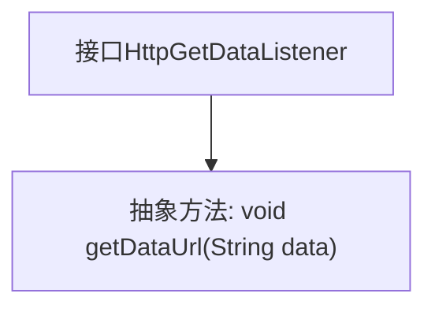

# 基础信息

|      |      |
|------|------|
| 名称 | HttpGetDataListener |
| 编码语言 | .java |
| 代码路径 | happycat/src/com/happycat/tuling/HttpGetDataListener.java |
| 包名 | com.happycat.tuling |
| 依赖项 | [] |
| 概述说明 | 接口HttpGetDataListener定义了一个方法getDataUrl，用于接收字符串类型的数据参数data。 |

# 说明

这是一个名为HttpGetDataListener的公共接口，定义了一个名为getDataUrl的抽象方法。该方法接收一个String类型参数data，无返回值。接口用于实现HTTP数据获取后的回调机制，允许外部通过实现该接口来处理获取到的URL数据。

# 类列表 Class Summary

| 名称   | 类型  | 说明 |
|-------|------|-------------|
| HttpGetDataListener | interface | 接口HttpGetDataListener定义了一个方法getDataUrl，用于接收字符串类型的数据参数data。 |

## 类 HttpGetDataListener

|      |      |
|------|------|
| 访问范围 | public |
| 类型 | interface |
| 名称 | HttpGetDataListener |
| 说明 | 接口HttpGetDataListener定义了一个方法getDataUrl，用于接收字符串类型的数据参数data。 |

### UML类图

这段代码定义了一个名为`HttpGetDataListener`的接口，其中包含一个抽象方法`getDataUrl`，该方法接收一个`String`类型参数`data`且无返回值。接口通过`<<Interface>>`标记明确标识其接口性质，方法前的`+`表示该方法是公开的。该接口可能用于网络请求回调场景，由实现类处理获取到的字符串数据。类图简洁展示了接口结构，为后续实现类提供标准化方法约束。

### 内部方法调用关系图

这段代码定义了一个名为HttpGetDataListener的接口，其中包含一个抽象方法getDataUrl，该方法接收一个String类型参数data且无返回值。流程图清晰地展示了接口与其唯一方法之间的层级关系，表明任何实现该接口的类都必须提供getDataUrl方法的具体实现。这种设计常用于回调机制，允许在HTTP请求完成后通过回调方法传递获取的数据。

### 字段列表 Field List

| 名称  | 类型  | 说明 |
|-------|-------|------|

### 方法列表 Method List

| 名称  | 类型  | 说明 |
|-------|-------|------|
| getDataUrl | void | 方法声明：获取数据URL，参数为字符串类型data。 |

