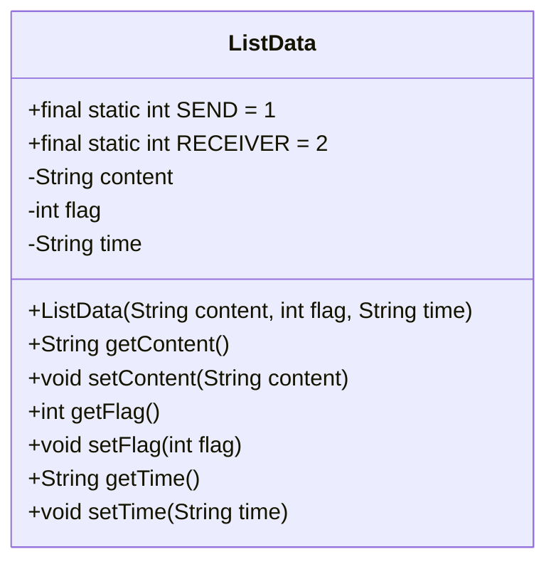
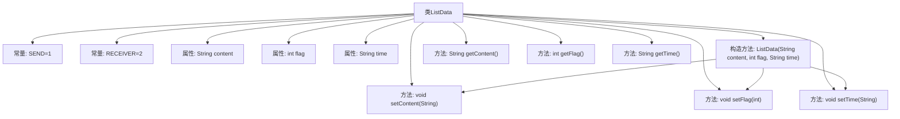

# 基础信息

|      |      |
|------|------|
| 名称 | ListData |
| 编码语言 | .java |
| 代码路径 | happycat/src/com/happycat/tuling/ListData.java |
| 包名 | com.happycat.tuling |
| 依赖项 | [] |
| 概述说明 | ListData类定义消息数据结构，包含内容、标识符（发送/接收）和时间字段，提供构造方法和getter/setter。 |

# 说明

这是一个名为ListData的Java类，用于表示消息数据。类中包含三个主要属性：content存储消息内容，flag标识消息类型（1表示发送，2表示接收），time记录消息时间。提供了构造方法和对应的getter/setter方法，用于初始化和访问这些属性。整个类结构清晰，封装了消息的基本信息。

# 类列表 Class Summary

| 名称   | 类型  | 说明 |
|-------|------|-------------|
| ListData | class | ListData类定义消息数据，包含内容、标识符（1发送/2接收）和时间字段，提供构造方法和getter/setter。 |

## 类 ListData

|      |      |
|------|------|
| 访问范围 | public |
| 类型 | class |
| 名称 | ListData |
| 说明 | ListData类定义消息数据，包含内容、标识符（1发送/2接收）和时间字段，提供构造方法和getter/setter。 |

### UML类图

这段代码定义了一个名为ListData的类，用于表示消息数据，包含消息内容(content)、消息类型标识(flag)和消息时间(time)三个主要属性。该类提供了完整的getter和setter方法用于属性访问和修改，并通过静态常量SEND和RECEIVER定义了两种消息类型（发送和接收）。构造方法要求初始化时必须传入所有三个属性值，确保了对象的完整性。这个类适合用于即时通讯等需要区分消息方向的场景。

### 内部方法调用关系图

这段代码定义了一个名为ListData的类，用于表示消息数据。类中包含两个静态常量SEND和RECEIVER用于标识消息类型，三个私有属性content、flag和time分别存储消息内容、类型标识和时间。通过构造方法和多个getter/setter方法实现对属性的初始化和访问。流程图清晰地展示了类的结构、常量定义、属性声明以及方法之间的调用关系，特别是构造方法中通过setter方法初始化属性的过程。

### 字段列表 Field List

| 名称  | 类型  | 说明 |
|-------|-------|------|
| time | String | 声明了一个私有字符串变量time。 |
| flag | int | 私有整型变量flag。 |
| SEND=1 | int | 定义静态常量SEND，值为1。 |
| RECEIVER=2 | int | 定义静态常量RECEIVER，值为2。 |
| content | String | 私有字符串变量content。 |

### 方法列表 Method List

| 名称  | 类型  | 说明 |
|-------|-------|------|
| setFlag | void | 设置整型flag值的公有方法。 |
| getFlag | int | 获取flag的整数值方法。 |
| setContent | void | 设置内容属性的方法，将输入参数赋值给类的content变量。 |
| getContent | String | Java方法：返回字符串类型变量content的值。 |
| getTime | String | 方法getTime返回字符串time的值。 |
| setTime | void | 设置时间变量的方法，将输入字符串赋值给类成员变量time。 |

