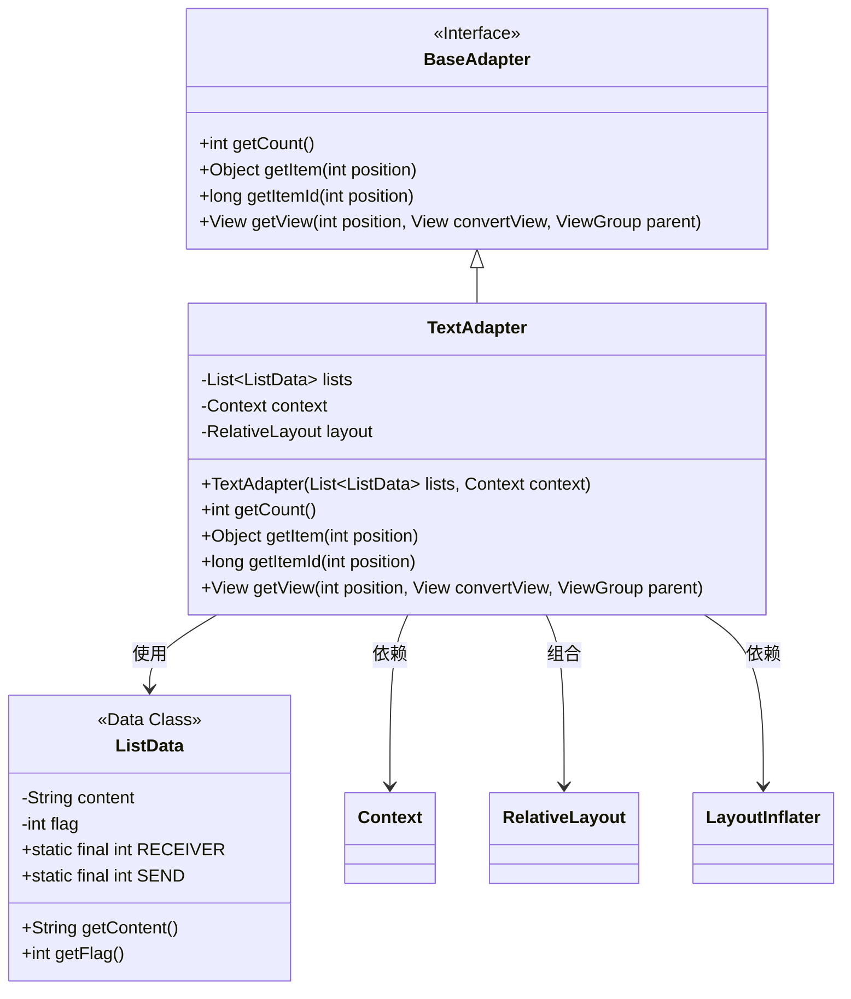
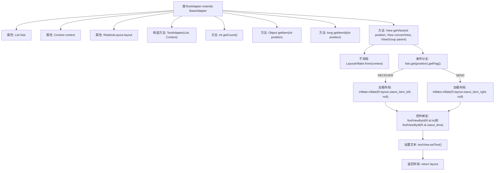

# 基础信息

|      |      |
|------|------|
| 名称 | TextAdapter |
| 编码语言 | .java |
| 代码路径 | happycat/src/com/happycat/tuling/TextAdapter.java |
| 包名 | com.happycat.tuling |
| 依赖项 | ['java.util.List', 'com.example.happucat.R', 'android.content.Context', 'android.view.LayoutInflater', 'android.view.View', 'android.view.ViewGroup', 'android.widget.BaseAdapter', 'android.widget.RelativeLayout', 'android.widget.TextView'] |
| 概述说明 | TextAdapter继承BaseAdapter，根据数据标志位动态加载左右布局，显示消息内容和时间。 |

# 说明

该内容描述了一个名为TextAdapter的Java类，继承自BaseAdapter，用于在Android应用中适配列表数据。类中包含一个List<ListData>类型的数据列表和一个Context对象作为成员变量。构造函数接收这两个参数并初始化。类实现了BaseAdapter的四个必要方法：getCount返回列表大小，getItem和getItemId分别返回指定位置的数据项和ID。getView方法根据数据项的Flag属性（RECEIVER或SEND）动态加载不同的布局文件（xiaoxi_item_left或xiaoxi_item_right），并设置文本内容和时间显示。最后返回填充好的布局视图。

# 类列表 Class Summary

| 名称   | 类型  | 说明 |
|-------|------|-------------|
| TextAdapter | class | TextAdapter继承BaseAdapter，根据数据标志动态加载左右布局，显示内容和时间。 |

## 类 TextAdapter

|      |      |
|------|------|
| 访问范围 | public |
| 类型 | class |
| 名称 | TextAdapter |
| 说明 | TextAdapter继承BaseAdapter，根据数据标志动态加载左右布局，显示内容和时间。 |

### UML类图

这段代码展示了一个Android适配器模式实现，TextAdapter继承自BaseAdapter接口，用于在ListView中显示左右两种聊天消息布局。类图清晰地呈现了TextAdapter与ListData数据类的关系，以及它对Android系统组件(Context/RelativeLayout)的依赖。适配器根据ListData中的flag字段(RECEIVER/SEND)动态选择不同布局文件，实现了消息列表的左右分屏显示效果。

### 内部方法调用关系图

这段代码是一个Android适配器类，用于在ListView中动态加载左右两种聊天消息布局。流程图展示了从构造方法初始化数据，到根据消息类型(RECEIVER/SEND)选择不同布局，最后绑定控件并返回视图的完整流程。关键点包括条件分支判断消息方向、动态加载XML布局文件、以及典型ViewHolder模式中的控件绑定操作。适配器通过getView方法实现列表项的高效复用和差异化渲染。

### 字段列表 Field List

| 名称  | 类型  | 说明 |
|-------|-------|------|
| context | Context | 私有上下文变量context。 |
| lists | List<ListData> | 定义私有列表变量lists，存储ListData类型数据。 |
| layout | RelativeLayout | 声明一个私有RelativeLayout布局变量。 |

### 方法列表 Method List

| 名称  | 类型  | 说明 |
|-------|-------|------|
| getItem | Object | 重写getItem方法，返回列表中指定位置的元素。 |
| getCount | int | 重写getCount方法，返回lists集合的大小。 |
| getItemId | long | 重写getItemId方法，返回位置参数作为ID。 |
| getView | View | 重写getView方法，根据数据标志位动态加载左右布局，设置文本内容后返回视图。 |

