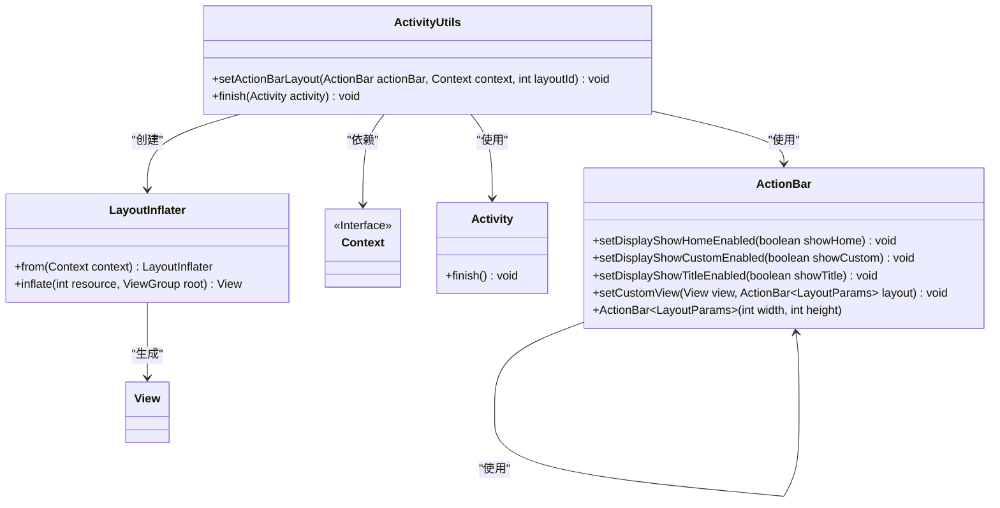
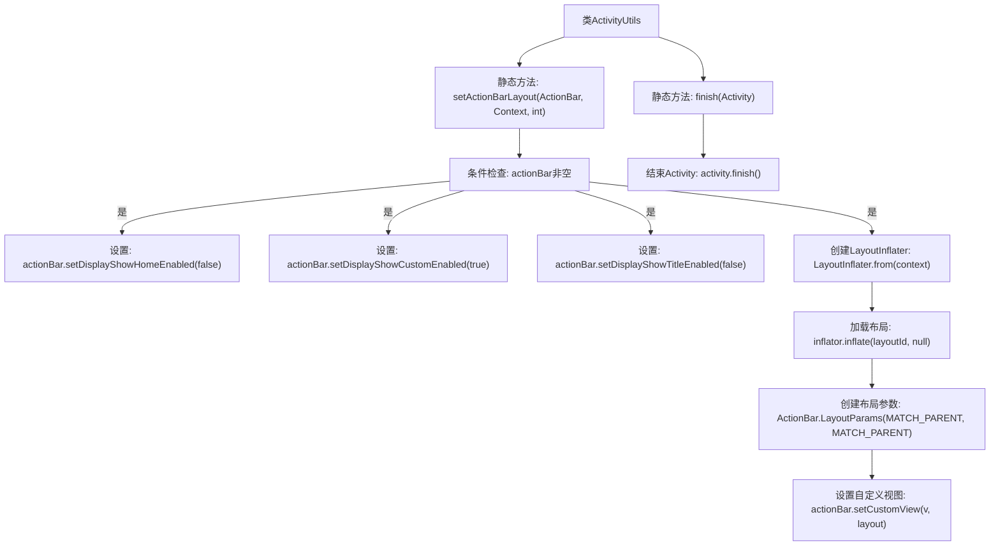

# 基础信息

|      |      |
|------|------|
| 名称 | ActivitiyUtils |
| 编码语言 | .java |
| 代码路径 | happycat/src/com/happycat/util/ActivitiyUtils.java |
| 包名 | com.happycat.util |
| 依赖项 | ['android.app.ActionBar', 'android.app.Activity', 'android.app.ActionBar.LayoutParams', 'android.content.Context', 'android.view.LayoutInflater', 'android.view.View'] |
| 概述说明 | ActivityUtils工具类提供两个功能：1. 自定义ActionBar布局（隐藏默认元素，设置自定义视图）；2. 结束Activity（直接调用finish方法）。 |

# 说明

该代码定义了一个名为ActivitiyUtils的工具类，包含两个静态方法。setActionBarLayout方法用于配置ActionBar的布局，它会禁用默认的标题和图标显示，启用自定义视图，并通过传入的布局ID和上下文来设置自定义视图。finish方法用于结束当前Activity，但注释掉了页面切换动画的实现部分。整个类提供了对Activity界面元素和生命周期的基础操作封装。

# 类列表 Class Summary

| 名称   | 类型  | 说明 |
|-------|------|-------------|
| ActivitiyUtils | class | 工具类ActivitiyUtils提供两个方法：setActionBarLayout用于自定义ActionBar布局，finish用于结束Activity。 |

## 类 ActivitiyUtils

|      |      |
|------|------|
| 访问范围 | public |
| 类型 | class |
| 名称 | ActivitiyUtils |
| 说明 | 工具类ActivitiyUtils提供两个方法：setActionBarLayout用于自定义ActionBar布局，finish用于结束Activity。 |

### UML类图

这段代码展示了一个`ActivityUtils`工具类，主要用于处理Android Activity相关的操作。类中包含两个静态方法：`setActionBarLayout`用于自定义ActionBar布局（通过LayoutInflater动态加载视图并设置参数），`finish`用于关闭Activity。代码涉及与Android框架的多个核心组件交互，包括ActionBar、Context、Activity和LayoutInflater等，展现了Android UI定制和生命周期管理的基本模式。工具类设计符合单一职责原则，便于复用和维护。

### 内部方法调用关系图

这段代码定义了一个`ActivityUtils`工具类，包含两个核心方法。`setActionBarLayout`方法用于配置ActionBar的自定义布局，首先检查ActionBar是否为空，然后禁用默认显示项并启用自定义视图，最后通过LayoutInflater加载指定布局并设置全屏参数。`finish`方法则封装了Activity的关闭操作，当前仅调用`finish()`方法（过渡动画被注释）。流程图清晰展示了方法间的调用关系和条件分支逻辑。

### 字段列表 Field List

| 名称  | 类型  | 说明 |
|-------|-------|------|

### 方法列表 Method List

| 名称  | 类型  | 说明 |
|-------|-------|------|
| finish | void | 静态方法finish(Activity activity)用于关闭指定Activity，默认无转场动画。注释显示可选转场动画功能被禁用。 |
| setActionBarLayout | void | 静态方法设置ActionBar布局，禁用默认显示，启用自定义视图并填充指定布局。 |

