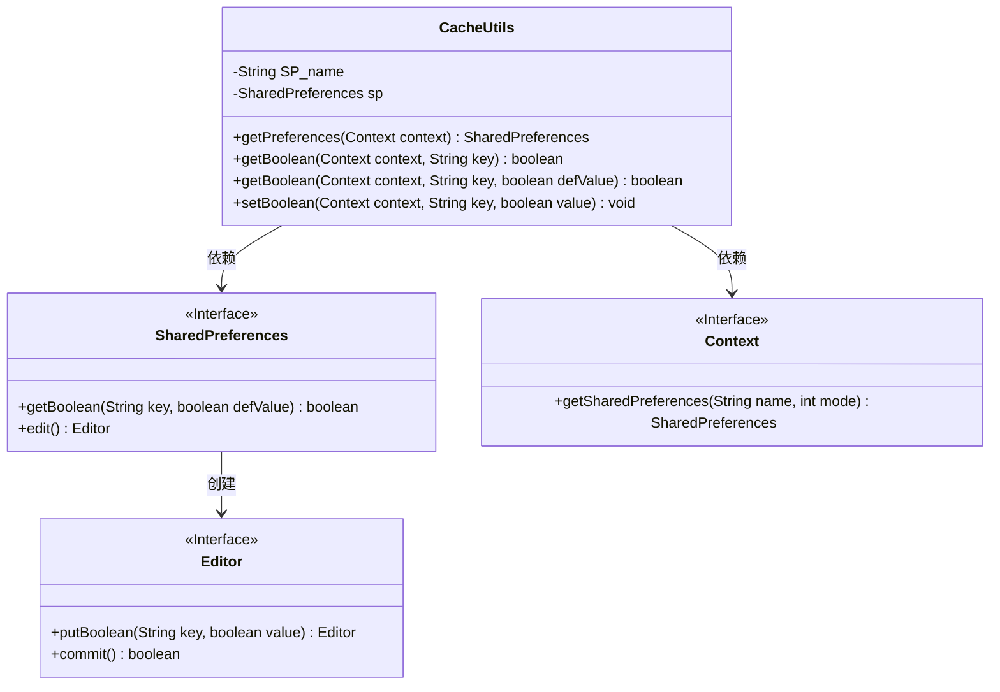
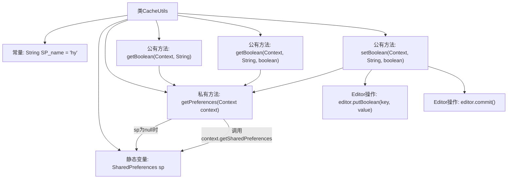

# 基础信息

|      |      |
|------|------|
| 名称 | CacheUtils |
| 编码语言 | .java |
| 代码路径 | happycat/src/com/happycat/util/CacheUtils.java |
| 包名 | com.happycat.util |
| 依赖项 | ['android.content.Context', 'android.content.SharedPreferences', 'android.content.SharedPreferences.Editor'] |
| 概述说明 | CacheUtils类提供SharedPreferences的布尔值存取功能，支持默认值设置和缓存初始化。 |

# 说明

这是一个名为CacheUtils的工具类，主要用于管理Android应用中的SharedPreferences缓存数据。类中包含一个私有静态SharedPreferences对象sp和常量SP_name（值为"hy"）。提供了获取和设置布尔类型缓存数据的方法：getBoolean有两个重载方法，分别支持默认值false和自定义默认值；setBoolean用于存储布尔值。所有方法都通过getPreferences方法获取SharedPreferences实例，采用单例模式确保只初始化一次。数据存储使用私有模式（MODE_PRIVATE），修改数据后立即提交（commit）。

# 类列表 Class Summary

| 名称   | 类型  | 说明 |
|-------|------|-------------|
| CacheUtils | class | CacheUtils类提供SharedPreferences的布尔值读写功能，支持默认值设置和缓存初始化。 |

## 类 CacheUtils

|      |      |
|------|------|
| 访问范围 | public |
| 类型 | class |
| 名称 | CacheUtils |
| 说明 | CacheUtils类提供SharedPreferences的布尔值读写功能，支持默认值设置和缓存初始化。 |

### UML类图

这段代码展示了CacheUtils工具类，用于管理Android中的SharedPreferences数据存储。它通过静态方法提供布尔值的读写操作，内部维护一个SharedPreferences实例，通过Context接口获取存储实例。类图清晰地体现了CacheUtils与Android系统接口(SharedPreferences、Editor、Context)的依赖关系，以及各接口间的层级调用逻辑。

### 内部方法调用关系图

流程图描述：该流程图展示了CacheUtils类的结构和工作流程。类包含一个常量SP_name、静态SharedPreferences变量sp，以及三个核心方法：两个重载的getBoolean方法用于读取布尔值缓存，setBoolean方法用于写入布尔值缓存。所有方法都通过私有方法getPreferences获取SharedPreferences实例，其中setBoolean方法还涉及Editor的putBoolean和commit操作。当sp为null时，getPreferences会初始化SharedPreferences实例。

### 字段列表 Field List

| 名称  | 类型  | 说明 |
|-------|-------|------|
| SP_name = "hy" | String | 私有静态常量字符串SP_name值为"hy"。 |
| sp | SharedPreferences | 私有静态SharedPreferences变量sp。 |

### 方法列表 Method List

| 名称  | 类型  | 说明 |
|-------|-------|------|
| setBoolean | void | 静态方法setBoolean用于在Android中存储布尔值到SharedPreferences，需传入上下文、键名和值，通过Editor提交修改。 |
| getBoolean | boolean | 获取SharedPreferences中布尔值，默认返回false。 |
| getBoolean | boolean | 从SharedPreferences读取布尔值，参数为上下文、键名和默认值，返回对应键的值或默认值。 |
| getPreferences | SharedPreferences | 获取SharedPreferences单例实例，若未初始化则创建私有模式下的实例并返回。 |

