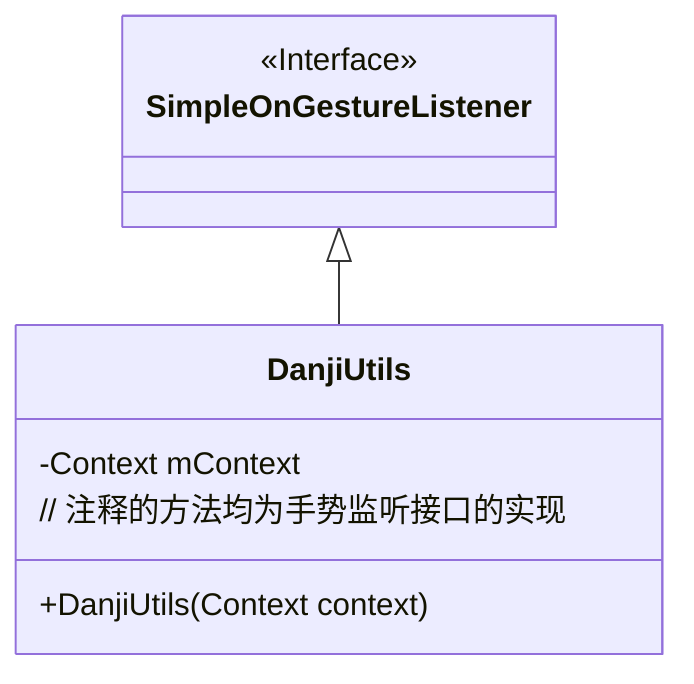

# 基础信息

|      |      |
|------|------|
| 名称 | DanjiUtils |
| 编码语言 | .java |
| 代码路径 | happycat/src/com/happycat/util/DanjiUtils.java |
| 包名 | com.happycat.util |
| 依赖项 | ['android.content.Context', 'android.view.MotionEvent', 'android.view.GestureDetector.SimpleOnGestureListener', 'android.widget.Toast'] |
| 概述说明 | DanjiUtils类继承SimpleOnGestureListener，包含多种手势事件处理，如单击、长按、滚动等，均被注释未启用。 |

# 说明

DanjiUtils类继承SimpleOnGestureListener，用于处理触摸手势事件。构造函数接收Context参数。包含多种手势处理方法：onDown处理单击按下，onShowPress处理短按，onSingleTapUp处理抬起，onScroll处理滚动，onLongPress处理长按，onFling处理滑动。还支持双击相关事件：onDoubleTap处理双击，onDoubleTapEvent处理双击按下抬起，onSingleTapConfirmed处理单击确认。每个方法触发时显示对应Toast提示，部分方法返回布尔值。

# 类列表 Class Summary

| 名称   | 类型  | 说明 |
|-------|------|-------------|
| DanjiUtils | class | DanjiUtils类继承SimpleOnGestureListener，处理手势事件如单击、滚动、长按等，通过Toast显示动作类型。注释代码展示不同手势触发逻辑。 |

## 类 DanjiUtils

|      |      |
|------|------|
| 访问范围 | public |
| 类型 | class |
| 名称 | DanjiUtils |
| 说明 | DanjiUtils类继承SimpleOnGestureListener，处理手势事件如单击、滚动、长按等，通过Toast显示动作类型。注释代码展示不同手势触发逻辑。 |

### UML类图

这段类图展示了DanjiUtils继承自SimpleOnGestureListener接口的关系。DanjiUtils是一个Android手势工具类，通过构造函数接收Context对象，并包含多个被注释掉的手势回调方法实现（如单击、双击、长按等）。类图中清晰地体现了继承关系和主要成员变量，其中所有手势处理方法虽然被注释但展示了该类完整的功能定位。

### 内部方法调用关系图

```mermaid
graph TD
    A["类DanjiUtils"]
    B["继承: SimpleOnGestureListener"]
    C["属性: Context mContext"]
    D["构造方法: DanjiUtils(Context context)"]
    E["注释方法: onDown(MotionEvent e)"]
    F["注释方法: onShowPress(MotionEvent e)"]
    G["注释方法: onSingleTapUp(MotionEvent e)"]
    H["注释方法: onScroll(MotionEvent e1, e2, distanceX, distanceY)"]
    I["注释方法: onLongPress(MotionEvent e)"]
    J["注释方法: onFling(MotionEvent e1, e2, velocityX, velocityY)"]
    K["注释方法: onDoubleTap(MotionEvent e)"]
    L["注释方法: onDoubleTapEvent(MotionEvent e)"]
    M["注释方法: onSingleTapConfirmed(MotionEvent e)"]

    A --> B
    A --> C
    A --> D
    A -.-> E
    A -.-> F
    A -.-> G
    A -.-> H
    A -.-> I
    A -.-> J
    A -.-> K
    A -.-> L
    A -.-> M
```

这段代码展示了一个继承自SimpleOnGestureListener的工具类DanjiUtils，主要用于处理Android手势事件。类中包含多个被注释掉的手势回调方法（如单击、双击、长按、滑动等），每个方法被触发时都会显示对应的Toast提示。当前所有手势处理方法均被注释，实际使用时需要根据需求取消注释相应方法。构造方法接收Context参数用于Toast显示，体现了Android手势处理的基本框架结构。

### 字段列表 Field List

| 名称  | 类型  | 说明 |
|-------|-------|------|
| mContext | Context | 私有上下文变量mContext |

### 方法列表 Method List

| 名称  | 类型  | 说明 |
|-------|-------|------|

