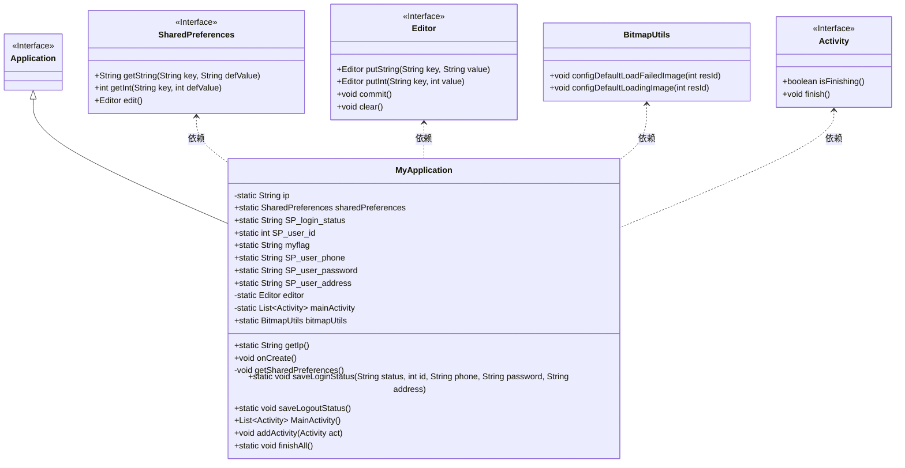

# 基础信息

|      |      |
|------|------|
| 名称 | MyApplication |
| 编码语言 | .java |
| 代码路径 | happycat/src/com/happycat/util/MyApplication.java |
| 包名 | com.happycat.util |
| 依赖项 | ['java.util.ArrayList', 'java.util.List', 'com.example.happucat.R', 'com.lidroid.xutils.BitmapUtils', 'android.app.Activity', 'android.app.Application', 'android.content.SharedPreferences', 'android.content.SharedPreferences.Editor'] |
| 概述说明 | Android应用类MyApplication，管理全局IP、用户登录状态、ID、手机号、密码及地址，使用SharedPreferences存储数据，提供登录登出状态保存功能，集成图片加载工具BitmapUtils，并维护活动列表管理应用生命周期。 |

# 说明

这是一个名为MyApplication的Android应用类，继承自Application类。它包含静态变量存储IP地址、用户登录状态、用户ID、手机号、密码和地址等信息。类中初始化了BitmapUtils用于图片加载，并设置默认加载和失败图片。通过SharedPreferences持久化存储用户数据，提供保存登录状态和退出状态的方法。还管理Activity列表，支持添加和关闭所有Activity的功能。

# 类列表 Class Summary

| 名称   | 类型  | 说明 |
|-------|------|-------------|
| MyApplication | class | Android应用类MyApplication，管理全局IP、用户登录状态、ID、手机号、密码和地址，使用SharedPreferences存储数据，提供登录登出状态保存功能，支持图片加载和活动管理。 |

## 类 MyApplication

|      |      |
|------|------|
| 访问范围 | public |
| 类型 | class |
| 名称 | MyApplication |
| 说明 | Android应用类MyApplication，管理全局IP、用户登录状态、ID、手机号、密码和地址，使用SharedPreferences存储数据，提供登录登出状态保存功能，支持图片加载和活动管理。 |

### UML类图

这段代码描述了一个Android应用的基础框架类MyApplication，它继承自Application类，主要用于管理全局状态和资源。该类包含静态变量存储IP地址、用户登录状态、用户ID等全局信息，通过SharedPreferences持久化存储数据，并提供了BitmapUtils用于图片加载管理。同时维护了一个Activity列表用于统一管理应用内所有Activity的生命周期。类图中清晰地展示了MyApplication与SharedPreferences、Editor、BitmapUtils等组件的依赖关系，以及从Application继承的层级结构。

### 内部方法调用关系图

```mermaid
graph TD
    A["类MyApplication"]
    B["静态属性: String ip"]
    C["静态属性: SharedPreferences sharedPreferences"]
    D["静态属性: String SP_login_status"]
    E["静态属性: int SP_user_id"]
    F["静态属性: String myflag"]
    G["静态属性: String SP_user_phone"]
    H["静态属性: String SP_user_password"]
    I["静态属性: String SP_user_address"]
    J["静态属性: Editor editor"]
    K["静态属性: List<Activity> mainActivity"]
    L["静态属性: BitmapUtils bitmapUtils"]
    M["静态方法: String getIp()"]
    N["重写方法: void onCreate()"]
    O["私有方法: void getSharedPreferences()"]
    P["静态方法: saveLoginStatus(status,id,phone,password,address)"]
    Q["静态方法: saveLogoutStatus()"]
    R["方法: List<Activity> MainActivity()"]
    S["方法: void addActivity(act)"]
    T["静态方法: void finishAll()"]

    A --> B
    A --> C
    A --> D
    A --> E
    A --> F
    A --> G
    A --> H
    A --> I
    A --> J
    A --> K
    A --> L
    A --> M
    A --> N
    N --> O
    N --> L
    O --> C
    O --> J
    O --> D
    O --> E
    O --> G
    O --> H
    O --> I
    A --> P
    P --> J
    A --> Q
    Q --> J
    A --> R
    A --> S
    S --> K
    A --> T
    T --> K
```

这段代码是Android应用的基础框架类，继承自Application类，主要功能包括：管理全局静态变量（如IP地址、用户登录状态）、初始化图片加载工具BitmapUtils、通过SharedPreferences持久化存储用户数据、以及管理Activity生命周期。特别值得注意的是它实现了用户登录状态的保存/清除机制，并提供了全局Activity管理功能，可以一键结束所有Activity。流程图清晰展示了类成员变量与方法的调用关系，特别是onCreate()初始化流程和SharedPreferences操作的数据流向。

### 字段列表 Field List

| 名称  | 类型  | 说明 |
|-------|-------|------|
| SP_user_phone | String | 静态字符串变量SP_user_phone，用于存储用户电话信息。 |
| SP_user_id=0 | int | 静态整型变量SP_user_id初始值为0。 |
| sharedPreferences | SharedPreferences | 声明一个静态SharedPreferences变量sharedPreferences。 |
| ip = "192.168.191.1" | String | 私有静态字符串变量ip，值为"192.168.191.1"。 |
| SP_login_status | String | 静态字符串变量SP_login_status，用于存储登录状态。 |
| bitmapUtils | BitmapUtils | 声明一个静态的BitmapUtils类实例变量bitmapUtils。 |
| SP_user_address | String | 静态字符串变量SP_user_address，用于存储用户地址信息。 |
| myflag="0" | String | 定义静态字符串变量myflag，初始值为"0"。 |
| SP_user_password = "SP_user_password" | String | 静态字符串变量SP_user_password存储用户密码字段标识。 |
| editor | Editor | 私有静态编辑器变量editor。 |
| mainActivity = new ArrayList<Activity>() | List<Activity> | 声明一个私有静态列表变量mainActivity，存储Activity类型元素，初始化为空ArrayList。 |

### 方法列表 Method List

| 名称  | 类型  | 说明 |
|-------|-------|------|
| MainActivity | List<Activity> | Java方法返回主活动列表。 |
| getIp | String | 获取IP地址的静态方法。 |
| getSharedPreferences | void | 获取SharedPreferences存储的登录状态、用户ID、电话、密码和地址信息。 |
| onCreate | void | 在应用创建时初始化BitmapUtils，配置默认加载中和失败图片，并调用父类onCreate及获取SharedPreferences。 |
| saveLoginStatus | void | 保存用户登录状态，包括状态、ID、电话、密码和地址到共享偏好中。 |
| saveLogoutStatus | void | 静态方法saveLogoutStatus用于保存登出状态：清空登录状态、用户ID和密码，保留用户手机号，提交编辑器更改。 |
| addActivity | void | 向主活动列表添加新活动。 |
| finishAll | void | 静态方法finishAll遍历mainActivity列表，结束所有未关闭的Activity并清空列表。 |

