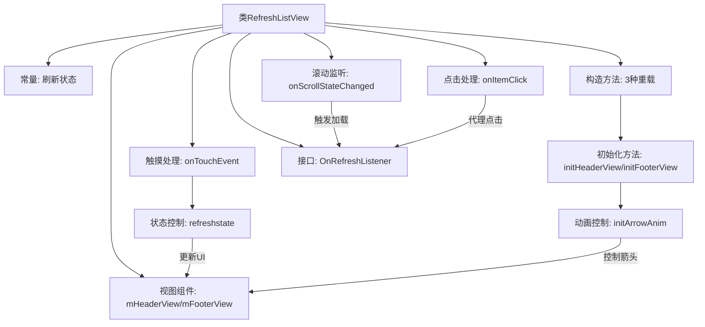

# 基础信息

|      |      |
|------|------|
| 名称 | RefreshListView |
| 编码语言 | .java |
| 代码路径 | happycat/src/com/happycat/util/RefreshListView.java |
| 包名 | com.happycat.util |
| 依赖项 | ['java.text.SimpleDateFormat', 'java.util.Date', 'com.example.happucat.R', 'android.content.Context', 'android.util.AttributeSet', 'android.view.MotionEvent', 'android.view.View', 'android.view.animation.Animation', 'android.view.animation.RotateAnimation', 'android.widget.AbsListView', 'android.widget.AbsListView.OnScrollListener', 'android.widget.AdapterView', 'android.widget.ImageView', 'android.widget.ListView', 'android.widget.ProgressBar', 'android.widget.TextView'] |
| 概述说明 | 自定义下拉刷新和上拉加载的ListView组件，支持状态切换、动画效果及时间显示，提供刷新和加载更多接口。 |

# 说明

RefreshListView是一个自定义的ListView控件，实现了下拉刷新和上拉加载功能。它包含三个状态：下拉刷新、松开刷新和正在刷新。控件通过初始化头布局和脚布局，并设置相应的动画效果来展示不同状态。头布局包含标题、时间和箭头图标，脚布局用于上拉加载。通过触摸事件处理滑动逻辑，根据偏移量改变状态和布局显示。提供OnRefreshListener接口回调刷新和加载更多操作，并支持收起刷新控件和更新时间。同时重写了滚动监听和点击事件处理，确保功能完整性和用户体验。

# 类列表 Class Summary

| 名称   | 类型  | 说明 |
|-------|------|-------------|
| RefreshListView | class | 自定义下拉刷新和上拉加载的ListView控件，支持状态切换、动画效果及时间显示。 |


## 类 RefreshListView

|      |      |
|------|------|
| 访问范围 | public |
| 类型 | class |
| 名称 | RefreshListView |
| 说明 | 自定义下拉刷新和上拉加载的ListView控件，支持状态切换、动画效果及时间显示。 |


### UML类图

```mermaid
classDiagram
    class RefreshListView {
        -int START_PULL_REDRESH
        -int START_RELEASE_REDRESH
        -int START_REDRESHING
        -View mHeaderView
        -View mFooterView
        -int startY
        -int mHeaderViewHeight
        -int mFooterViewHeight
        -int mCurrentState
        -TextView tvTitle
        -TextView tvTime
        -ImageView ivArrow
        -ProgressBar pbProgressBar
        -RotateAnimation animUP
        -RotateAnimation animDown
        -boolean isLoadingMore
        -OnRefreshListener mListener
        -OnItemClickListener mItemClickListener
        +RefreshListView(Context context, AttributeSet attrs, int defStyle)
        +RefreshListView(Context context, AttributeSet attrs)
        +RefreshListView(Context context)
        -initHeaderView()
        -initFooterView()
        -refreshstate()
        -initArrowAnim()
        +onTouchEvent(MotionEvent ev) boolean
        +onRefreshComplete(boolean success)
        +getCurrentTime() String
        +onScrollStateChanged(AbsListView view, int scrollState)
        +onScroll(AbsListView view, int firstVisibleItem, int visibleItemCount, int totalItemCount)
        +setOnRefreshListener(OnRefreshListener syJsActivity)
        +setOnItemClickListener(OnItemClickListener listener)
        +onItemClick(AdapterView<?> parent, View view, int position, long id)
    }

    <<Interface>> OnRefreshListener {
        <<Interface>>
        +onRefresh()
        +onLoadMore()
    }

    <<Interface>> OnItemClickListener {
        <<Interface>>
        +onItemClick(AdapterView<?> parent, View view, int position, long id)
    }

    RefreshListView --|> ListView : 继承
    RefreshListView ..|> OnScrollListener : 实现
    RefreshListView ..|> OnItemClickListener : 实现
    RefreshListView --> OnRefreshListener : 依赖
    RefreshListView --> OnItemClickListener : 依赖
```

类图描述：
RefreshListView是一个继承自ListView的自定义控件，实现了OnScrollListener和OnItemClickListener接口，支持下拉刷新和上拉加载功能。通过mHeaderView和mFooterView分别管理刷新头布局和加载脚布局，使用动画效果提升交互体验。类中包含状态管理（START_PULL_REDRESH等）、触摸事件处理（onTouchEvent）、滚动监听（onScrollStateChanged）等核心方法，并通过OnRefreshListener接口与外部通信。整体设计采用组合模式，将复杂的手势交互和状态管理封装在控件内部。


### 内部方法调用关系图



这段代码实现了一个支持下拉刷新和上拉加载的ListView控件。核心流程包含：1) 初始化时创建头部/底部布局并设置隐藏；2) 通过触摸事件检测下拉动作，根据位移量切换"下拉刷新/松开刷新/正在刷新"三种状态；3) 使用旋转动画和进度条实现视觉反馈；4) 通过接口回调通知外部刷新/加载事件；5) 滚动到底部自动触发加载更多。代码采用状态模式管理刷新流程，并通过测量布局高度实现弹性拖动效果，最后通过padding控制布局的显示隐藏。

### 字段列表 Field List

| 名称  | 类型  | 说明 |
|-------|-------|------|
| animUP | RotateAnimation | 私有旋转动画变量animUP。 |
| START_RELEASE_REDRESH = 1 | int | 定义私有静态常量START_RELEASE_REDRESH，值为1。 |
| pbProgressBar | ProgressBar | 私有进度条控件pbProgressBar。 |
| startY = -1 | int | 私有整型变量startY初始值为-1。 |
| animDown | RotateAnimation | 私有旋转动画对象animDown。 |
| mFooterViewHeight | int | 声明两个私有整型变量：mHeaderViewHeight和mFooterViewHeight。 |
| mListener | OnRefreshListener | 定义了一个OnRefreshListener类型的成员变量mListener。 |
| ivArrow | ImageView | 私有图像视图变量ivArrow声明。 |
| isLoadingMore | boolean | 正在加载更多数据的私有布尔变量。 |
| START_PULL_REDRESH = 0 | int | 私有静态常量START_PULL_REDRESH初始值为0。 |
| mItemClickListener | OnItemClickListener | 定义项目点击监听器变量mItemClickListener。 |
| mFooterView | View | 声明两个私有视图变量：mHeaderView和mFooterView。 |
| mCurrentState = START_PULL_REDRESH | int | 私有整型变量mCurrentState初始化为START_PULL_REFRESH状态。 |
| START_REDRESHING = 2 | int | 私有静态常量START_REFRESHING值为2，用于控制刷新起始状态。 |
| tvTime | TextView | 声明两个私有TextView变量：tvTitle和tvTime。 |

### 方法列表 Method List

| 名称  | 类型  | 说明 |
|-------|-------|------|
| setOnRefreshListener | void | 设置下拉刷新监听器，将传入的OnRefreshListener赋值给mListener。 |
| initFooterView | void | 初始化底部加载视图，设置高度并通过负边距隐藏，添加滚动监听。 |
| initHeaderView | void | 初始化下拉刷新头部视图，包括标题、时间、箭头图标和进度条，设置初始状态为隐藏，并初始化箭头动画和默认刷新时间。 |
| getCurrentTime | String | Java方法：返回当前时间的字符串，格式为"yyyy-MM-dd HH:mm:ss"。 |
| onScroll | void | Android列表滚动事件回调方法，参数包括视图、首项位置、可见项数和总项数。 |
| onTouchEvent | boolean | 处理触摸事件，实现下拉刷新功能。记录起始位置，计算偏移量，根据状态调整头部视图padding，松开时触发刷新或隐藏头部。 |
| onScrollStateChanged | void | 滚动列表至底部时显示页脚并触发加载更多操作，防止重复加载。 |
| onItemClick | void | 重写onItemClick方法，当点击列表项时，若有监听器则调用其onItemClick方法，并调整position参数。 |
| setOnItemClickListener | void | 重写setOnItemClickListener方法，调用父类方法并设置监听器mItemClickListener。 |
| onRefreshComplete | void | 刷新完成处理：加载更多时隐藏底部视图，否则重置顶部刷新状态并更新最后刷新时间。 |
| refreshstate | void | 刷新状态控制：下拉显示"下拉刷新"和向下箭头动画；松开显示"松开刷新"和向上箭头动画；刷新中显示"正在刷新..."并隐藏箭头显示进度条，触发刷新接口。 |
| initArrowAnim | void | 定义箭头动画：向上旋转180度，向下复位，各持续200毫秒，保持最终状态。 |


