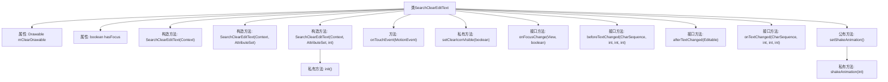
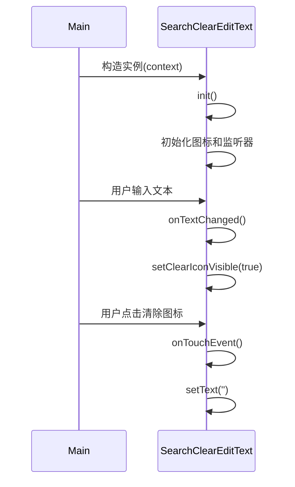

# 基础信息

|      |      |
|------|------|
| 名称 | SearchClearEditText |
| 编码语言 | .java |
| 代码路径 | happycat/src/com/happycat/util/SearchClearEditText.java |
| 包名 | com.happycat.util |
| 依赖项 | ['com.example.happucat.R', 'android.content.Context', 'android.graphics.drawable.Drawable', 'android.text.Editable', 'android.text.TextWatcher', 'android.util.AttributeSet', 'android.widget.EditText', 'android.view.MotionEvent', 'android.view.View', 'android.view.View.OnFocusChangeListener', 'android.view.animation.Animation', 'android.view.animation.CycleInterpolator', 'android.view.animation.TranslateAnimation'] |
| 概述说明 | 自定义EditText控件，实现清除按钮功能，支持焦点变化监听和文本变化监听，点击右侧图标清空文本，可设置抖动动画。 |

# 说明

这是一个自定义的搜索框控件SearchClearEditText，继承自EditText并实现了焦点变化监听和文本变化监听。主要功能包括：1.右侧显示清除图标，点击可清空文本；2.根据焦点状态和文本内容动态显示/隐藏清除图标；3.支持设置抖动动画效果。控件通过重写onTouchEvent处理点击事件，使用TextWatcher监听文本变化，并通过setClearIconVisible方法控制图标显示。还提供了shakeAnimation方法实现水平抖动动画效果。

# 类列表 Class Summary

| 名称   | 类型  | 说明 |
|-------|------|-------------|
| SearchClearEditText | class | 自定义搜索框控件，继承EditText，实现焦点监听和文本变化监听，支持右侧清除图标显示与点击清空功能，可设置抖动动画。 |


## 类 SearchClearEditText

|      |      |
|------|------|
| 访问范围 | public |
| 类型 | class |
| 名称 | SearchClearEditText |
| 说明 | 自定义搜索框控件，继承EditText，实现焦点监听和文本变化监听，支持右侧清除图标显示与点击清空功能，可设置抖动动画。 |


### UML类图

```mermaid
classDiagram
    class SearchClearEditText {
        -Drawable mClearDrawable
        -boolean hasFocus
        +SearchClearEditText(Context context)
        +SearchClearEditText(Context context, AttributeSet attrs)
        +SearchClearEditText(Context context, AttributeSet attrs, int defStyle)
        -init()
        +onTouchEvent(MotionEvent event) boolean
        -setClearIconVisible(boolean visible)
        +onFocusChange(View v, boolean hasFocus)
        +beforeTextChanged(CharSequence s, int start, int count, int after)
        +afterTextChanged(Editable s)
        +onTextChanged(CharSequence text, int start, int lengthBefore, int lengthAfter)
        +setShakeAnimation()
        -shakeAnimation(int counts) Animation
    }
    <<Interface>> OnFocusChangeListener
    <<Interface>> TextWatcher
    SearchClearEditText --|> EditText
    SearchClearEditText ..|> OnFocusChangeListener
    SearchClearEditText ..|> TextWatcher
```

该代码实现了一个自定义的EditText控件，具有清除文本和动画效果功能。SearchClearEditText继承自EditText，并实现了OnFocusChangeListener和TextWatcher接口。主要功能包括：通过右侧图标清除文本、根据焦点和文本变化控制清除图标显示、实现抖动动画效果。类中包含私有方法初始化控件、设置图标可见性、创建动画等，公有方法处理触摸事件、焦点变化和文本变化回调。


### 内部方法调用关系图





这段代码实现了一个带清除功能的搜索输入框控件。流程图展示了类结构关系，包含3个构造方法、核心初始化逻辑、触摸事件处理和文本变化监听。时序图描述了从实例创建到用户交互的完整流程，包括初始化、文本变化时的图标显示控制，以及点击清除图标时的文本清空操作。该控件通过组合Drawable、触摸事件和文本监听实现交互式清除功能。

### 字段列表 Field List

| 名称  | 类型  | 说明 |
|-------|-------|------|
| hasFocus | boolean | 私有布尔变量，表示是否拥有焦点。 |
| mClearDrawable | Drawable | 私有Drawable类型变量mClearDrawable声明。 |

### 方法列表 Method List

| 名称  | 类型  | 说明 |
|-------|-------|------|
| afterTextChanged | void | 重写afterTextChanged方法，用于处理文本变化后的操作。 |
| onFocusChange | void | 重写焦点变化事件，有焦点时根据输入文本显示清除图标，无焦点时隐藏清除图标。 |
| init | void | 初始化方法：获取右侧清除图标，若无则使用搜索图标，设置图标边界，默认隐藏图标，添加焦点和文本变化监听。 |
| onTextChanged | void | 重写onTextChanged方法，当控件获得焦点且输入文本长度大于0时显示清除图标。 |
| setClearIconVisible | void | 方法setClearIconVisible控制清除图标显示。参数visible决定是否显示图标，通过设置右侧Drawable实现。保持其他方向图标不变。 |
| onTouchEvent | boolean | 重写触摸事件方法，当抬起动作且右侧有图标时，检测点击位置在图标区域内则清空文本。 |
| beforeTextChanged | void | 重写beforeTextChanged方法，参数为字符序列s、起始位置start、变化前字符数count和变化后字符数after。 |
| setShakeAnimation | void | 方法setShakeAnimation调用shakeAnimation(5)为对象设置抖动动画效果。 |
| shakeAnimation | Animation | 创建水平抖动动画，偏移10像素，循环次数可调，持续1秒。 |


