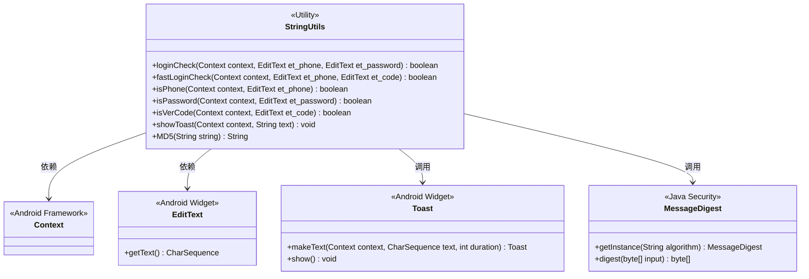
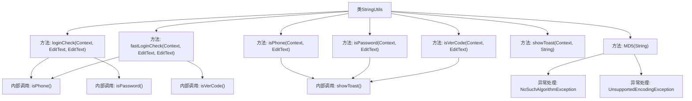

# 基础信息

|      |      |
|------|------|
| 名称 | StringUtils |
| 编码语言 | .java |
| 代码路径 | happycat/src/com/happycat/util/StringUtils.java |
| 包名 | com.happycat.util |
| 依赖项 | ['java.io.UnsupportedEncodingException', 'java.security.MessageDigest', 'java.security.NoSuchAlgorithmException', 'android.content.Context', 'android.util.Config', 'android.widget.EditText', 'android.widget.Toast'] |
| 概述说明 | StringUtils类提供登录验证功能，包括手机号、密码和验证码的格式检查，支持MD5加密和Toast提示。 |

# 说明

StringUtils类包含多个静态方法用于验证用户输入。loginCheck方法验证手机号和密码，fastLoginCheck验证手机号和验证码。isPhone方法检查手机号非空且符合格式，isPassword检查密码长度6-16位，isVerCode验证码必须4位。错误时通过showToast显示提示。MD5方法对字符串进行加密处理，返回32位十六进制哈希值。所有验证方法返回布尔值表示是否通过。

# 类列表 Class Summary

| 名称   | 类型  | 说明 |
|-------|------|-------------|
| StringUtils | class | StringUtils类提供登录验证功能，包括手机号、密码、验证码校验，支持MD5加密和Toast提示。 |

## 类 StringUtils

|      |      |
|------|------|
| 访问范围 | public |
| 类型 | class |
| 名称 | StringUtils |
| 说明 | StringUtils类提供登录验证功能，包括手机号、密码、验证码校验，支持MD5加密和Toast提示。 |

### UML类图

该代码实现了一个Android工具类`StringUtils`，主要提供登录验证相关功能。包含手机号格式校验、密码长度校验、验证码校验等方法，以及Toast提示和MD5加密功能。类图中清晰展示了与Android框架类（Context、EditText、Toast）和Java安全类（MessageDigest）的依赖关系，所有方法均为静态方法，符合工具类的设计模式。验证逻辑采用分层校验策略，任一条件失败立即终止后续检查，并显示对应错误提示。

### 内部方法调用关系图

这段代码展示了一个Android工具类StringUtils，主要包含登录验证、手机号校验、密码校验、验证码校验、Toast提示和MD5加密等功能。流程图清晰地展示了类结构和方法间的调用关系，其中loginCheck和fastLoginCheck作为入口方法，分别调用不同的验证方法，所有验证方法都会在失败时调用showToast显示错误信息。MD5方法包含异常处理流程，整个类设计符合单一职责原则，各方法分工明确。

### 字段列表 Field List

| 名称  | 类型  | 说明 |
|-------|-------|------|

### 方法列表 Method List

| 名称  | 类型  | 说明 |
|-------|-------|------|
| fastLoginCheck | boolean | 检查手机号和验证码是否有效，全部有效返回true，否则返回false。 |
| isPhone | boolean | 检查手机号是否为空及格式是否正确，空号或格式错误时提示并返回false，否则返回true。 |
| loginCheck | boolean | 登录验证方法，检查手机号和密码格式，全部正确返回true，否则false。 |
| isVerCode | boolean | 检查验证码是否为空或非4位数字，返回验证结果。 |
| isPassword | boolean | 检查密码是否为空或长度在6-16位之间，否则提示错误并返回验证结果。 |
| showToast | void | 这是一个Java静态方法，用于在Android中显示短时Toast提示。接收Context和文本参数，调用Toast.makeText创建并显示提示。 |
| MD5 | String | 静态方法MD5对字符串进行加密，处理异常后返回16进制哈希值。 |

