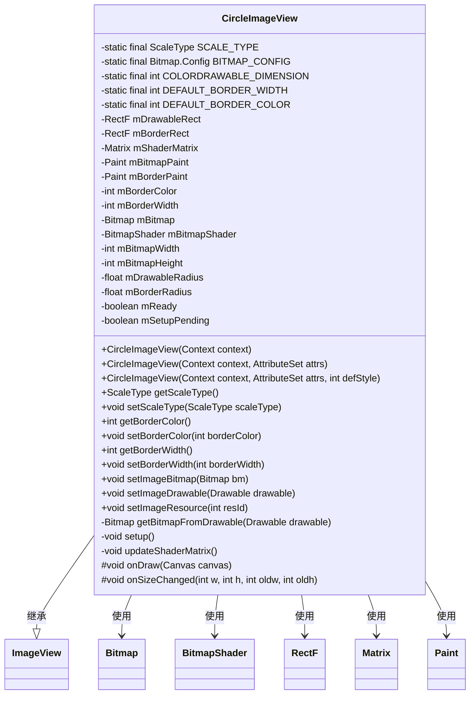
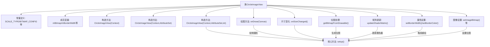

# 基础信息

|      |      |
|------|------|
| 名称 | CircleImageView |
| 编码语言 | .java |
| 代码路径 | happycat/src/com/happycat/view/CircleImageView.java |
| 包名 | com.happycat.view |
| 依赖项 | ['com.example.happucat.R', 'android.content.Context', 'android.content.res.TypedArray', 'android.graphics.Bitmap', 'android.graphics.BitmapShader', 'android.graphics.Canvas', 'android.graphics.Color', 'android.graphics.Matrix', 'android.graphics.Paint', 'android.graphics.RectF', 'android.graphics.Shader', 'android.graphics.drawable.BitmapDrawable', 'android.graphics.drawable.ColorDrawable', 'android.graphics.drawable.Drawable', 'android.util.AttributeSet', 'android.widget.ImageView'] |
| 概述说明 | 圆形图片视图类，继承ImageView，支持边框设置，强制居中裁剪，通过Shader和Paint实现圆形绘制，包含尺寸变化处理和资源更新逻辑。 |

# 说明

CircleImageView是一个自定义圆形图像视图类，继承自ImageView。它强制使用CENTER_CROP缩放类型，支持可配置的边框宽度和颜色。核心实现包含BitmapShader绘制圆形图像，通过矩阵计算保持图像比例，并维护两个圆形绘制区域（图像区域和边框区域）。类提供边框颜色/宽度的getter/setter，重写图像设置方法确保及时更新。关键步骤包括：从Drawable获取Bitmap、设置着色器、计算绘制区域半径、更新变换矩阵。onDraw时绘制两个同心圆分别呈现图像和边框。

# 类列表 Class Summary

| 名称   | 类型  | 说明 |
|-------|------|-------------|
| CircleImageView | class | 圆形图片视图类，支持边框设置，通过BitmapShader实现圆形裁剪，自动调整图片缩放和位置。 |

## 类 CircleImageView

|      |      |
|------|------|
| 访问范围 | public |
| 类型 | class |
| 名称 | CircleImageView |
| 说明 | 圆形图片视图类，支持边框设置，通过BitmapShader实现圆形裁剪，自动调整图片缩放和位置。 |

### UML类图

这段代码定义了一个CircleImageView类，继承自ImageView，用于显示圆形图片。它通过BitmapShader和矩阵变换实现圆形裁剪效果，支持自定义边框宽度和颜色。核心功能包括：通过setup()初始化绘制参数，updateShaderMatrix()计算缩放比例，onDraw()实现圆形绘制。类中维护了多个状态变量（如mReady、mBorderWidth）和绘图工具（如Paint、Matrix），通过重写setImageXXX方法确保图片更新时重新计算布局。该实现考虑了内存优化（getBitmapFromDrawable处理OOM）和性能优化（延迟初始化机制）。

### 内部方法调用关系图

这段代码实现了一个圆形图像视图控件，继承自ImageView。主要功能包括：通过构造方法初始化视图属性，处理不同类型的图像资源转换为位图，计算圆形绘制区域和边框尺寸，使用BitmapShader实现圆形裁剪效果，并在属性变更时自动更新视图。核心setup()方法负责计算绘制参数，updateShaderMatrix()调整图像缩放比例，onDraw()执行实际圆形绘制操作。该控件支持自定义边框宽度和颜色，通过重写setImageXXX方法确保图像始终以圆形方式显示。

### 字段列表 Field List

| 名称  | 类型  | 说明 |
|-------|-------|------|
| mDrawableRadius | float | 私有浮点型变量mDrawableRadius，用于存储可绘制对象的半径值。 |
| mDrawableRect = new RectF() | RectF | 定义私有矩形区域变量mDrawableRect，用于绘制图形边界。 |
| mBitmap | Bitmap | 声明一个私有Bitmap变量mBitmap。 |
| mBorderColor = DEFAULT_BORDER_COLOR | int | 私有整型变量mBorderColor，默认值为DEFAULT_BORDER_COLOR。 |
| DEFAULT_BORDER_COLOR = Color.BLACK | int | 定义私有静态常量DEFAULT_BORDER_COLOR，默认值为Color.BLACK。 |
| mBitmapHeight | int | 私有整型变量，存储位图高度。 |
| mBitmapShader | BitmapShader | 私有位图着色器变量mBitmapShader。 |
| mSetupPending | boolean | 私有布尔变量，表示设置是否待处理。 |
| mBitmapWidth | int | 私有整型变量，存储位图宽度。 |
| BITMAP_CONFIG = Bitmap.Config.ARGB_8888 | Bitmap.Config | 定义静态常量BITMAP_CONFIG，使用ARGB_8888位图配置。 |
| SCALE_TYPE = ScaleType.CENTER_CROP | ScaleType | 私有静态常量SCALE_TYPE设为CENTER_CROP缩放类型。 |
| mBorderPaint = new Paint() | Paint | 私有画笔对象mBorderPaint初始化。 |
| mBorderRadius | float | 私有浮点型变量mBorderRadius，表示边框圆角半径。 |
| COLORDRAWABLE_DIMENSION = 1 | int | 定义静态常量COLORDRAWABLE_DIMENSION，值为1。 |
| mShaderMatrix = new Matrix() | Matrix | 私有矩阵变量mShaderMatrix，用于着色器变换。 |
| DEFAULT_BORDER_WIDTH = 0 | int | 定义私有静态常量DEFAULT_BORDER_WIDTH，默认边框宽度为0。 |
| mBorderWidth = DEFAULT_BORDER_WIDTH | int | 私有整型变量mBorderWidth，默认值为DEFAULT_BORDER_WIDTH。 |
| mBitmapPaint = new Paint() | Paint | 私有画笔对象mBitmapPaint使用Paint构造函数初始化。 |
| mReady | boolean | 私有布尔变量mReady，表示就绪状态。 |
| mBorderRect = new RectF() | RectF | 定义私有矩形区域变量mBorderRect，使用RectF类初始化。 |

### 方法列表 Method List

| 名称  | 类型  | 说明 |
|-------|-------|------|
| getBorderWidth | int | 该方法返回成员变量mBorderWidth的值，表示边框宽度。 |
| getScaleType | ScaleType | 重写getScaleType方法，返回常量SCALE_TYPE。 |
| onDraw | void | 自定义绘制方法，若无图像则返回，否则在画布中心绘制两个同心圆，分别使用位图画笔和边框画笔。 |
| onSizeChanged | void | 重写onSizeChanged方法，在视图尺寸变化时调用父类方法并执行setup初始化。 |
| getBorderColor | int | 获取边框颜色值的方法，返回整数类型。 |
| setScaleType | void | 重写setScaleType方法，仅支持特定缩放类型，否则抛出异常。 |
| setBorderColor | void | 设置边框颜色方法：检查颜色是否相同，不同则更新颜色并重绘。 |
| setBorderWidth | void | 设置边框宽度方法：检查新宽度与当前值不同则更新并重新初始化。 |
| setImageBitmap | void | 重写setImageBitmap方法，调用父类方法后保存位图并执行setup初始化。 |
| setImageDrawable | void | 重写setImageDrawable方法，调用父类方法后更新位图并执行初始化。 |
| setImageResource | void | 重写setImageResource方法，调用父类方法后更新位图并执行setup。 |
| getBitmapFromDrawable | Bitmap | 将Drawable转换为Bitmap的方法：检查null和BitmapDrawable，处理ColorDrawable创建固定尺寸位图，其他按原尺寸创建，绘制到Canvas后返回位图，内存不足返回null。 |
| setup | void | 方法setup初始化绘图设置：检查就绪状态和位图有效性，创建位图着色器，配置抗锯齿和边框样式，计算尺寸和半径，更新着色矩阵并重绘。 |
| updateShaderMatrix | void | 该方法根据位图与绘制区域的宽高比计算缩放比例，调整矩阵使位图居中显示，并考虑边框宽度。若位图宽度相对较高，则按高度缩放；否则按宽度缩放。最终应用缩放和平移矩阵到位图着色器。 |

