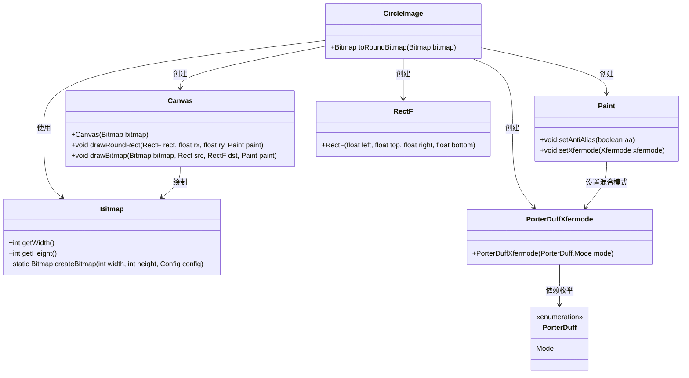
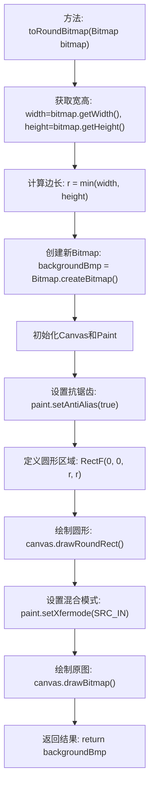

# 基础信息

|      |      |
|------|------|
| 名称 | Circleimage |
| 编码语言 | .java |
| 代码路径 | happycat/src/com/happycat/view/Circleimage.java |
| 包名 | com.happycat.view |
| 依赖项 | ['android.graphics.Bitmap', 'android.graphics.Bitmap.Config', 'android.graphics.Canvas', 'android.graphics.Paint', 'android.graphics.PorterDuff.Mode', 'android.graphics.PorterDuffXfermode', 'android.graphics.RectF'] |
| 概述说明 | 将位图转换为圆形图片，通过取最短边作为直径，绘制圆形并裁剪多余部分，最终返回圆形位图。 |

# 说明

该代码定义了一个Circleimage类，包含将位图转换为圆形图像的方法toRoundBitmap。方法首先获取输入位图的宽高，取较短边作为圆形直径。然后创建新位图作为画布，使用抗锯齿画笔绘制一个与短边等宽的正方形圆角矩形（圆角半径设为边长一半，形成正圆）。通过设置SRC_IN混合模式，裁剪出原始位图与圆形重叠区域，最终返回处理后的圆形位图。整个过程不改变原始图像宽高比例。

# 类列表 Class Summary

| 名称   | 类型  | 说明 |
|-------|------|-------------|
| Circleimage | class | 将位图转换为圆形图片，通过创建正方形画布，绘制圆形并裁剪多余部分实现。 |

## 类 Circleimage

|      |      |
|------|------|
| 访问范围 | public |
| 类型 | class |
| 名称 | Circleimage |
| 说明 | 将位图转换为圆形图片，通过创建正方形画布，绘制圆形并裁剪多余部分实现。 |

### UML类图

这段代码实现了一个将矩形图片转换为圆形图片的功能。CircleImage类通过toRoundBitmap方法接收Bitmap输入，使用Canvas和Paint进行图形处理，通过绘制圆角矩形并应用SRC_IN混合模式实现圆形裁剪效果。涉及的关键类包括Bitmap（位图操作）、Canvas（画布绘制）、Paint（画笔设置）、RectF（矩形区域）和PorterDuffXfermode（混合模式）。整个过程先确定圆形直径，创建目标位图，绘制圆形遮罩，最后应用位图混合完成转换。

### 内部方法调用关系图

该流程图展示了将矩形图片转换为圆形图片的处理过程。首先获取原始图片尺寸并确定圆形直径，然后创建画布和画笔工具，通过绘制圆角矩形（圆角半径设为边长一半）形成圆形遮罩，最后使用SRC_IN混合模式裁剪原始图片至圆形区域。整个过程涉及位图操作、画布绘制和图形混合模式设置，最终输出带透明通道的圆形位图。

### 字段列表 Field List

| 名称  | 类型  | 说明 |
|-------|-------|------|

### 方法列表 Method List

| 名称  | 类型  | 说明 |
|-------|-------|------|
| toRoundBitmap | Bitmap | 将位图转换为圆形：取最短边为直径，创建正方形画布，绘制圆形并裁剪多余部分，返回圆形位图。 |

