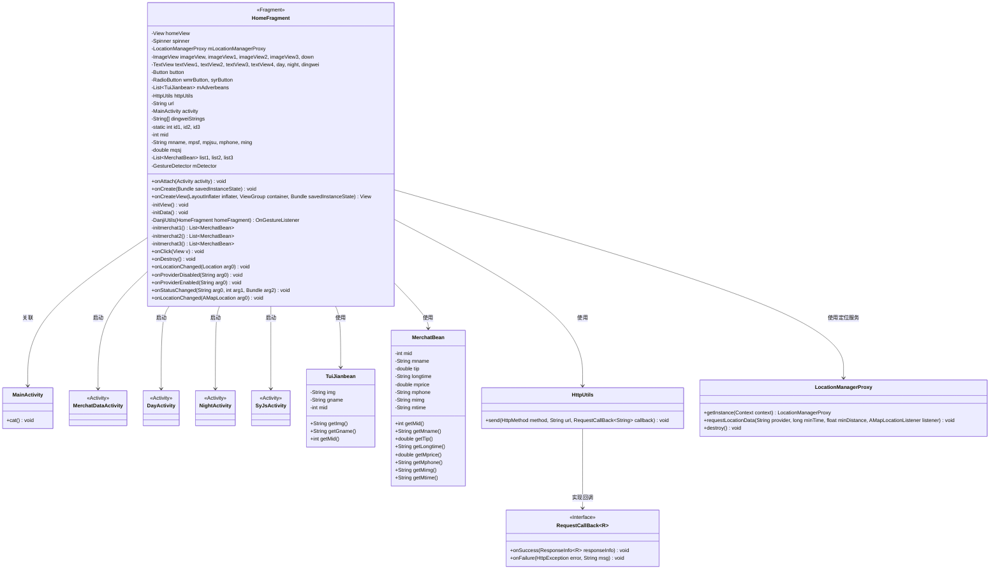
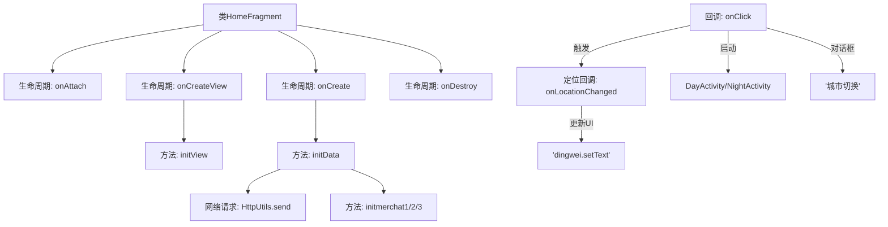

# 基础信息

|      |      |
|------|------|
| 名称 | HomeFragment |
| 编码语言 | .java |
| 代码路径 | happycat/src/com/happycay/fragments/HomeFragment.java |
| 包名 | com.happycay.fragments |
| 依赖项 | ['java.lang.reflect.Type', 'java.util.ArrayList', 'java.util.LinkedList', 'java.util.List', 'com.amap.api.location.AMapLocation', 'com.amap.api.location.AMapLocationListener', 'com.amap.api.location.LocationManagerProxy', 'com.amap.api.location.LocationProviderProxy', 'com.example.happucat.R', 'com.google.gson.Gson', 'com.google.gson.reflect.TypeToken', 'com.happycat.DayActivity', 'com.happycat.MainActivity', 'com.happycat.MerchatDataActivity', 'com.happycat.NightActivity', 'com.happycat.SyJsActivity', 'com.happycat.Bean.MerchatBean', 'com.happycat.Bean.TuiJianbean', 'com.happycat.util.DanjiUtils', 'com.happycat.util.MyApplication', 'com.lidroid.xutils.HttpUtils', 'com.lidroid.xutils.exception.HttpException', 'com.lidroid.xutils.http.ResponseInfo', 'com.lidroid.xutils.http.callback.RequestCallBack', 'com.lidroid.xutils.http.client.HttpRequest.HttpMethod', 'android.app.Activity', 'android.app.AlertDialog', 'android.content.DialogInterface', 'android.content.Intent', 'android.location.Location', 'android.os.Bundle', 'android.support.v4.app.Fragment', 'android.util.Log', 'android.view.GestureDetector', 'android.view.GestureDetector.OnGestureListener', 'android.view.LayoutInflater', 'android.view.MotionEvent', 'android.view.View', 'android.view.View.OnClickListener', 'android.view.ViewGroup', 'android.widget.AdapterView', 'android.widget.AdapterView.OnItemSelectedListener', 'android.widget.Button', 'android.widget.ImageView', 'android.widget.RadioButton', 'android.widget.Spinner', 'android.widget.TextView', 'android.widget.Toast'] |
| 概述说明 | HomeFragment实现定位和商家推荐功能，包含视图初始化、数据请求、点击事件处理及城市切换功能。 |

# 说明

HomeFragment是一个继承自Fragment的Android组件，实现了OnClickListener和AMapLocationListener接口。它主要负责首页的展示和交互功能。该组件包含多个视图元素，如ImageView、TextView、Button等，并处理用户点击事件。通过LocationManagerProxy实现定位功能，获取当前城市信息。使用HttpUtils从服务器获取推荐商家数据，并通过Gson解析JSON数据。点击不同商家会跳转到MerchatDataActivity并传递商家信息。还支持城市切换、日夜模式切换等功能。组件在销毁时会释放定位资源。

# 类列表 Class Summary

| 名称   | 类型  | 说明 |
|-------|------|-------------|
| HomeFragment | class | HomeFragment实现定位和商家推荐功能，包含UI初始化、网络请求、点击事件处理及城市切换功能。 |

## 类 HomeFragment

|      |      |
|------|------|
| 访问范围 | public |
| 类型 | class |
| 名称 | HomeFragment |
| 说明 | HomeFragment实现定位和商家推荐功能，包含UI初始化、网络请求、点击事件处理及城市切换功能。 |

### UML类图

这段代码描述了一个Android的HomeFragment类，它继承自Fragment并实现了OnClickListener和AMapLocationListener接口。主要功能包括：初始化视图组件、处理用户点击事件、使用HttpUtils进行网络请求获取推荐数据、使用LocationManagerProxy进行定位服务，并通过多个Activity展示不同功能模块。类图展示了HomeFragment与多个Activity、数据模型类(TuiJianbean、MerchatBean)以及工具类(HttpUtils、LocationManagerProxy)之间的关系，体现了该模块的完整功能结构和数据流转路径。

### 内部方法调用关系图

该流程图展示了Android Fragment的核心生命周期和功能模块。从onAttach绑定Activity开始，依次经过onCreate初始化定位和网络请求、onCreateView加载布局，最后在onDestroy释放资源。核心业务逻辑包含视图初始化(initView)、数据加载(initData)和三个商家数据获取方法(initmerchat1/2/3)，通过点击事件触发商家详情跳转或城市切换对话框，定位成功后会通过回调更新UI显示城市信息。网络请求使用HttpUtils实现异步数据获取和JSON解析。

### 字段列表 Field List

| 名称  | 类型  | 说明 |
|-------|-------|------|
| mid | int | 声明了一个整型变量mid。 |
| mLocationManagerProxy | LocationManagerProxy | LocationManagerProxy是用于管理位置服务的代理类实例。 |
| id3 = 0 | int | 静态整型变量id3初始化为0。 |
| id2 = 0 | int | 静态整型变量id2初始化为0。 |
| httpUtils | HttpUtils | 声明了一个HttpUtils类型的变量httpUtils。 |
| list3 | List<MerchatBean> | 两个商户列表list1和list2，以及一个list3。 |
| dingwei | TextView | 定义了四个文本视图和三个变量：day、night、dingwei。 |
| dingweiStrings = new String[] { "苏州市", "南阳市", "濮阳市", "安阳市" } | String[] | 定义一个字符串数组，包含四个城市名：苏州市、南阳市、濮阳市、安阳市。 |
| down | ImageView | 定义四个图像视图控件：imageView、imageView1、imageView2、imageView3，方向向下排列。 |
| mqsj | double | 变量声明：双精度浮点数mqsj。 |
| mDetector | GestureDetector | 声明一个手势检测器对象mDetector。 |
| activity | MainActivity | MainActivity是Android应用的主活动类，负责用户界面和交互逻辑。 |
| syrButton | RadioButton | 界面包含两个单选按钮：wmrButton和syrButton。 |
| button | Button | 按钮组件。 |
| mAdverbeans | List<TuiJianbean> | 广告推荐列表mAdverbeans。 |
| ming | String | 字符串变量：名称、平方英尺价格、月租金、电话、收入。 |
| spinner | Spinner | UI加载指示器组件，用于表示操作进行中。 |
| id1 = 0 | int | 静态整型变量id1初始化为0。 |
| homeView | View | 显示主页视图。 |
| url | String | 私有字符串变量url |

### 方法列表 Method List

| 名称  | 类型  | 说明 |
|-------|-------|------|
| onAttach | void | 重写onAttach方法，调用父类并赋值activity为MainActivity实例。 |
| initmerchat3 | List<MerchatBean> | 方法initmerchat3通过HTTP GET请求获取商户列表数据，使用Gson解析JSON并返回List<MerchatBean>。成功时添加数据到list3，失败无操作。 |
| onClick | void | 点击事件处理逻辑：根据视图ID跳转不同活动或执行操作，传递商户数据或切换城市。 |
| initView | void | 初始化视图组件并设置点击监听器，包括多个ImageView、TextView和RadioButton，同时初始化三个MerchatBean列表。 |
| onProviderEnabled | void | 重写onProviderEnabled方法，空实现。 |
| onCreateView | View | 重写Android Fragment的onCreateView方法，加载home布局并初始化视图，返回视图对象。 |
| onProviderDisabled | void | 重写父类方法，当提供者被禁用时触发，当前无具体实现。 |
| DanjiUtils | OnGestureListener | 私有方法DanjiUtils返回OnGestureListener，参数为HomeFragment，当前为空实现返回null。 |
| initmerchat2 | List<MerchatBean> | 方法initmerchat2通过HTTP GET请求获取商户列表数据，使用Gson解析JSON响应并返回List<MerchatBean>。失败时无处理，成功时将结果添加到list2。 |
| onLocationChanged | void | Android位置变化回调方法，需实现具体逻辑处理新位置数据。 |
| onCreate | void | Android代码片段：初始化定位管理器并请求网络定位，设置回调监听，最后调用initData()。 |
| initmerchat1 | List<MerchatBean> | 该方法通过HTTP GET请求从指定URL获取商户数据，使用Gson解析JSON响应并返回商户列表。失败时无操作。 |
| initData | void | 使用XUtils框架从服务器获取推荐数据，解析JSON后显示图片和商家名称，并获取商家ID和详细信息。 |
| onDestroy | void | Android组件销毁时需调用父类onDestroy并销毁定位管理器实例。 |
| onStatusChanged | void | 重写状态变更回调方法，参数为字符串、整型和Bundle，当前为空实现。 |
| onLocationChanged | void | Android定位回调方法，处理成功定位结果并显示城市和区域信息。 |

