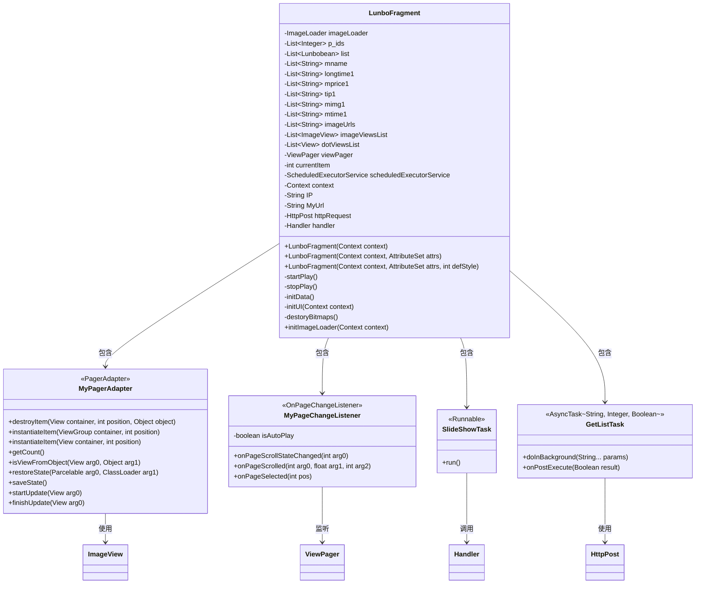
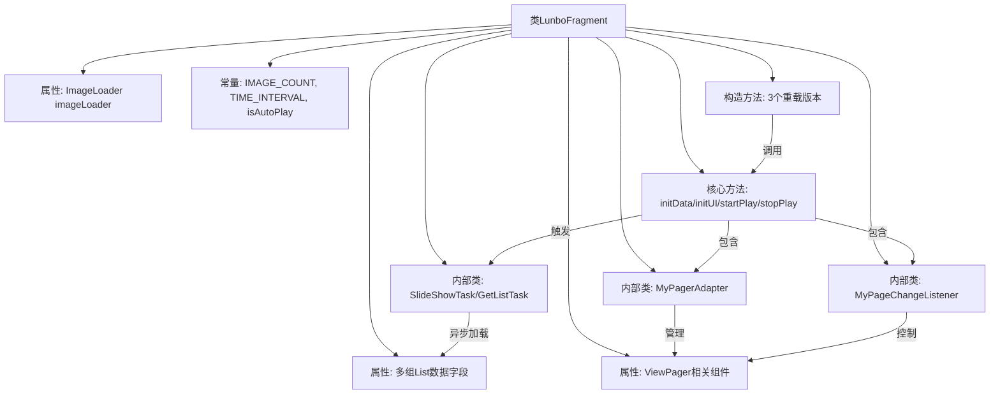

# 基础信息

|      |      |
|------|------|
| 名称 | LunboFragment |
| 编码语言 | .java |
| 代码路径 | happycat/src/com/happycay/fragments/LunboFragment.java |
| 包名 | com.happycay.fragments |
| 依赖项 | ['java.lang.reflect.Type', 'java.util.ArrayList', 'java.util.List', 'java.util.concurrent.Executors', 'java.util.concurrent.ScheduledExecutorService', 'java.util.concurrent.TimeUnit', 'org.apache.http.HttpResponse', 'org.apache.http.NameValuePair', 'org.apache.http.client.entity.UrlEncodedFormEntity', 'org.apache.http.client.methods.HttpPost', 'org.apache.http.impl.client.DefaultHttpClient', 'org.apache.http.message.BasicNameValuePair', 'org.apache.http.protocol.HTTP', 'org.apache.http.util.EntityUtils', 'org.json.JSONArray', 'org.json.JSONObject', 'com.example.happucat.R', 'com.google.gson.Gson', 'com.google.gson.reflect.TypeToken', 'com.happycat.MerchatDataActivity', 'com.happycat.Bean.Lunbobean', 'com.happycat.Bean.MerchatBean', 'com.happycat.util.MyApplication', 'com.lidroid.xutils.HttpUtils', 'com.lidroid.xutils.exception.HttpException', 'com.lidroid.xutils.http.ResponseInfo', 'com.lidroid.xutils.http.callback.RequestCallBack', 'com.lidroid.xutils.http.client.HttpRequest.HttpMethod', 'com.nostra13.universalimageloader.cache.disc.naming.Md5FileNameGenerator', 'com.nostra13.universalimageloader.core.ImageLoader', 'com.nostra13.universalimageloader.core.ImageLoaderConfiguration', 'com.nostra13.universalimageloader.core.assist.QueueProcessingType', 'android.content.Context', 'android.content.Intent', 'android.graphics.drawable.Drawable', 'android.os.AsyncTask', 'android.os.Bundle', 'android.os.Handler', 'android.os.Message', 'android.os.Parcelable', 'android.support.v4.view.PagerAdapter', 'android.support.v4.view.ViewPager', 'android.support.v4.view.ViewPager.OnPageChangeListener', 'android.util.AttributeSet', 'android.util.Log', 'android.view.LayoutInflater', 'android.view.View', 'android.view.ViewGroup', 'android.widget.FrameLayout', 'android.widget.ImageView', 'android.widget.ImageView.ScaleType', 'android.widget.LinearLayout'] |
| 概述说明 | LunboFragment是一个实现轮播图功能的Android自定义控件，包含自动轮播、点击跳转、圆点指示器等功能。通过AsyncTask异步获取网络图片数据，使用ViewPager展示图片，支持定时切换和手势滑动切换。图片加载采用Universal Image Loader库，并封装了相关配置。 |

# 说明

LunboFragment是一个实现轮播图功能的Android自定义控件，继承自FrameLayout。主要功能包括：通过ViewPager展示5张网络图片，支持自动轮播（间隔5秒）和手动滑动切换。控件使用universal-image-loader加载图片，并通过异步任务从服务器获取图片URL及相关商品数据（名称、价格、时间等）。轮播图底部有点状指示器，点击图片可跳转到商品详情页。核心组件包含ViewPager适配器、页面切换监听器、定时任务处理器，以及图片内存回收机制。服务器数据通过HTTP请求获取，图片路径需拼接IP地址。

# 类列表 Class Summary

| 名称   | 类型  | 说明 |
|-------|------|-------------|
| LunboFragment | class | LunboFragment实现轮播图功能，支持自动切换、点击跳转，使用universal-image-loader加载网络图片，通过异步任务获取数据并初始化UI。 |

## 类 LunboFragment

|      |      |
|------|------|
| 访问范围 | public |
| 类型 | class |
| 名称 | LunboFragment |
| 说明 | LunboFragment实现轮播图功能，支持自动切换、点击跳转，使用universal-image-loader加载网络图片，通过异步任务获取数据并初始化UI。 |

### UML类图

该代码实现了一个轮播图Fragment，主要功能包括：通过AsyncTask异步获取网络图片数据，使用ViewPager展示轮播图，支持自动轮播和手动滑动切换，通过圆点指示器显示当前页码。包含四个内部类：MyPagerAdapter处理页面适配，MyPageChangeListener监听页面切换，SlideShowTask实现自动轮播任务，GetListTask负责异步获取图片数据。整体采用MVC架构，数据获取与UI展示分离，具有良好的扩展性。

### 内部方法调用关系图

流程图描述：该流程图展示了LunboFragment轮播图组件的核心结构，包含初始化方法链、三个内部适配器类（页面适配器、滑动监听器和定时任务）以及数据加载流程。组件通过ViewPager实现图片轮播，结合定时任务自动切换，采用异步网络请求获取图片数据，并通过自定义监听器处理用户交互和自动轮播逻辑。

### 字段列表 Field List

| 名称  | 类型  | 说明 |
|-------|-------|------|
| handler = new Handler() {		@Override		public void handleMessage(Message msg) {			// TODO Auto-generated method stub			super.handleMessage(msg);			viewPager.setCurrentItem(currentItem);		}	} | Handler | 定义私有Handler对象，重写handleMessage方法，在收到消息时将viewPager切换到currentItem位置。 |
| IP = MyApplication.getIp() | String | 获取IP地址并赋值给私有字符串变量IP。 |
| mimg1 | List<String> | 私有字符串列表mimg1 |
| httpRequest = new HttpPost(MyUrl) | HttpPost | 创建HTTP POST请求对象，目标URL为MyUrl。 |
| list = new ArrayList<Lunbobean>() | List<Lunbobean> | 创建了一个名为list的ArrayList，用于存储Lunbobean类型对象。 |
| isAutoPlay = true | boolean | 私有静态常量isAutoPlay，值为true，表示自动播放开启。 |
| imageViewsList | List<ImageView> | 私有图像视图列表变量imageViewsList，类型为List<ImageView>。 |
| context | Context | 私有上下文变量context。 |
| longtime1 | List<String> | 声明一个私有字符串列表longtime1。 |
| TIME_INTERVAL = 5 | int | 私有静态常量TIME_INTERVAL值为5。 |
| tip1 | List<String> | 私有字符串列表tip1 |
| mname | List<String> | 私有字符串列表变量mname。 |
| imageUrls | List<String> | 私有字符串列表，存储图片URL。 |
| scheduledExecutorService | ScheduledExecutorService | 私有定时任务执行服务变量。 |
| imageLoader = ImageLoader.getInstance() | ImageLoader | 初始化ImageLoader单例实例。 |
| dotViewsList | List<View> | 私有视图列表存储点视图对象。 |
| currentItem = 0 | int | 私有整型变量currentItem初始化为0。 |
| p_ids | List<Integer> | 私有整数列表p_ids。 |
| mtime1 | List<String> | 私有字符串列表变量mtime1。 |
| mprice1 | List<String> | 私有字符串列表变量mprice1。 |
| MyUrl = "http://" + IP + ":8080/happycat/GetUpload" | String | 定义字符串变量MyUrl，值为拼接的HTTP URL，包含IP和固定路径/happycat/GetUpload，端口8080。 |
| viewPager | ViewPager | 私有视图分页控件viewPager。 |
| IMAGE_COUNT = 5 | int | 定义私有静态常量IMAGE_COUNT，值为5。 |

### 方法列表 Method List

| 名称  | 类型  | 说明 |
|-------|-------|------|
| initUI | void | 初始化轮播图UI，检查图片URL非空后加载布局，动态创建图片视图和指示点，设置适配器和页面切换监听。 |
| initData | void | 初始化数据方法：创建多个空列表存储ID、图片视图、URL等，并启动异步任务获取数据。 |
| startPlay | void | 启动定时任务，单线程执行SlideShowTask，初始延迟1秒，间隔4秒。 |
| destoryBitmaps | void | 销毁位图资源：遍历图片视图列表，解除每个视图的Drawable引用，防止内存泄漏。 |
| initImageLoader | void | 初始化图片加载器配置：设置线程优先级、禁止缓存多尺寸图片、使用MD5生成缓存文件名、任务处理顺序为后进先出、启用调试日志，并初始化ImageLoader实例。 |
| stopPlay | void | 停止播放时关闭定时任务执行服务。 |

