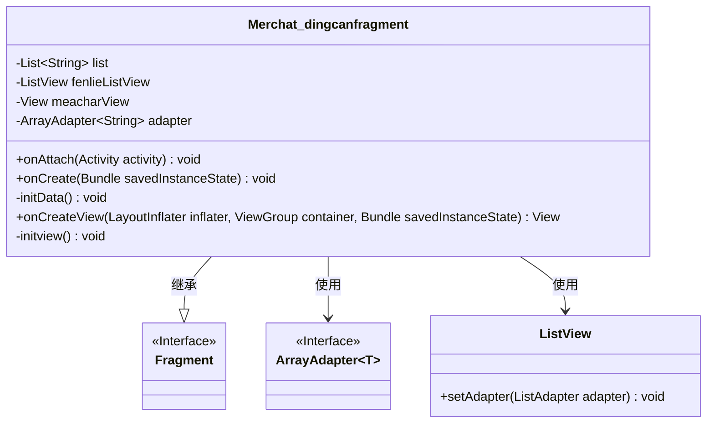
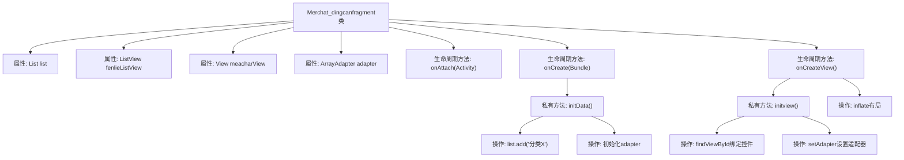

# 基础信息

|      |      |
|------|------|
| 名称 | Merchat_dingcanfragment |
| 编码语言 | .java |
| 代码路径 | happycat/src/com/happycay/fragments/Merchat_dingcanfragment.java |
| 包名 | com.happycay.fragments |
| 依赖项 | ['java.util.ArrayList', 'java.util.List', 'com.example.happucat.R', 'android.R.string', 'android.app.Activity', 'android.os.Bundle', 'android.support.v4.app.Fragment', 'android.view.LayoutInflater', 'android.view.View', 'android.view.ViewGroup', 'android.widget.ArrayAdapter', 'android.widget.ListView'] |
| 概述说明 | Android Fragment类Merchat_dingcanfragment实现，初始化数据列表并绑定到ListView，包含分类数据加载和视图初始化逻辑。 |

# 说明

该代码定义了一个名为Merchat_dingcanfragment的Fragment类，用于显示商家点餐分类列表。类中初始化了一个包含六个分类字符串的ArrayList，并通过ArrayAdapter适配器将数据绑定到ListView控件上。Fragment生命周期方法包括onAttach、onCreate和onCreateView，其中onCreateView负责加载布局并初始化视图。initData方法填充列表数据，initview方法完成ListView的适配器设置。整体实现了一个简单的分类列表展示功能。

# 类列表 Class Summary

| 名称   | 类型  | 说明 |
|-------|------|-------------|
| Merchat_dingcanfragment | class | Android Fragment类Merchat_dingcanfragment实现，初始化数据列表并绑定到ListView适配器显示。 |

## 类 Merchat_dingcanfragment

|      |      |
|------|------|
| 访问范围 | public |
| 类型 | class |
| 名称 | Merchat_dingcanfragment |
| 说明 | Android Fragment类Merchat_dingcanfragment实现，初始化数据列表并绑定到ListView适配器显示。 |

### UML类图

这段代码描述了一个Android Fragment类`Merchat_dingcanfragment`，它继承自`Fragment`基类，主要用于显示一个包含分类列表的界面。类中包含私有成员变量：字符串列表`list`、列表视图`fenlieListView`、根视图`meacharView`和字符串数组适配器`adapter`。主要方法包括生命周期回调方法`onAttach`、`onCreate`和`onCreateView`，以及私有方法`initData`（初始化列表数据）和`initview`（初始化视图并设置适配器）。该类通过`ArrayAdapter`将数据绑定到`ListView`上显示。

### 内部方法调用关系图

这段代码描述了一个Android Fragment的实现，主要用于显示餐饮分类列表。流程图展示了从Fragment生命周期开始，依次初始化数据列表、创建适配器、加载布局视图，最终将适配器绑定到ListView的完整过程。关键步骤包括通过initData()方法填充分类数据，在onCreateView中加载布局，并通过initview()完成视图控件的初始化和数据绑定。整个过程遵循Android组件的标准生命周期管理。

### 字段列表 Field List

| 名称  | 类型  | 说明 |
|-------|-------|------|
| fenlieListView | ListView | 列表视图控件fenlieListView。 |
| list= new ArrayList<String>() | List<String> | 创建字符串类型的动态数组列表。 |
| meacharView | View | 视图界面对象，用于展示或操作数据。 |
| adapter | ArrayAdapter<String> | 定义字符串数组适配器adapter。 |

### 方法列表 Method List

| 名称  | 类型  | 说明 |
|-------|-------|------|
| initData | void | 初始化数据方法，添加六个分类项到列表并设置适配器。 |
| onCreateView | View | Android Fragment的onCreateView方法，通过inflater加载布局merchat_dingcan，初始化视图后返回。 |
| onCreate | void | Android Activity生命周期方法onCreate，调用父类方法并初始化数据。 |
| onAttach | void | 重写Fragment的onAttach方法，调用父类实现并关联Activity上下文。 |
| initview | void | 初始化视图方法，设置列表视图并绑定适配器。 |

