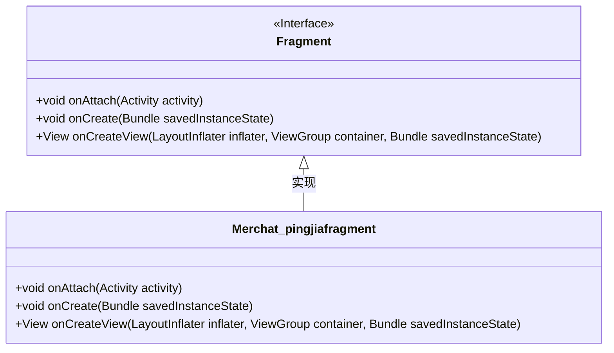
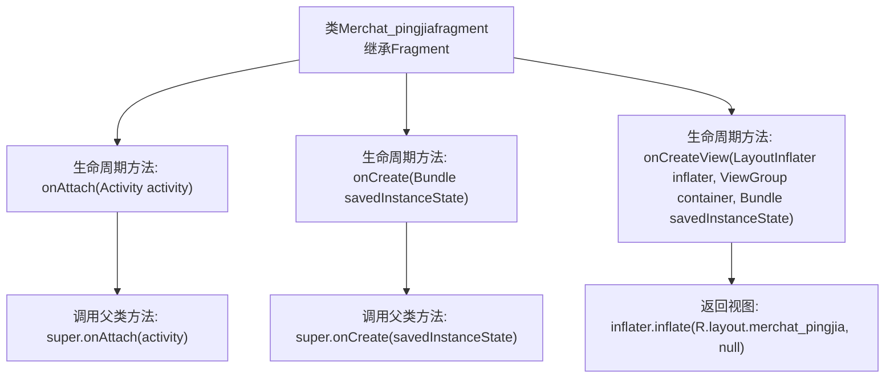

# 基础信息

|      |      |
|------|------|
| 名称 | Merchat_pingjiafragment |
| 编码语言 | .java |
| 代码路径 | happycat/src/com/happycay/fragments/Merchat_pingjiafragment.java |
| 包名 | com.happycay.fragments |
| 依赖项 | ['com.example.happucat.R', 'android.app.Activity', 'android.os.Bundle', 'android.support.v4.app.Fragment', 'android.view.LayoutInflater', 'android.view.View', 'android.view.ViewGroup'] |
| 概述说明 | Merchat_pingjiafragment继承Fragment类，重写onAttach、onCreate和onCreateView方法，加载merchat_pingjia布局。 |

# 说明

该内容描述了一个名为Merchat_pingjiafragment的Android Fragment类。该类继承自Fragment，重写了三个生命周期方法：onAttach在Fragment与Activity关联时调用，onCreate在Fragment创建时初始化，onCreateView用于加载并返回布局文件merchat_pingjia.xml的视图。所有方法都调用了父类实现，未添加额外功能。

# 类列表 Class Summary

| 名称   | 类型  | 说明 |
|-------|------|-------------|
| Merchat_pingjiafragment | class | Merchat_pingjiafragment继承Fragment类，重写onAttach、onCreate和onCreateView方法，其中onCreateView加载merchat_pingjia布局。 |

## 类 Merchat_pingjiafragment

|      |      |
|------|------|
| 访问范围 | public |
| 类型 | class |
| 名称 | Merchat_pingjiafragment |
| 说明 | Merchat_pingjiafragment继承Fragment类，重写onAttach、onCreate和onCreateView方法，其中onCreateView加载merchat_pingjia布局。 |

### UML类图

这段代码展示了一个Android Fragment的实现类Merchat_pingjiafragment，它继承自基础Fragment类并重写了三个关键生命周期方法：onAttach()用于关联Activity，onCreate()用于初始化，onCreateView()用于创建界面布局。类图清晰地显示了继承关系和接口实现，其中Fragment作为接口标记，Merchat_pingjiafragment作为具体实现类，通过重写方法完成特定功能。该结构体现了Android组件化开发中Fragment的标准使用模式。

### 内部方法调用关系图

该流程图描述了Merchat_pingjiafragment类的核心生命周期方法调用关系。作为Fragment的子类，它重写了三个关键方法：onAttach()在关联Activity时调用父类实现；onCreate()在创建时初始化数据；onCreateView()通过布局填充器返回merchat_pingjia.xml对应的视图。箭头清晰展示了从类定义到各方法实现，再到内部具体操作的层级调用流程，体现了Android Fragment的标准生命周期管理逻辑。

### 字段列表 Field List

| 名称  | 类型  | 说明 |
|-------|-------|------|

### 方法列表 Method List

| 名称  | 类型  | 说明 |
|-------|-------|------|
| onAttach | void | 重写onAttach方法，调用父类实现。 |
| onCreate | void | Android Activity生命周期方法onCreate，调用父类初始化并预留待办注释。 |
| onCreateView | View | 重写onCreateView方法，使用inflater加载布局merchat_pingjia并返回视图。 |

