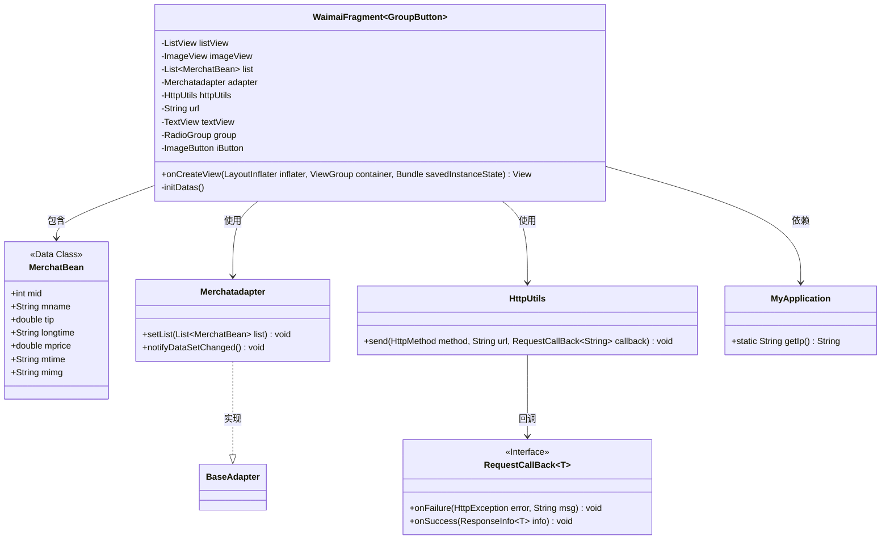
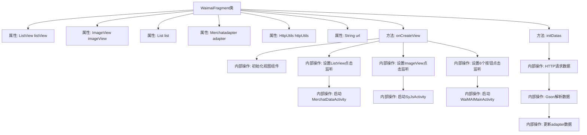

# 基础信息

|      |      |
|------|------|
| 名称 | WaimaiFragment |
| 编码语言 | .java |
| 代码路径 | happycat/src/com/happycay/fragments/WaimaiFragment.java |
| 包名 | com.happycay.fragments |
| 依赖项 | ['java.lang.reflect.Type', 'java.util.ArrayList', 'java.util.List', 'com.example.happucat.R', 'com.example.happucat.R.layout', 'com.google.gson.Gson', 'com.google.gson.reflect.TypeToken', 'com.happycat.MainActivity', 'com.happycat.MerchatDataActivity', 'com.happycat.SyJsActivity', 'com.happycat.WaiMAIMainActivity', 'com.happycat.Bean.Goods', 'com.happycat.Bean.MerchatBean', 'com.happycat.adapter.Merchatadapter', 'com.happycat.adapter.Myadapter', 'com.happycat.util.MyApplication', 'com.lidroid.xutils.HttpUtils', 'com.lidroid.xutils.bitmap.PauseOnScrollListener', 'com.lidroid.xutils.exception.HttpException', 'com.lidroid.xutils.http.RequestParams', 'com.lidroid.xutils.http.ResponseInfo', 'com.lidroid.xutils.http.callback.RequestCallBack', 'com.lidroid.xutils.http.client.HttpRequest.HttpMethod', 'android.R.raw', 'android.app.Activity', 'android.content.Intent', 'android.opengl.Visibility', 'android.os.Bundle', 'android.support.v4.app.Fragment', 'android.support.v4.app.FragmentManager', 'android.support.v4.app.FragmentTransaction', 'android.text.StaticLayout', 'android.util.Log', 'android.view.LayoutInflater', 'android.view.View', 'android.view.View.OnClickListener', 'android.view.ViewGroup', 'android.widget.AdapterView', 'android.widget.ImageButton', 'android.widget.ImageView', 'android.widget.ListView', 'android.widget.RadioGroup', 'android.widget.AdapterView.OnItemClickListener', 'android.widget.RadioGroup.OnCheckedChangeListener', 'android.widget.TextView'] |
| 概述说明 | 外卖Fragment实现列表展示与点击跳转，包含数据加载、分类筛选及详情页传参功能。 |

# 说明

该代码定义了一个名为WaimaiFragment的Android Fragment类，主要用于实现外卖功能界面。Fragment初始化时加载布局并设置ListView，包含商家列表展示和点击跳转功能。ListView的每个项点击后会携带商家信息跳转到MerchatDataActivity。界面还包含多个分类按钮（如品牌快餐、早餐等），点击不同按钮会携带不同URL参数跳转到WaiMAIMainActivity。Fragment通过HTTP请求获取商家数据，使用Gson解析JSON并更新列表。若数据加载失败会显示错误提示。整体实现了外卖商家的分类展示和详情跳转功能。

# 类列表 Class Summary

| 名称   | 类型  | 说明 |
|-------|------|-------------|
| WaimaiFragment | class | 外卖Fragment类，包含列表视图和点击事件处理，通过HTTP请求获取商家数据并展示，支持分类跳转和详情页导航。 |

## 类 WaimaiFragment

|      |      |
|------|------|
| 访问范围 | public |
| 类型 | class |
| 名称 | WaimaiFragment |
| 说明 | 外卖Fragment类，包含列表视图和点击事件处理，通过HTTP请求获取商家数据并展示，支持分类跳转和详情页导航。 |

### UML类图

该代码是一个Android外卖模块的Fragment实现，主要功能包括：通过HTTP请求获取商家数据、展示列表视图、处理用户点击事件。类图展示了核心组件关系，包含数据适配器Merchatadapter、网络工具HttpUtils、回调接口RequestCallBack等关键类。WaimaiFragment通过组合方式管理这些组件，实现商家数据的获取、展示和交互功能，同时依赖MyApplication获取服务器IP地址。整体采用典型的MVP模式结构，通过回调机制处理异步网络请求结果。

### 内部方法调用关系图

这段代码是Android外卖模块的Fragment实现，主要功能包括：1) 初始化视图组件并设置各种点击监听；2) 处理ListView项点击跳转商家详情页；3) 响应通知图标跳转；4) 实现6个分类按钮的点击事件；5) 通过HTTP请求获取商家数据并用Gson解析。流程图清晰展示了从视图初始化到数据加载的完整流程，突出了多个事件监听器和异步网络请求的处理路径。

### 字段列表 Field List

| 名称  | 类型  | 说明 |
|-------|-------|------|
| iButton | ImageButton | 图像按钮控件iButton。 |
| textView | TextView | 定义TextView控件变量textView。 |
| listView | ListView | 声明一个名为listView的ListView控件实例。 |
| imageView | ImageView | 显示图片视图控件。 |
| list = new ArrayList<MerchatBean>() | List<MerchatBean> | 创建一个MerchatBean类型的动态数组列表。 |
| group | RadioGroup | 单选按钮组组件，用于创建一组互斥的单选选项。 |
| adapter | Merchatadapter | 商户适配器实例。 |
| url | String | 私有字符串变量url |
| httpUtils | HttpUtils | 声明一个HttpUtils类型的变量httpUtils。 |

### 方法列表 Method List

| 名称  | 类型  | 说明 |
|-------|-------|------|
| onCreateView | View | 代码实现外卖界面功能，包括列表点击跳转、按钮点击跳转及空视图处理。列表项点击传递商户数据，按钮点击跳转不同分类页。 |
| initDatas | void | 初始化数据方法：创建适配器并设置列表视图，通过HTTP GET请求获取商户数据，使用Gson解析JSON并更新适配器。 |

