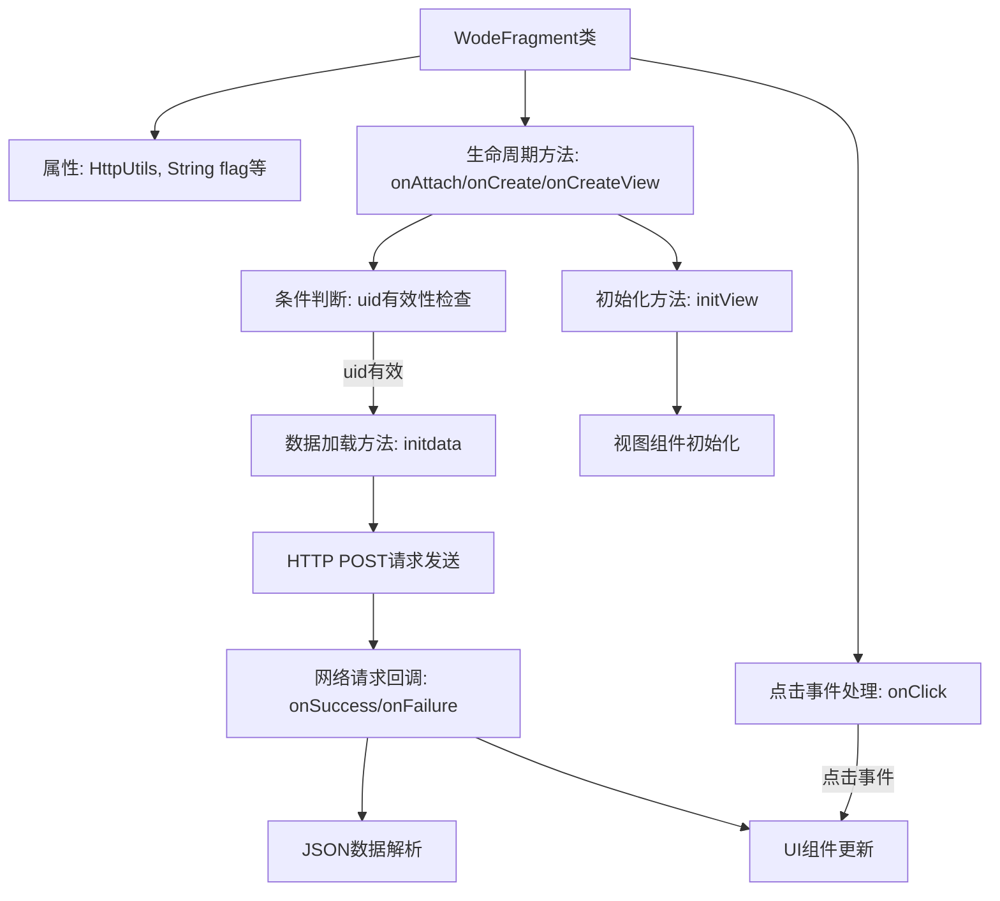

# 基础信息

|      |      |
|------|------|
| 名称 | WodeFragment |
| 编码语言 | .java |
| 代码路径 | happycat/src/com/happycay/fragments/WodeFragment.java |
| 包名 | com.happycay.fragments |
| 依赖项 | ['java.lang.reflect.Type', 'java.util.LinkedList', 'java.util.List', 'com.example.happucat.R', 'com.google.gson.Gson', 'com.google.gson.reflect.TypeToken', 'com.happycat.AddAddressActivity', 'com.happycat.AddressActivity', 'com.happycat.LoginActivity', 'com.happycat.MerchatDataActivity', 'com.happycat.MyCollectionActivity', 'com.happycat.MyinstallActivity', 'com.happycat.OrderActivity', 'com.happycat.QieHuanLoginActivity', 'com.happycat.ShareActivity', 'com.happycat.UserActivity', 'com.happycat.WalletActivity', 'com.happycat.Bean.MyShouYeBean', 'com.happycat.util.MyApplication', 'com.lidroid.xutils.HttpUtils', 'com.lidroid.xutils.exception.HttpException', 'com.lidroid.xutils.http.RequestParams', 'com.lidroid.xutils.http.ResponseInfo', 'com.lidroid.xutils.http.callback.RequestCallBack', 'com.lidroid.xutils.http.client.HttpRequest.HttpMethod', 'android.app.Activity', 'android.content.Intent', 'android.os.Bundle', 'android.support.v4.app.Fragment', 'android.util.Log', 'android.view.LayoutInflater', 'android.view.View', 'android.view.ViewGroup', 'android.view.View.OnClickListener', 'android.widget.ImageButton', 'android.widget.ImageView', 'android.widget.RelativeLayout', 'android.widget.TextView'] |
| 概述说明 | 这是一个Android Fragment类，实现用户个人中心功能，包含用户信息展示、收藏、订单、钱包、设置、分享和地址管理等模块，通过HTTP请求获取用户数据并处理点击事件跳转不同页面。 |

# 说明

该代码定义了一个名为WodeFragment的Android Fragment类，主要用于实现用户个人中心功能。Fragment包含多个RelativeLayout控件，分别对应收藏、钱包、订单、设置、资料、分享、地址和登录注册等功能模块。通过HttpUtils进行网络请求，从服务器获取用户数据并显示，包括用户头像、性别、昵称和账号等信息。根据用户ID判断是否已登录，未登录则显示登录界面。实现了OnClickListener接口处理各功能模块的点击事件，点击后跳转到对应Activity页面。代码中还包含视图初始化和数据初始化方法，使用Gson解析服务器返回的JSON数据。

# 类列表 Class Summary

| 名称   | 类型  | 说明 |
|-------|------|-------------|
| WodeFragment | class | Android Fragment实现个人中心页面，包含用户信息展示、收藏、订单、钱包、设置、分享等功能模块，通过HTTP请求获取用户数据并处理点击事件跳转对应页面。 |


## 类 WodeFragment

|      |      |
|------|------|
| 访问范围 | public |
| 类型 | class |
| 名称 | WodeFragment |
| 说明 | Android Fragment实现个人中心页面，包含用户信息展示、收藏、订单、钱包、设置、分享等功能模块，通过HTTP请求获取用户数据并处理点击事件跳转对应页面。 |


### UML类图

```mermaid
classDiagram
    class WodeFragment {
        -HttpUtils httpUtils
        -String flag
        -List~MyShouYeBean~ mlist
        -TextView ncTextView
        -TextView sexTextView
        -TextView zhTextView
        -ImageView Button
        -WodeFragment fragment
        -String url
        -View myLayout
        -ImageButton loginButton
        -RelativeLayout rl_shoucang
        -RelativeLayout rl_qianbao
        -RelativeLayout rl_dingdan
        -RelativeLayout rl_shezhi
        -RelativeLayout rl_ziliao
        -RelativeLayout rl_fenxiang
        -RelativeLayout rl_login
        -RelativeLayout rl_dizhi
        -String uid
        +onAttach(Activity activity) void
        +onCreate(Bundle savedInstanceState) void
        +onCreateView(LayoutInflater inflater, ViewGroup container, Bundle savedInstanceState) View
        -initdata() void
        -initView() void
        +onClick(View v) void
    }

    <<Interface>> OnClickListener {
        +onClick(View v) void
    }

    class MyShouYeBean {
        // 假设有相关属性和方法
    }

    class HttpUtils {
        +send(HttpMethod method, String url, RequestParams params, RequestCallBack~String~ callback) void
    }

    class RequestParams {
        +addBodyParameter(String key, String value) void
    }

    class RequestCallBack~R~ {
        <<Interface>>
        +onSuccess(ResponseInfo~R~ responseInfo) void
        +onFailure(HttpException error, String msg) void
    }

    WodeFragment --|> Fragment
    WodeFragment ..|> OnClickListener
    WodeFragment --> HttpUtils : 使用
    WodeFragment --> RequestParams : 使用
    WodeFragment --> RequestCallBack~String~ : 回调
    WodeFragment --> MyShouYeBean : 包含数据
```

这段类图描述了一个Android的Fragment类WodeFragment，它实现了OnClickListener接口用于处理点击事件。该类主要功能包括初始化视图(initView)、加载数据(initdata)以及处理用户交互(onClick)。通过HttpUtils进行网络请求，使用RequestParams构建请求参数，并通过RequestCallBack处理响应结果。该类与多个Activity（如LoginActivity、UserActivity等）存在隐式关联，通过Intent进行跳转。整体结构展示了典型的Android Fragment实现模式，包含生命周期管理、视图操作和事件处理机制。


### 内部方法调用关系图



这段代码是Android Fragment的实现类，主要处理用户个人中心页面的逻辑。流程图展示了从Fragment生命周期开始，经过视图初始化、数据加载、网络请求到最终UI更新的完整流程。核心功能包括：1) 通过HttpUtils发送POST请求获取用户数据；2) 使用Gson解析JSON响应；3) 根据用户性别动态设置头像；4) 处理多个RelativeLayout的点击事件，跳转到不同功能页面。特别注意uid有效性检查和网络请求失败的处理逻辑。

### 字段列表 Field List

| 名称  | 类型  | 说明 |
|-------|-------|------|
| rl_shoucang | RelativeLayout | 私有相对布局控件rl_shoucang |
| rl_qianbao | RelativeLayout | 私有相对布局控件rl_qianbao |
| rl_shezhi | RelativeLayout | 私有相对布局控件rl_shezhi |
| flag = "" | String | 声明一个名为flag的字符串变量，初始值为空。 |
| loginButton | ImageButton | 声明一个私有ImageButton变量loginButton。 |
| zhTextView | TextView | 定义三个TextView变量：ncTextView、sexTextView、zhTextView。 |
| rl_ziliao | RelativeLayout | 私有相对布局控件rl_ziliao |
| httpUtils | HttpUtils | 声明一个HttpUtils类型的变量httpUtils。 |
| mlist | List<MyShouYeBean> | 定义了一个名为mlist的列表，存储MyShouYeBean类型的数据。 |
| url | String | 私有字符串变量url |
| fragment | WodeFragment | 该片段定义了一个名为WodeFragment的变量或类片段，具体用途需结合上下文代码确定。 |
| uid=MyApplication.SP_user_id+"" | String | 代码片段定义字符串变量uid，值为应用全局变量SP_user_id转为字符串的结果。 |
| Button | ImageView | 图像视图按钮 |
| rl_login | RelativeLayout | 定义私有RelativeLayout控件rl_login。 |
| rl_fenxiang | RelativeLayout | 私有相对布局控件rl_fenxiang |
| rl_dingdan | RelativeLayout | 私有相对布局控件rl_dingdan |
| rl_dizhi | RelativeLayout | 私有相对布局控件rl_dizhi |
| myLayout | View | 私有视图变量myLayout。 |

### 方法列表 Method List

| 名称  | 类型  | 说明 |
|-------|-------|------|
| onCreateView | View | 重写onCreateView方法，初始化布局和视图，根据uid条件调用initdata，返回布局。 |
| initdata | void | 方法initdata通过HTTP POST请求获取用户数据，解析JSON响应并更新UI，包括头像、性别图标和账号昵称显示，处理失败时记录日志。 |
| initView | void | 初始化界面视图，绑定多个文本、按钮和布局控件，并设置点击监听器。 |
| onClick | void | 代码实现点击事件处理，根据不同按钮跳转对应页面：登录、用户中心、收藏、订单、钱包、设置、分享、地址等。 |
| onCreate | void | Android Activity生命周期方法，调用父类onCreate初始化界面。 |
| onAttach | void | 重写onAttach方法，调用父类实现并预留待办注释。 |


