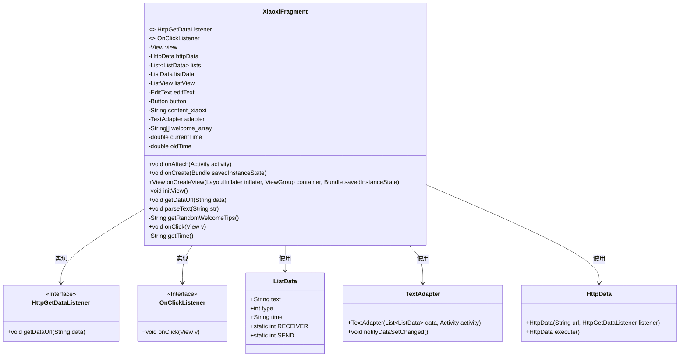
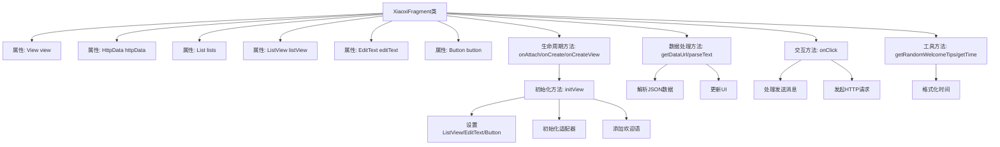

# 基础信息

|      |      |
|------|------|
| 名称 | XiaoxiFragment |
| 编码语言 | .java |
| 代码路径 | happycat/src/com/happycay/fragments/XiaoxiFragment.java |
| 包名 | com.happycay.fragments |
| 依赖项 | ['java.text.SimpleDateFormat', 'java.util.ArrayList', 'java.util.Date', 'java.util.List', 'org.json.JSONObject', 'com.example.happucat.R', 'com.happycat.tuling.HttpData', 'com.happycat.tuling.HttpGetDataListener', 'com.happycat.tuling.ListData', 'com.happycat.tuling.TextAdapter', 'android.app.Activity', 'android.os.Bundle', 'android.support.v4.app.Fragment', 'android.view.LayoutInflater', 'android.view.View', 'android.view.View.OnClickListener', 'android.view.ViewGroup', 'android.widget.Button', 'android.widget.EditText', 'android.widget.ListView'] |
| 概述说明 | XiaoxiFragment实现聊天功能，包含消息发送、接收、显示及时间处理，使用ListView和适配器管理消息列表，支持随机欢迎语和网络数据获取。 |

# 说明

XiaoxiFragment是一个继承Fragment的类，实现了HttpGetDataListener和OnClickListener接口。主要功能包括初始化视图组件如ListView、EditText和Button，处理用户输入消息并发送到指定URL，接收并解析返回的JSON数据。类中包含欢迎语数组，随机显示欢迎提示，记录消息时间戳，限制消息列表不超过30条，并通过TextAdapter更新UI。消息处理包括去除空格和换行符，时间格式化显示间隔超过5分钟才更新。通过HttpData异步获取网络数据并回调解析结果。

# 类列表 Class Summary

| 名称   | 类型  | 说明 |
|-------|------|-------------|
| XiaoxiFragment | class | XiaoxiFragment实现消息发送与接收功能，包含随机欢迎语、时间显示、消息列表管理和网络请求处理。 |

## 类 XiaoxiFragment

|      |      |
|------|------|
| 访问范围 | public |
| 类型 | class |
| 名称 | XiaoxiFragment |
| 说明 | XiaoxiFragment实现消息发送与接收功能，包含随机欢迎语、时间显示、消息列表管理和网络请求处理。 |

### UML类图

这段代码展示了一个Android Fragment类`XiaoxiFragment`，它实现了`HttpGetDataListener`和`OnClickListener`接口，用于处理HTTP数据获取和点击事件。主要功能包括初始化视图、解析JSON数据、随机生成欢迎语、处理用户输入消息并通过HTTP请求发送。类图中清晰展示了各组件间的依赖关系，如`TextAdapter`用于列表数据适配，`HttpData`处理网络请求，`ListData`存储消息数据。整体设计遵循Android组件化思想，通过接口实现松耦合。

### 内部方法调用关系图

这段代码实现了一个Android聊天界面Fragment，主要功能包括：初始化视图组件、处理HTTP数据响应、解析JSON消息、管理聊天列表数据、实现发送按钮点击事件，以及时间格式化等辅助功能。流程图展示了类属性与核心方法的调用关系，重点突出了视图初始化、数据交互和用户操作的处理流程，其中HTTP请求和列表更新形成闭环交互。

### 字段列表 Field List

| 名称  | 类型  | 说明 |
|-------|-------|------|
| content_xiaoxi | String | 私有字符串变量content_xiaoxi。 |
| editText | EditText | 私有EditText控件editText。 |
| listView | ListView | 代码定义了一个私有ListView类型的变量listView。 |
| oldTime=0 | double | 声明两个double变量：currentTime和oldTime（初始值为0）。 |
| view | View | 私有视图变量声明。 |
| welcome_array | String [] | 声明一个私有字符串数组变量welcome_array。 |
| listData | ListData | 声明一个私有变量listData，类型为ListData。 |
| button | Button | 私有按钮变量button。 |
| lists | List<ListData> | 私有列表变量lists，存储ListData类型元素的集合。 |
| adapter | TextAdapter | 声明一个私有的TextAdapter类型变量adapter。 |
| httpData | HttpData | 私有HttpData类型变量httpData。 |

### 方法列表 Method List

| 名称  | 类型  | 说明 |
|-------|-------|------|
| onClick | void | 点击事件处理：获取时间、消息内容并清空输入框，去除空格和回车后存入列表。列表超过30条时清理，刷新适配器并发送HTTP请求到图灵API。 |
| onAttach | void | 重写onAttach方法，调用父类实现。 |
| initView | void | 初始化视图组件：获取ListView、EditText和Button实例，创建消息列表并设置适配器，添加欢迎消息。 |
| getRandomWelcomeTips | String | 该方法从资源数组随机获取欢迎语并返回。 |
| getTime | String | 方法getTime返回当前时间字符串，格式为"yyyy年MM月dd日 hh:mm:ss"。若当前时间与旧时间差超过5分钟，则返回时间字符串，否则返回空字符串。 |
| onCreateView | View | 重写onCreateView方法，加载布局xiaoxi，初始化视图并返回。 |
| getDataUrl | void | 重写getDataUrl方法，接收data参数并输出，调用parseText处理数据。 |
| parseText | void | 解析JSON字符串并封装数据到列表，更新适配器。异常时打印堆栈。 |
| onCreate | void | Android生命周期方法，初始化Activity时调用父类onCreate。 |

