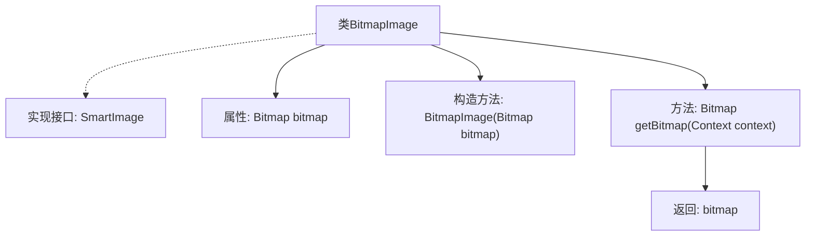

# 基础信息

|      |      |
|------|------|
| 名称 | BitmapImage |
| 编码语言 | .java |
| 代码路径 | happycat/src/image/BitmapImage.java |
| 包名 | None |
| 依赖项 | ['android.content.Context', 'android.graphics.Bitmap'] |
| 概述说明 | BitmapImage类实现SmartImage接口，封装Bitmap对象，提供获取Bitmap的方法。 |

# 说明

这是一个名为BitmapImage的类，实现了SmartImage接口。类中包含一个私有Bitmap类型成员变量bitmap。构造函数接收Bitmap参数并赋值给成员变量。提供了一个getBitmap方法，接收Context参数并返回bitmap对象。该类主要用于封装Bitmap对象并提供访问接口。

# 类列表 Class Summary

| 名称   | 类型  | 说明 |
|-------|------|-------------|
| BitmapImage | class | BitmapImage类实现SmartImage接口，包含Bitmap对象，通过构造函数初始化，提供获取Bitmap的方法。 |


## 类 BitmapImage

|      |      |
|------|------|
| 访问范围 | public |
| 类型 | class |
| 名称 | BitmapImage |
| 说明 | BitmapImage类实现SmartImage接口，包含Bitmap对象，通过构造函数初始化，提供获取Bitmap的方法。 |


### UML类图

```mermaid
classDiagram
    class BitmapImage {
        -Bitmap bitmap
        +BitmapImage(Bitmap bitmap)
        +Bitmap getBitmap(Context context) 
    }
    <<Interface>> SmartImage {
        +Bitmap getBitmap(Context context)
    }
    BitmapImage ..|> SmartImage : 实现
```

这段类图展示了BitmapImage类与SmartImage接口的关系。BitmapImage实现了SmartImage接口，包含一个私有Bitmap类型字段bitmap，通过构造函数初始化，并提供了获取bitmap的公有方法getBitmap。SmartImage作为接口定义了统一的图像获取规范，BitmapImage通过实现该接口确保对外提供一致的图像访问能力。类图清晰地体现了接口与实现类之间的"实现"关系，符合面向对象设计原则。


### 内部方法调用关系图



该流程图展示了BitmapImage类的结构，该类实现了SmartImage接口。主要包含一个Bitmap类型的私有属性bitmap，通过构造方法初始化该属性，并提供一个getBitmap方法返回该bitmap对象。整个流程清晰地描述了类的组成和方法的调用关系，从类声明到接口实现，再到属性定义和方法实现，最后到方法返回值的完整路径。

### 字段列表 Field List

| 名称  | 类型  | 说明 |
|-------|-------|------|
| bitmap | Bitmap | 私有位图对象bitmap。 |

### 方法列表 Method List

| 名称  | 类型  | 说明 |
|-------|-------|------|
| getBitmap | Bitmap | 这是一个Java方法，返回一个Bitmap对象。方法接受Context参数，直接返回成员变量bitmap。 |


