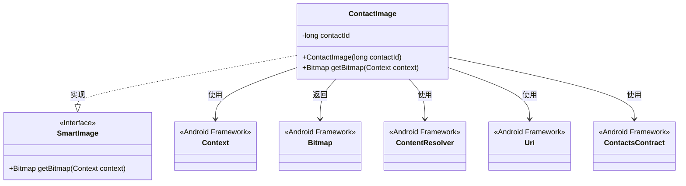
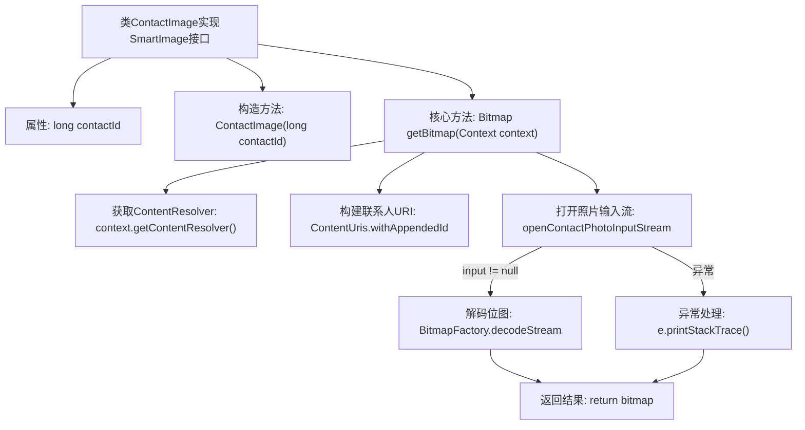

# 基础信息

|      |      |
|------|------|
| 名称 | ContactImage |
| 编码语言 | .java |
| 代码路径 | happycat/src/image/ContactImage.java |
| 包名 | None |
| 依赖项 | ['java.io.InputStream', 'android.content.ContentUris', 'android.content.ContentResolver', 'android.content.Context', 'android.provider.ContactsContract', 'android.graphics.Bitmap', 'android.graphics.BitmapFactory', 'android.net.Uri'] |
| 概述说明 | ContactImage类实现SmartImage接口，通过contactId获取联系人照片的Bitmap。构造函数接收contactId，getBitmap方法使用ContentResolver查询联系人照片并解码为Bitmap，异常时返回null。 |

# 说明

该代码定义了一个名为ContactImage的类，实现了SmartImage接口。类中包含一个长整型变量contactId，通过构造函数初始化。核心功能是通过getBitmap方法获取联系人头像的位图：根据contactId构造联系人URI，使用ContentResolver打开联系人照片输入流，若存在则解码为Bitmap对象返回。异常处理采用打印堆栈跟踪方式。整个过程涉及Android的联系人内容提供者API。

# 类列表 Class Summary

| 名称   | 类型  | 说明 |
|-------|------|-------------|
| ContactImage | class | ContactImage类实现SmartImage接口，通过contactId获取联系人头像的Bitmap。构造函数接收contactId，getBitmap方法使用ContentResolver查询并返回头像。 |

## 类 ContactImage

|      |      |
|------|------|
| 访问范围 | public |
| 类型 | class |
| 名称 | ContactImage |
| 说明 | ContactImage类实现SmartImage接口，通过contactId获取联系人头像的Bitmap。构造函数接收contactId，getBitmap方法使用ContentResolver查询并返回头像。 |

### UML类图

类图描述：ContactImage类实现了SmartImage接口，用于根据联系人ID获取联系人头像的Bitmap。它依赖Android框架的Context、ContentResolver、Uri和ContactsContract类来完成联系人数据库查询和图片解码操作。核心方法getBitmap()通过内容解析器获取联系人照片流，并使用BitmapFactory解码为位图，整个过程包含异常处理机制。

### 内部方法调用关系图

这段代码流程图展示了ContactImage类的工作流程，该类用于获取Android系统联系人的照片。从构造方法初始化contactId开始，到通过ContentResolver查询联系人数据库，构建特定联系人的URI并尝试打开照片输入流。如果成功获取输入流则解码为位图，无论成功或异常最终都返回位图对象。整个过程体现了Android内容提供者机制的使用和基本的异常处理逻辑。

### 字段列表 Field List

| 名称  | 类型  | 说明 |
|-------|-------|------|
| contactId | long | 私有长整型变量contactId，用于存储联系人ID。 |

### 方法列表 Method List

| 名称  | 类型  | 说明 |
|-------|-------|------|
| getBitmap | Bitmap | 该方法通过联系人ID获取联系人头像的Bitmap。使用ContentResolver查询联系人URI，打开头像输入流并解码为Bitmap，异常时打印错误日志，最后返回Bitmap或null。 |

