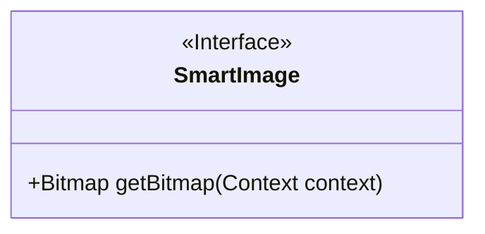
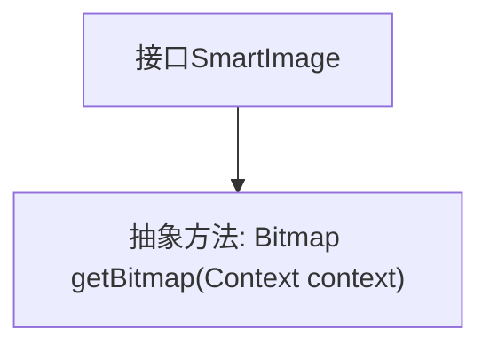

# 基础信息

|      |      |
|------|------|
| 名称 | SmartImage |
| 编码语言 | .java |
| 代码路径 | happycat/src/image/SmartImage.java |
| 包名 | None |
| 依赖项 | ['android.content.Context', 'android.graphics.Bitmap'] |
| 概述说明 | SmartImage接口定义了一个方法getBitmap，用于在给定上下文中获取Bitmap图像。 |

# 说明

这是一个名为SmartImage的公开接口，定义了一个方法getBitmap，该方法接收Context类型的参数并返回Bitmap对象。接口用于在Android开发中获取位图图像，适用于需要动态加载或处理图像的场景。

# 类列表 Class Summary

| 名称   | 类型  | 说明 |
|-------|------|-------------|
| SmartImage | interface | 这是一个名为SmartImage的公开接口，定义了一个方法getBitmap，用于根据上下文获取位图对象。 |

## 类 SmartImage

|      |      |
|------|------|
| 访问范围 | public |
| 类型 | interface |
| 名称 | SmartImage |
| 说明 | 这是一个名为SmartImage的公开接口，定义了一个方法getBitmap，用于根据上下文获取位图对象。 |

### UML类图

这段类图描述了一个名为SmartImage的接口，该接口定义了一个获取位图的方法。SmartImage接口标记为<<Interface>>，表示它是一个纯抽象接口而非具体类。接口中唯一的方法是getBitmap，该方法接收Context类型的参数并返回Bitmap对象。这个设计模式常用于需要根据不同上下文动态获取图像资源的场景，遵循了面向接口编程的原则，使得具体实现可以灵活替换而不影响客户端代码。

### 内部方法调用关系图

该流程图展示了SmartImage接口的结构，其中包含一个核心抽象方法getBitmap。这个接口定义了获取位图的标准契约，要求实现类必须提供接收Context参数并返回Bitmap对象的方法。图形清晰地呈现了接口与方法之间的从属关系，突出了面向接口编程的设计思想。

### 字段列表 Field List

| 名称  | 类型  | 说明 |
|-------|-------|------|

### 方法列表 Method List

| 名称  | 类型  | 说明 |
|-------|-------|------|
| getBitmap | Bitmap | 获取上下文相关的位图对象。 |

