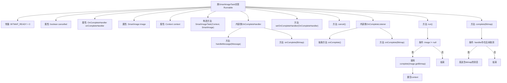

# 基础信息

|      |      |
|------|------|
| 名称 | SmartImageTask |
| 编码语言 | .java |
| 代码路径 | happycat/src/image/SmartImageTask.java |
| 包名 | None |
| 依赖项 | ['android.content.Context', 'android.graphics.Bitmap', 'android.os.Handler', 'android.os.Message'] |
| 概述说明 | SmartImageTask实现Runnable，用于异步加载SmartImage的位图。包含取消功能、完成处理器和监听器，支持位图加载完成回调。通过Handler传递位图数据，确保线程安全。 |

# 说明

这是一个名为SmartImageTask的Java类，实现了Runnable接口，用于异步加载图像。类中包含一个OnCompleteHandler内部类，用于处理图像加载完成后的回调，通过Handler机制传递Bitmap对象。还有一个OnCompleteListener抽象类，提供图像加载完成的回调方法，支持向后兼容。主要功能包括：通过构造函数传入上下文和图像对象，在run方法中执行异步加载，提供设置完成处理器、取消任务和完成回调的方法。当图像加载完成后，会通过Handler发送消息通知处理器，前提是任务未被取消。

# 类列表 Class Summary

| 名称   | 类型  | 说明 |
|-------|------|-------------|
| SmartImageTask | class | SmartImageTask是一个Runnable实现类，用于异步加载SmartImage的位图。包含取消功能、完成处理器和监听器，支持位图加载完成回调。关键方法：run()执行加载，complete()处理结果，cancel()取消任务。 |


## 类 SmartImageTask

|      |      |
|------|------|
| 访问范围 | public |
| 类型 | class |
| 名称 | SmartImageTask |
| 说明 | SmartImageTask是一个Runnable实现类，用于异步加载SmartImage的位图。包含取消功能、完成处理器和监听器，支持位图加载完成回调。关键方法：run()执行加载，complete()处理结果，cancel()取消任务。 |


### UML类图

```mermaid
classDiagram
    class SmartImageTask {
        -static int BITMAP_READY
        -boolean cancelled
        -OnCompleteHandler onCompleteHandler
        -SmartImage image
        -Context context
        +SmartImageTask(Context context, SmartImage image)
        +run() void
        +setOnCompleteHandler(OnCompleteHandler handler) void
        +cancel() void
        +complete(Bitmap bitmap) void
    }

    class OnCompleteHandler {
        <<Handler>>
        +handleMessage(Message msg) void
        +onComplete(Bitmap bitmap) void
    }
    // OnCompleteHandler继承自Android的Handler类

    class OnCompleteListener {
        <<abstract>>
        +onComplete() void
        +onComplete(Bitmap bitmap) void
    }
    // OnCompleteListener是抽象类，提供两种回调方式

    SmartImageTask --> OnCompleteHandler : 包含
    SmartImageTask --> SmartImage : 依赖
    SmartImageTask --> Context : 依赖
    OnCompleteHandler ..|> Handler : 实现
```

这段代码描述了一个异步加载图片的任务系统。SmartImageTask实现了Runnable接口，通过OnCompleteHandler处理图片加载完成的消息通知，同时支持通过OnCompleteListener抽象类进行回调。系统提供了取消任务、设置完成处理器等功能，通过Handler机制实现线程间通信，确保图片加载完成后能安全更新UI。设计上采用了两种回调方式（带参数和不带参数）以保持向后兼容性。


### 内部方法调用关系图



该流程图展示了SmartImageTask类的完整结构，包含两个内部类（事件处理器和监听器）和主类逻辑。核心流程是异步加载图片时，通过run()方法触发图片获取，通过complete()方法处理回调。当满足条件时，通过Handler机制将Bitmap传递给完成回调，同时支持取消操作和两种回调方式（带参数和不带参数）的兼容处理。

### 字段列表 Field List

| 名称  | 类型  | 说明 |
|-------|-------|------|
| BITMAP_READY = 0 | int | 定义静态常量BITMAP_READY，值为0，表示位图准备就绪状态。 |
| cancelled = false | boolean | 变量cancelled初始化为false，表示未取消状态。 |
| image | SmartImage | 私有SmartImage对象image。 |
| onCompleteHandler | OnCompleteHandler | 私有完成处理程序onCompleteHandler。 |
| context | Context | 私有上下文变量context。 |

### 方法列表 Method List

| 名称  | 类型  | 说明 |
|-------|-------|------|
| cancel | void | 该方法将变量cancelled设为true，用于取消操作。 |
| run | void | 重写run方法，检查image非空时调用complete并传入位图，随后清空context。 |
| setOnCompleteHandler | void | 设置完成回调处理器，将传入的handler赋值给当前对象的onCompleteHandler。 |
| complete | void | 方法complete接收Bitmap参数，若onCompleteHandler非空且未取消，则发送包含bitmap的消息通知处理完成。 |


