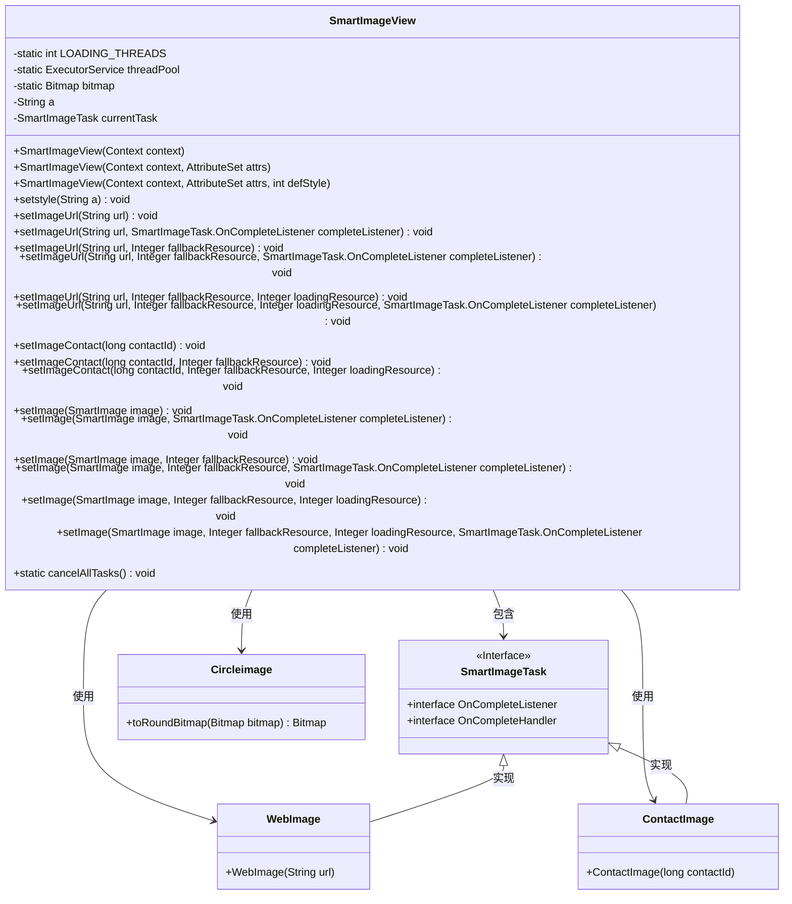
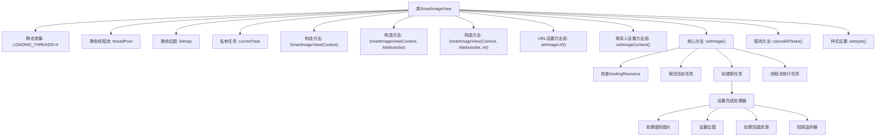
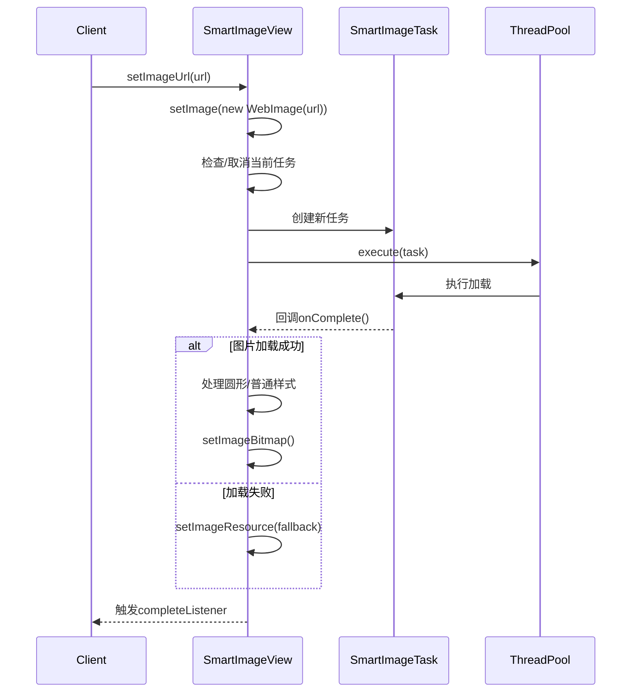

# 基础信息

|      |      |
|------|------|
| 名称 | SmartImageView |
| 编码语言 | .java |
| 代码路径 | happycat/src/image/SmartImageView.java |
| 包名 | None |
| 依赖项 | ['android.content.Context', 'android.graphics.Bitmap', 'android.util.AttributeSet', 'android.widget.ImageView', 'java.util.concurrent.ExecutorService', 'java.util.concurrent.Executors', 'com.happycat.view.Circleimage'] |
| 概述说明 | SmartImageView扩展ImageView，支持多线程加载网络图片和联系人图片，可设置圆形样式、加载和错误占位图，提供任务取消功能。 |

# 说明

SmartImageView是一个扩展自ImageView的自定义视图类，主要用于异步加载和显示图像。它支持通过URL或通讯录ID设置图像，并提供多种重载方法以适应不同需求，如设置加载中、加载失败的占位图以及完成回调。类内部使用线程池管理最多4个并发加载任务，可取消所有任务或单个任务。此外，支持通过setstyle方法设置圆形图像样式，自动处理图像为圆形。所有图像加载均在后台线程执行，避免阻塞UI线程，加载完成后自动更新视图或显示占位图。

# 类列表 Class Summary

| 名称   | 类型  | 说明 |
|-------|------|-------------|
| SmartImageView | class | SmartImageView扩展ImageView，支持通过URL或联系人ID设置图片，提供多线程加载、回调监听、占位图和圆形裁剪功能。 |

## 类 SmartImageView

|      |      |
|------|------|
| 访问范围 | public |
| 类型 | class |
| 名称 | SmartImageView |
| 说明 | SmartImageView扩展ImageView，支持通过URL或联系人ID设置图片，提供多线程加载、回调监听、占位图和圆形裁剪功能。 |

### UML类图

类图描述：
该图展示了一个Android图像加载组件SmartImageView的核心结构，它继承自ImageView并实现了多线程异步加载功能。SmartImageView通过SmartImageTask管理异步任务，支持WebImage和ContactImage两种图片来源，并可通过Circleimage实现圆形图像处理。类图中清晰地展示了线程池管理、多种图像设置方法、回调接口以及图像处理工具类之间的关系，体现了模块化设计和职责分离原则。

### 内部方法调用关系图

该流程图展示了SmartImageView的核心架构和主要方法调用关系。类包含三种构造方法和多组重载的图像设置方法，最终都汇聚到核心的setImage()方法。该方法实现了异步图片加载流程：先取消当前任务，创建新任务并设置回调处理器，最后通过线程池执行。时序图则具体描述了从客户端调用到异步加载完成的完整交互过程，包括成功/失败两种处理路径和最终回调通知机制。

### 字段列表 Field List

| 名称  | 类型  | 说明 |
|-------|-------|------|
| threadPool = Executors.newFixedThreadPool(LOADING_THREADS) | ExecutorService | 创建固定大小的线程池，用于并发任务处理。 |
| a=null | String | 声明了一个字符串变量a，初始值为null。 |
| bitmap | Bitmap | 声明一个静态位图对象bitmap。 |
| currentTask | SmartImageTask | 私有变量currentTask，类型为SmartImageTask。 |
| LOADING_THREADS = 4 | int | 定义私有静态常量LOADING_THREADS，值为4，表示加载线程数。 |

### 方法列表 Method List

| 名称  | 类型  | 说明 |
|-------|-------|------|
| setImage | void | 设置图像方法，接受SmartImage参数，调用重载方法并传递空值。 |
| setImageUrl | void | 方法setImageUrl用于设置图片URL，支持备用资源和加载中资源，可设置完成监听器。 |
| setImage | void | 设置图像方法，接受SmartImage对象和备用资源ID参数，调用重载方法处理图像显示。 |
| setImageUrl | void | 设置图片URL，通过WebImage加载并监听完成事件。 |
| setImage | void | 设置图像方法，接收SmartImage对象和完成监听器，调用重载方法并传入空参数。 |
| setImageContact | void | 方法setImageContact设置联系人图像，参数包括联系人ID、备用资源和加载资源，内部调用setImage方法处理。 |
| setImageUrl | void | 方法setImageUrl接收URL和备用资源参数，调用setImage方法加载网络图片。 |
| setImage | void | 设置图片方法，接受SmartImage对象、备用资源ID和完成监听器，内部调用重载方法。 |
| setImageUrl | void | 设置图片URL方法，通过URL创建WebImage对象并赋值。 |
| setstyle | void | 设置字符串样式的方法，将输入参数赋值给成员变量a。 |
| setImageUrl | void | 设置图片URL方法：接收URL、备用资源和完成监听器，调用setImage加载网络图片。 |
| setImageContact | void | 设置联系人图像方法，参数为联系人ID和备用资源ID，调用内部方法设置图像。 |
| setImage | void | 设置图片方法，参数包括智能图片、备用资源和加载资源，内部调用四参数版本。 |
| setImageUrl | void | 这是一个Java方法，用于设置图片URL，支持备用资源和加载中资源的参数，内部调用setImage方法处理WebImage对象。 |
| setImageContact | void | 设置联系人图像，通过联系人ID创建ContactImage对象并赋值。 |
| setImage | void | 设置智能图片视图：加载时显示预设图，取消旧任务，创建新任务处理图片，支持圆形裁剪，失败时显示备用图，完成后回调监听器。 |
| cancelAllTasks | void | 该方法取消所有任务，关闭线程池并重新初始化固定大小的线程池。 |

