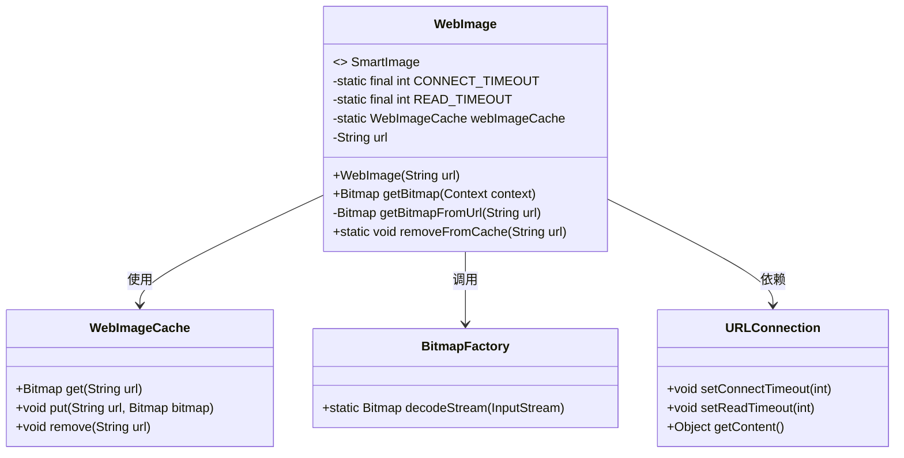
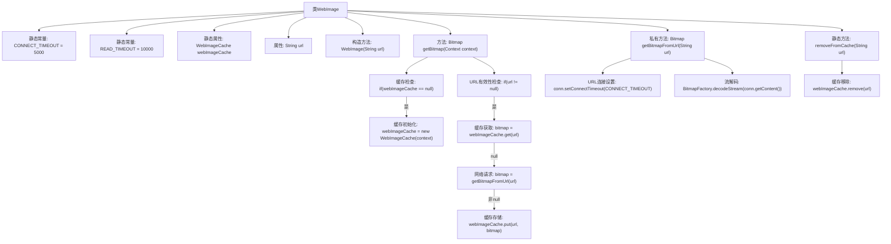

# 基础信息

|      |      |
|------|------|
| 名称 | WebImage |
| 编码语言 | .java |
| 代码路径 | happycat/src/image/WebImage.java |
| 包名 | None |
| 依赖项 | ['java.io.InputStream', 'java.net.URL', 'java.net.URLConnection', 'android.content.Context', 'android.graphics.Bitmap', 'android.graphics.BitmapFactory'] |
| 概述说明 | WebImage类实现SmartImage接口，通过URL获取图片并缓存。支持超时设置，优先从缓存读取图片，未命中则下载并存入缓存。提供移除缓存功能。 |

# 说明

WebImage类实现了SmartImage接口，用于从网络URL加载图片。它包含两个超时设置：连接超时5000毫秒和读取超时10000毫秒。使用WebImageCache缓存图片，避免重复下载。getBitmap方法优先从缓存获取图片，若不存在则通过getBitmapFromUrl下载并存入缓存。下载过程通过URLConnection实现，设置超时后解码为Bitmap。提供removeFromCache方法可移除指定URL的缓存。

# 类列表 Class Summary

| 名称   | 类型  | 说明 |
|-------|------|-------------|
| WebImage | class | WebImage类实现SmartImage接口，通过URL获取图片并缓存。支持连接超时设置，优先从缓存读取图片，未命中则下载并缓存。提供移除缓存功能。 |

## 类 WebImage

|      |      |
|------|------|
| 访问范围 | public |
| 类型 | class |
| 名称 | WebImage |
| 说明 | WebImage类实现SmartImage接口，通过URL获取图片并缓存。支持连接超时设置，优先从缓存读取图片，未命中则下载并缓存。提供移除缓存功能。 |

### UML类图

这段代码展示了一个WebImage类，实现了SmartImage接口，主要功能是从网络URL加载图片并缓存。类中包含静态配置参数、缓存管理实例和URL字符串，提供获取位图、从URL加载位图以及清除缓存的方法。通过WebImageCache实现缓存机制，利用URLConnection进行网络请求，最后通过BitmapFactory解码图片流。整体设计体现了网络图片加载的典型流程和缓存优化策略。

### 内部方法调用关系图

这段代码实现了一个网络图片加载器WebImage，包含缓存管理、网络请求和超时控制功能。流程图展示了从构造方法初始化URL，到通过getBitmap方法优先读取缓存，缓存未命中时触发网络请求并更新缓存的完整流程。静态方法removeFromCache提供了手动清除缓存的能力，私有方法getBitmapFromUrl处理实际的网络连接和图片解码操作，整个过程考虑了连接超时和读取超时的设置。

### 字段列表 Field List

| 名称  | 类型  | 说明 |
|-------|-------|------|
| CONNECT_TIMEOUT = 5000 | int | 定义私有静态常量CONNECT_TIMEOUT，超时时间设为5000毫秒。 |
| webImageCache | WebImageCache | 私有静态Web图片缓存对象。 |
| READ_TIMEOUT = 10000 | int | 定义私有静态常量READ_TIMEOUT，值为10000毫秒。 |
| url | String | 私有字符串变量url，用于存储网址信息。 |

### 方法列表 Method List

| 名称  | 类型  | 说明 |
|-------|-------|------|
| removeFromCache | void | 静态方法removeFromCache从webImageCache中移除指定URL的缓存项，若缓存存在。 |
| getBitmap | Bitmap | 方法从缓存获取位图，若无则下载并缓存。避免上下文泄漏，先检查缓存再尝试下载。 |
| getBitmapFromUrl | Bitmap | 从URL获取位图，设置连接和读取超时，异常处理返回空。 |

