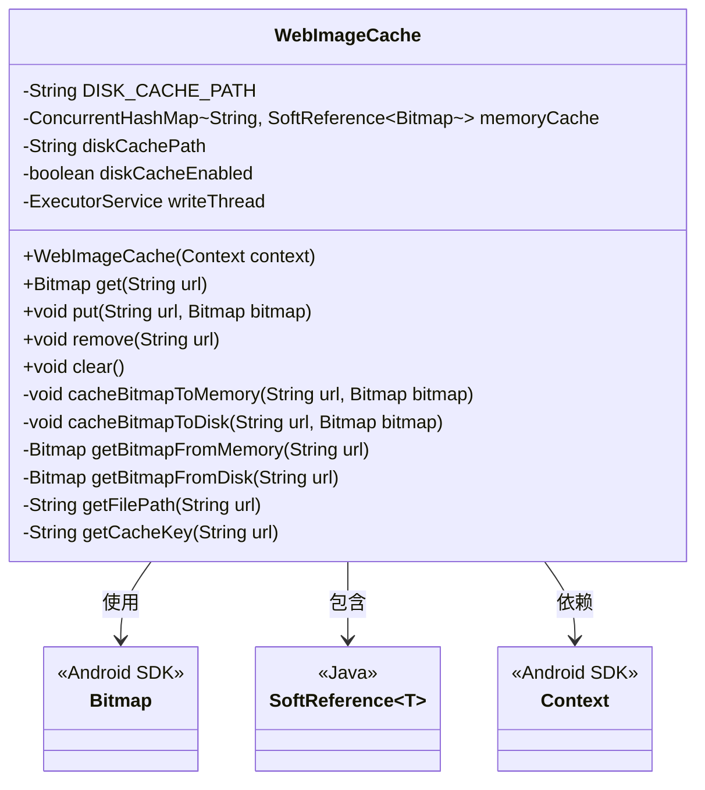
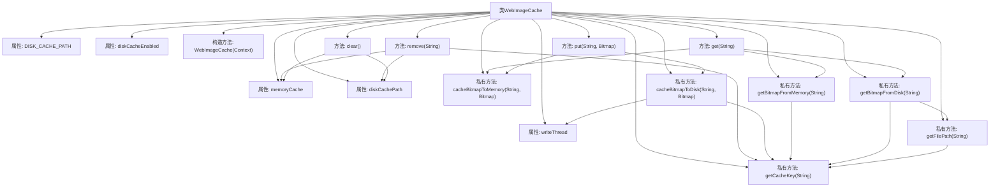

# 基础信息

|      |      |
|------|------|
| 名称 | WebImageCache |
| 编码语言 | .java |
| 代码路径 | happycat/src/image/WebImageCache.java |
| 包名 | None |
| 依赖项 | ['java.io.BufferedOutputStream', 'java.io.File', 'java.io.FileNotFoundException', 'java.io.FileOutputStream', 'java.io.IOException', 'java.lang.ref.SoftReference', 'java.util.concurrent.ConcurrentHashMap', 'java.util.concurrent.ExecutorService', 'java.util.concurrent.Executors', 'android.content.Context', 'android.graphics.Bitmap', 'android.graphics.Bitmap.CompressFormat', 'android.graphics.BitmapFactory'] |
| 概述说明 | WebImageCache实现图片内存和磁盘缓存，支持获取、存储、删除和清空操作，使用线程池处理磁盘写入。 |

# 说明

这是一个用于缓存网络图片的WebImageCache类实现。它采用两级缓存机制：内存缓存使用ConcurrentHashMap存储Bitmap的软引用，磁盘缓存将图片存储在应用缓存目录下的指定路径。类提供了获取、添加、删除和清空缓存的方法。内存操作直接进行，磁盘操作通过单线程线程池异步执行。图片URL经过处理作为缓存键名，确保特殊字符不影响文件存储。该类能有效管理图片资源，提升加载性能并减少网络请求。

# 类列表 Class Summary

| 名称   | 类型  | 说明 |
|-------|------|-------------|
| WebImageCache | class | WebImageCache类实现图片内存和磁盘缓存，支持获取、存储、删除和清空操作，使用软引用和线程池优化性能。 |

## 类 WebImageCache

|      |      |
|------|------|
| 访问范围 | public |
| 类型 | class |
| 名称 | WebImageCache |
| 说明 | WebImageCache类实现图片内存和磁盘缓存，支持获取、存储、删除和清空操作，使用软引用和线程池优化性能。 |

### UML类图

这段代码实现了一个Android平台的网络图片缓存系统，包含内存缓存（使用ConcurrentHashMap和SoftReference）和磁盘缓存（基于文件系统）双重机制。类图展示了WebImageCache的核心结构，它通过内存缓存提高读取速度，通过异步线程池实现磁盘写入，并提供了完整的缓存管理功能（获取、添加、删除、清空）。系统会优先检查内存缓存，未命中时查找磁盘缓存，同时采用URL编码生成唯一缓存键名，确保不同来源图片不会冲突。

### 内部方法调用关系图

该流程图展示了WebImageCache类的完整结构，包含5个属性和11个方法。核心功能包括内存缓存(ConcurrentHashMap)和磁盘缓存(文件系统)的双层存储机制，通过get/put/remove/clear方法提供完整的缓存管理功能。特别值得注意的是磁盘写入操作通过单线程池(writeThread)异步执行，内存缓存使用软引用(SoftReference)实现自动回收，且所有方法都通过getCacheKey方法统一处理URL规范化。类结构清晰地区分了公开接口和内部实现细节。

### 字段列表 Field List

| 名称  | 类型  | 说明 |
|-------|-------|------|
| writeThread | ExecutorService | 私有线程池writeThread用于执行写入任务。 |
| memoryCache | ConcurrentHashMap<String, SoftReference<Bitmap>> | 私有并发哈希表，键为字符串，值为位图软引用，用于内存缓存。 |
| diskCacheEnabled = false | boolean | 私有布尔变量diskCacheEnabled初始值为false，表示磁盘缓存未启用。 |
| diskCachePath | String | 私有字符串变量diskCachePath，用于存储磁盘缓存路径。 |
| DISK_CACHE_PATH = "/web_image_cache/" | String | 定义私有静态常量字符串，值为磁盘缓存路径"/web_image_cache/"。 |

### 方法列表 Method List

| 名称  | 类型  | 说明 |
|-------|-------|------|
| cacheBitmapToMemory | void | 将URL对应的位图缓存到内存，使用软引用存储。 |
| remove | void | 该方法移除指定URL的缓存，包括内存和文件缓存。若URL为空则直接返回。先删除内存缓存，再检查并删除对应的磁盘缓存文件。 |
| getBitmapFromDisk | Bitmap | 从磁盘缓存获取位图，若启用缓存且文件存在则解码返回，否则返回空。 |
| clear | void | 清除内存和文件缓存：清空内存缓存，删除磁盘缓存目录下的所有文件。 |
| getFilePath | String | 该方法根据URL生成文件路径，结合磁盘缓存路径和URL的缓存键值。 |
| getBitmapFromMemory | Bitmap | 从内存缓存中通过URL获取Bitmap，使用软引用避免内存泄漏，若存在则返回对应Bitmap，否则返回null。 |
| put | void | 该方法将位图缓存至内存和磁盘，接收URL和位图作为参数。 |
| get | Bitmap | 从内存或磁盘缓存获取位图，若磁盘存在则回写内存。 |
| cacheBitmapToDisk | void | 私有方法将位图缓存到磁盘：启用缓存时，在后台线程中创建文件输出流，以PNG格式压缩位图并写入磁盘，最后关闭流。异常处理包括文件未找到和IO操作。 |
| getCacheKey | String | 方法生成缓存键：若URL为空抛出异常，否则替换特殊字符为+并合并连续+。 |

