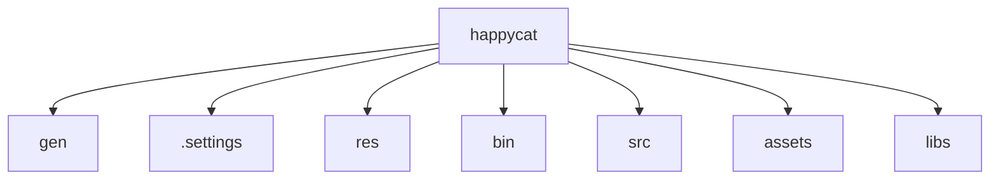

# 基础信息

|      |      |
|------|------|
| 名称 | happycat |
| 编码语言 | .java |
| 代码路径 | happycat |
| 概述说明 | Android资源管理与构建配置模块，含R.java资源索引和BuildConfig调试开关，支撑全生命周期资源调用。跨平台社交分享与图像加载模块，实现编辑-分享闭环和异步加载，依赖第三方服务与基础库。 |

### 包内部结构视图

该流程图展示了happycat项目的目录结构，包含7个直接子目录/文件：gen、.settings、res、bin、src、assets和libs。所有节点均为一级子节点，没有更深层级的嵌套关系，完整呈现了happycat项目的基础目录布局。这种扁平化结构常见于Android或Java项目，其中包含标准目录如src存放源代码、res存放资源文件、libs存放依赖库等。

# 模块列表

| 名称   | 类型  | 说明 |
|-------|------|-------------|

