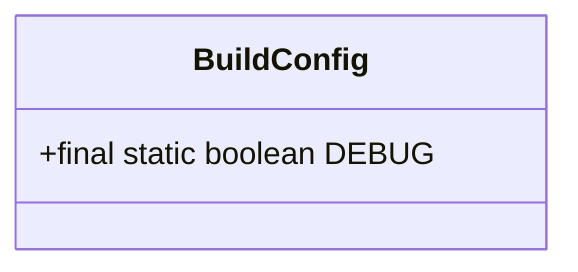
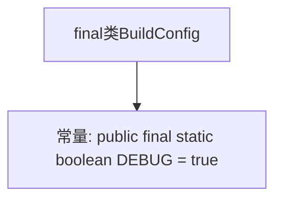

# 基础信息

|      |      |
|------|------|
| 名称 | BuildConfig |
| 编码语言 | .java |
| 代码路径 | happycat/gen/com/example/happucat/BuildConfig.java |
| 包名 | com.example.happucat |
| 依赖项 | [] |
| 概述说明 | BuildConfig类包含一个静态DEBUG常量，值为true，表示当前为调试模式。 |

# 说明

该内容定义了一个名为BuildConfig的不可变公开类，其中包含一个公开静态不可变的布尔类型变量DEBUG，其值被设置为true。此类通常用于构建配置，DEBUG变量用于标识当前是否为调试模式。

# 类列表 Class Summary

| 名称   | 类型  | 说明 |
|-------|------|-------------|
| BuildConfig | class | 这是一个Java类，定义了一个公开不可变的BuildConfig类，包含一个公开静态不可变的DEBUG布尔变量，值为true。 |

## 类 BuildConfig

|      |      |
|------|------|
| 访问范围 | public final |
| 类型 | class |
| 名称 | BuildConfig |
| 说明 | 这是一个Java类，定义了一个公开不可变的BuildConfig类，包含一个公开静态不可变的DEBUG布尔变量，值为true。 |

### UML类图

这段代码定义了一个不可变的最终类`BuildConfig`，其中包含一个公有的、静态的、不可修改的布尔类型常量`DEBUG`，其值被初始化为`true`。这个类通常用于构建配置，通过`DEBUG`标志可以判断当前是否为调试模式，从而在开发和生产环境中进行不同的逻辑处理。由于类是`final`的且成员是`static final`的，确保了全局唯一性和线程安全性。

### 内部方法调用关系图

这段代码定义了一个不可继承的最终类BuildConfig，其中包含一个公开的静态最终布尔常量DEBUG，其值被初始化为true。该常量在编译时被确定且不可修改，通常用于标识当前是否为调试模式。整个类结构极其简单，仅包含一个常量声明，没有方法或其他成员变量。这种设计模式常用于Android项目的自动生成配置文件中。

### 字段列表 Field List

| 名称  | 类型  | 说明 |
|-------|-------|------|
| DEBUG = true | boolean | 定义公共静态常量DEBUG，值为true，用于调试模式开关。 |

### 方法列表

| 名称  | 类型  | 说明 |
|-------|-------|------|

