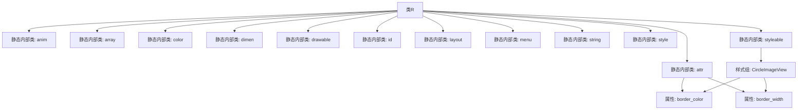

# 基础信息

|      |      |
|------|------|
| 名称 | R |
| 编码语言 | .java |
| 代码路径 | happycat/gen/com/example/happucat/R.java |
| 包名 | com.example.happucat |
| 依赖项 | [] |
| 概述说明 | 这是一个Android应用的R.java文件，包含了资源ID定义，如动画、数组、属性、颜色、尺寸、布局、菜单、字符串和样式等。 |

# 说明

这是一个Android应用的资源文件R.java，包含了各类资源的ID定义。文件结构清晰，分为多个内部类，分别对应不同资源类型：

1. anim类：定义了6个动画资源ID，包括左右进出动画和对话框动画。

2. array类：包含1个数组资源ID。

3. attr类：定义了2个自定义属性（border_color和border_width），用于CircleImageView控件。

4. color类：定义了21种颜色资源ID，包括各种灰色调、基础颜色和应用特定颜色。

5. dimen类：包含大量尺寸定义，涵盖边距、文字大小、指示器尺寸等。

6. drawable类：列出了144个图片资源ID，包括图标、按钮状态图片等。

7. id类：定义了357个视图ID，对应布局文件中的各种控件。

8. layout类：包含77个布局文件ID。

9. menu类：定义了9个菜单资源ID。

10. string类：包含129个字符串资源，涵盖应用文本、分享相关文字等。

11. style类：定义了44种样式，包括基础主题和各种自定义样式。

12. styleable类：定义了CircleImageView的自定义属性。

该文件是Android应用开发中自动生成的资源索引文件，为开发者提供了程序中所有资源的统一访问入口。

# 类列表 Class Summary

| 名称   | 类型  | 说明 |
|-------|------|-------------|
| R | class | 这是一个Android应用的资源文件R.java，包含动画、数组、属性、颜色、尺寸、绘图、ID、布局、菜单、字符串和样式等资源定义。关键点包括：动画资源如左右滑动效果，颜色资源如背景色和文本色，尺寸资源如边距和文本大小，绘图资源如图标和背景图，布局资源如登录和主界面，以及字符串资源和样式定义。 |


## 类 R

|      |      |
|------|------|
| 访问范围 | public final |
| 类型 | class |
| 名称 | R |
| 说明 | 这是一个Android应用的资源文件R.java，包含动画、数组、属性、颜色、尺寸、绘图、ID、布局、菜单、字符串和样式等资源定义。关键点包括：动画资源如左右滑动效果，颜色资源如背景色和文本色，尺寸资源如边距和文本大小，绘图资源如图标和背景图，布局资源如登录和主界面，以及字符串资源和样式定义。 |


### UML类图

```mermaid
classDiagram
    class R {
        <<final>>
    }
    class anim {
        <<static>> <<final>>
        +int anim_left_to_right_in
        +int anim_left_to_right_out
        +int anim_right_to_left_in
        +int anim_right_to_left_out
        +int photo_dialog_in_anim
        +int photo_dialog_out_anim
    }
    class array {
        <<static>> <<final>>
        +int xiaoxi_welcome
    }
    class attr {
        <<static>> <<final>>
        +int border_color
        +int border_width
    }
    class color {
        <<static>> <<final>>
        +int app_content_background_color
        +int background
        +int black
        // ... (其他颜色常量)
    }
    class dimen {
        <<static>> <<final>>
        +int activity_horizontal_margin
        +int activity_vertical_margin
        // ... (其他尺寸常量)
    }
    class drawable {
        <<static>> <<final>>
        +int aa
        +int aaa
        // ... (其他drawable资源ID)
    }
    class id {
        <<static>> <<final>>
        +int Djbt
        +int Tj
        // ... (其他ID常量)
    }
    class layout {
        <<static>> <<final>>
        +int activity_address_add
        +int activity_group_member_item
        // ... (其他布局资源ID)
    }
    class menu {
        <<static>> <<final>>
        +int address
        +int dai_ping_jia_order_pingjia
        // ... (其他菜单资源ID)
    }
    class string {
        <<static>> <<final>>
        +int action_settings
        +int alipay
        // ... (其他字符串资源ID)
    }
    class style {
        <<static>> <<final>>
        +int AppBaseTheme
        +int AppTheme
        // ... (其他样式资源ID)
    }
    class styleable {
        <<static>> <<final>>
        +int[] CircleImageView
        +int CircleImageView_border_color
        +int CircleImageView_border_width
    }

    R --> anim : 包含
    R --> array : 包含
    R --> attr : 包含
    R --> color : 包含
    R --> dimen : 包含
    R --> drawable : 包含
    R --> id : 包含
    R --> layout : 包含
    R --> menu : 包含
    R --> string : 包含
    R --> style : 包含
    R --> styleable : 包含
```

这段代码是一个典型的Android资源类R.java，由aapt工具自动生成，用于集中管理应用的所有资源ID。类图中展示了R类作为顶级容器，包含多个静态内部类（anim、array、color等），每个内部类存储特定类型的资源ID常量。这种结构为Android应用提供了类型安全的资源访问方式，例如R.drawable.icon或R.string.app_name。所有内部类都被声明为final且包含静态常量，确保资源ID在编译期确定且不可修改。通过类图可以清晰看到资源分类和层级关系，这是Android资源管理系统的核心设计模式。


### 内部方法调用关系图



这段代码定义了一个Android资源管理类R，包含多个静态内部类用于存放不同类型的资源ID。核心结构是顶级final类R，内部嵌套了anim（动画）、array（数组）、attr（自定义属性）、color（颜色）等资源类型的静态类。其中attr类包含两个自定义属性border_color和border_width，styleable类定义了这些属性的样式组CircleImageView。所有资源都以十六进制整型常量表示，格式为0x7fXXXXXX，这是Android aapt工具自动生成的资源标识符格式。该类主要用于在Java代码中通过R.xxx.yyy的方式引用资源，实现类型安全的资源访问。

### 字段列表 Field List

| 名称  | 类型  | 说明 |
|-------|-------|------|

### 方法列表

| 名称  | 类型  | 说明 |
|-------|-------|------|


