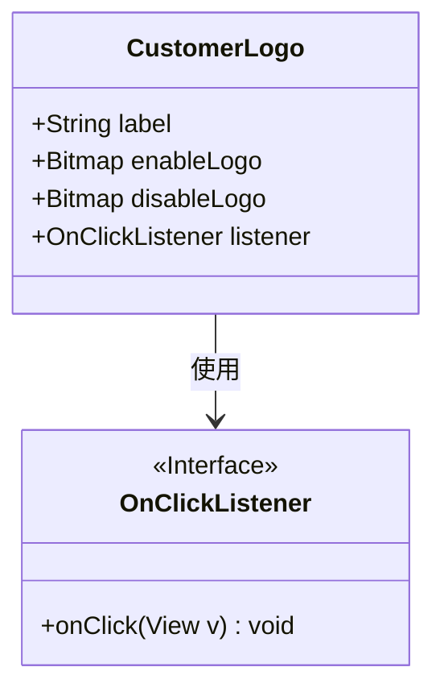
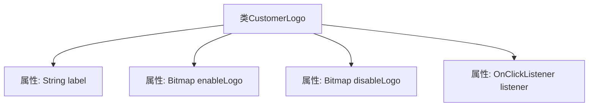

# 基础信息

|      |      |
|------|------|
| 名称 | CustomerLogo |
| 编码语言 | .java |
| 代码路径 | happycat/src/cn/sharesdk/onekeyshare/CustomerLogo.java |
| 包名 | cn.sharesdk.onekeyshare |
| 依赖项 | ['android.graphics.Bitmap', 'android.view.View.OnClickListener'] |
| 概述说明 | CustomerLogo类包含标签、启用/禁用Logo位图及点击监听器。 |

# 说明

该代码定义了一个名为CustomerLogo的公共类，包含四个成员变量：label为字符串类型，存储标签文本；enableLogo和disableLogo均为Bitmap类型，分别表示启用和禁用状态的图标；listener为OnClickListener类型，用于处理点击事件。该类用于管理客户标识的显示与交互功能。

# 类列表 Class Summary

| 名称   | 类型  | 说明 |
|-------|------|-------------|
| CustomerLogo | class | CustomerLogo类包含四个成员：label字符串、enableLogo和disableLogo位图，以及listener点击事件监听器。 |

## 类 CustomerLogo

|      |      |
|------|------|
| 访问范围 | public |
| 类型 | class |
| 名称 | CustomerLogo |
| 说明 | CustomerLogo类包含四个成员：label字符串、enableLogo和disableLogo位图，以及listener点击事件监听器。 |

### UML类图

这段类图展示了CustomerLogo类的结构及其与OnClickListener接口的关系。CustomerLogo包含四个公有成员：字符串类型的label、两个Bitmap类型的logo（enableLogo和disableLogo），以及一个OnClickListener类型的监听器。OnClickListener是一个接口，定义了onClick方法。类图中清晰地表明了CustomerLogo依赖于OnClickListener接口来实现点击事件处理，整体结构简单明了，体现了视图组件与事件监听器的典型交互模式。

### 内部方法调用关系图

该流程图展示了CustomerLogo类的结构，包含四个公开属性：label字符串类型、enableLogo和disableLogo位图类型、listener点击监听器类型。类设计用于存储客户标识相关数据，其中enable/disableLogo分别表示启用/禁用状态的图标，listener处理交互事件。这种结构常用于UI组件状态管理，但需注意属性直接暴露可能导致数据安全问题。

### 字段列表 Field List

| 名称  | 类型  | 说明 |
|-------|-------|------|
| label | String | 公共字符串变量label。 |
| enableLogo | Bitmap | 定义了一个公有的位图变量enableLogo。 |
| disableLogo | Bitmap | 禁用标志位图 |
| listener | OnClickListener | 定义了一个公共的点击监听器对象listener。 |

### 方法列表

| 名称  | 类型  | 说明 |
|-------|-------|------|

