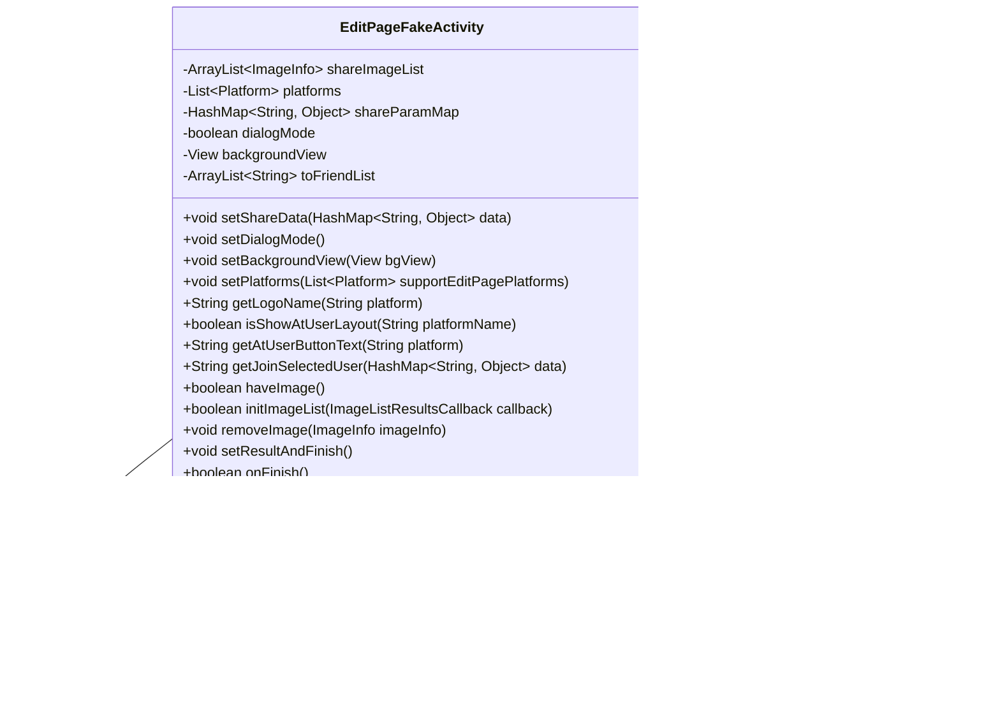

# 基础信息

|      |      |
|------|------|
| 名称 | EditPageFakeActivity |
| 编码语言 | .java |
| 代码路径 | happycat/src/cn/sharesdk/onekeyshare/EditPageFakeActivity.java |
| 包名 | cn.sharesdk.onekeyshare |
| 依赖项 | ['com.mob.tools.utils.R.getStringRes', 'java.io.File', 'java.util.ArrayList', 'java.util.HashMap', 'java.util.List', 'android.graphics.Bitmap', 'android.os.AsyncTask', 'android.text.TextUtils', 'android.view.View', 'android.widget.Toast', 'cn.sharesdk.framework.Platform', 'com.mob.tools.FakeActivity', 'com.mob.tools.utils.BitmapHelper'] |
| 概述说明 | EditPageFakeActivity类用于处理分享页面逻辑，支持多平台分享，管理图片数据，提供对话框模式，处理用户选择和图片处理，最终生成分享结果。 |

# 说明

EditPageFakeActivity是一个用于处理社交平台分享编辑页面的类，继承自FakeActivity。它包含平台列表、分享参数映射、对话框模式标志、背景视图等属性。主要功能包括设置分享数据、管理图片资源（支持URL、路径、位图等多种来源）、处理@用户功能（针对微博、Facebook等平台）、初始化图片列表并通过异步任务加载图片。该类还实现了结果返回逻辑，特别处理了FacebookMessenger平台的好友选择功能，最终将编辑结果封装返回并清理资源。

# 类列表 Class Summary

| 名称   | 类型  | 说明 |
|-------|------|-------------|
| EditPageFakeActivity | class | EditPageFakeActivity类用于处理社交平台分享功能，支持多种图片来源，提供对话框模式，管理分享参数和图片列表，并处理用户选择和结果返回。 |

## 类 EditPageFakeActivity

|      |      |
|------|------|
| 访问范围 | public |
| 类型 | class |
| 名称 | EditPageFakeActivity |
| 说明 | EditPageFakeActivity类用于处理社交平台分享功能，支持多种图片来源，提供对话框模式，管理分享参数和图片列表，并处理用户选择和结果返回。 |

### UML类图

该类图展示了EditPageFakeActivity继承自FakeActivity，包含ImageInfo内部类，并依赖ImageListResultsCallback接口和Platform类。主要功能包括社交分享参数管理、图片处理（通过ImageInfo对象存储图片信息）、平台设置和结果回调处理。通过HashMap存储分享参数，提供多种图片处理方法和平台适配功能，支持Dialog模式显示和后台异步图片加载。

### 内部方法调用关系图

这段代码定义了一个EditPageFakeActivity类，主要用于处理社交平台分享相关的功能。类中包含多个属性用于存储分享参数、平台信息、图片数据等，以及一系列方法用于设置分享数据、处理图片、构建结果等。流程图展示了类的结构和内部关系，时序图则描述了主要方法的调用顺序和数据流动。该类支持多种图片来源的处理，包括本地路径、网络URL、Bitmap对象等，并通过异步任务进行图片加载和处理，最终将结果返回给调用方。

### 字段列表 Field List

| 名称  | 类型  | 说明 |
|-------|-------|------|
| toFriendList | ArrayList<String> | 保护类型的字符串动态数组，用于存储好友列表。 |
| shareImageList | ArrayList<ImageInfo> | 私有图像信息列表，存储ImageInfo对象。 |
| backgroundView | View | 保护视图背景视图 |
| shareParamMap | HashMap<String, Object> | 保护类型的HashMap，键为String，值为Object，用于存储共享参数。 |
| dialogMode | boolean | 类中受保护的布尔变量dialogMode，用于控制对话框模式状态。 |
| platforms | List<Platform> | 这是一个受保护的列表变量，存储Platform类型的对象。 |

### 方法列表

| 名称  | 类型  | 说明 |
|-------|-------|------|
| setDialogMode | void | 设置dialogMode为true。 |
| setBackgroundView | void | 设置背景视图的方法，将参数bgView赋值给当前对象的backgroundView属性。 |
| getJoinSelectedUser | String | 方法getJoinSelectedUser处理数据中的selected列表，若平台为FacebookMessenger则返回null，否则拼接用户名为"@用户 "格式的字符串。若无数据或selected字段则返回null。 |
| setShareData | void | 方法setShareData接收一个HashMap参数，将其赋值给成员变量shareParamMap。 |
| setPlatforms | void | 设置支持编辑页面的平台列表。 |
| getLogoName | String | 方法根据平台参数获取对应的logo名称。若平台为空返回空字符串，否则查找资源ID并返回对应字符串。 |
| isShowAtUserLayout | boolean | 判断平台是否显示用户布局：新浪微博、腾讯微博、Facebook、Twitter或FacebookMessenger时返回真。 |
| getAtUserButtonText | String | 方法根据平台参数返回"To"（FacebookMessenger）或"@"（其他平台）。 |
| haveImage | boolean | 检查是否存在图片：通过imageUrl、imagePath、viewToShare或imageArray任一有效即返回true，否则false。 |
| initImageList | boolean | 方法初始化图片列表，优先检查本地路径、位图、URL或数组中的图片，异步加载网络图片后回调结果。成功返回true，失败false。 |
| removeImage | void | 移除指定图片：检查列表和图片非空后，从共享图片列表中删除给定图片信息。 |
| setResultAndFinish | void | 方法setResultAndFinish处理分享图片数据，将imagePath、imageUrl存入shareParamMap，viewToShare存bitmap，imageArray转为数组。检查FacebookMessenger平台是否有接收地址，无则提示选择好友。最后打包结果并结束活动。 |
| onFinish | boolean | 方法重写，清空共享图片列表并调用父类结束处理。 |

