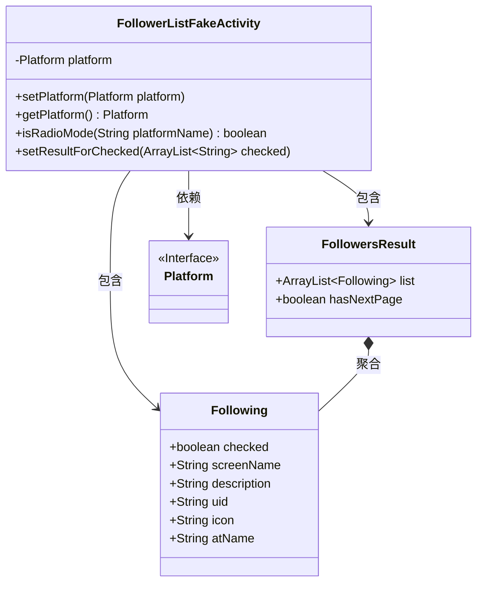

# 基础信息

|      |      |
|------|------|
| 名称 | FollowerListFakeActivity |
| 编码语言 | .java |
| 代码路径 | happycat/src/cn/sharesdk/onekeyshare/FollowerListFakeActivity.java |
| 包名 | cn.sharesdk.onekeyshare |
| 依赖项 | ['java.util.ArrayList', 'java.util.HashMap', 'com.mob.tools.FakeActivity', 'cn.sharesdk.framework.Platform'] |
| 概述说明 | FollowerListFakeActivity类用于处理不同社交平台的粉丝列表数据，包含设置平台、检查单选模式、设置选中结果及解析粉丝数据功能。支持微博、脸书、推特等平台，解析用户信息并返回列表及分页状态。 |

# 说明

FollowerListFakeActivity是一个模拟活动类，用于处理不同社交平台的粉丝列表数据。它包含设置和获取平台的方法，以及判断是否为FacebookMessenger平台的逻辑。内部类Following表示单个粉丝信息，包含选中状态、用户名、描述、UID、图标和@名称等属性。FollowersResult类包含粉丝列表和是否有下一页的标志。parseFollowers方法根据平台名称解析不同格式的粉丝数据，支持新浪微博、腾讯微博、Facebook、Twitter和FacebookMessenger平台，提取用户信息并填充到Following对象中，最后返回包含处理结果的FollowersResult对象。

# 类列表 Class Summary

| 名称   | 类型  | 说明 |
|-------|------|-------------|
| FollowerListFakeActivity | class | FollowerListFakeActivity类用于处理不同社交平台的粉丝列表数据，包含获取平台信息、设置选中结果及解析粉丝数据功能，支持微博、Facebook、Twitter等平台。 |

## 类 FollowerListFakeActivity

|      |      |
|------|------|
| 访问范围 | public |
| 类型 | class |
| 名称 | FollowerListFakeActivity |
| 说明 | FollowerListFakeActivity类用于处理不同社交平台的粉丝列表数据，包含获取平台信息、设置选中结果及解析粉丝数据功能，支持微博、Facebook、Twitter等平台。 |

### UML类图

这段代码描述了一个社交平台粉丝列表管理系统的核心结构。FollowerListFakeActivity作为主类，包含Platform接口和两个静态内部类Following(粉丝信息)和FollowersResult(查询结果)。系统支持多种社交平台(微博、Facebook等)的粉丝数据解析，通过parseFollowers方法将原始数据转换为统一格式。类图展示了它们之间的依赖和包含关系，其中FollowersResult聚合了多个Following对象，体现了"一个结果包含多个粉丝"的业务逻辑。

### 内部方法调用关系图

```mermaid
graph TD
    A["类FollowerListFakeActivity"]
    B["属性: Platform platform"]
    C["方法: setPlatform(Platform platform)"]
    D["方法: getPlatform()"]
    E["方法: isRadioMode(String platformName)"]
    F["方法: setResultForChecked(ArrayList<String> checked)"]
    G["内部类: Following"]
    H["内部类: FollowersResult"]
    I["静态方法: parseFollowers(String platformName, HashMap<String, Object> res, HashMap<String, Boolean> uidMap)"]

    A --> B
    A --> C
    A --> D
    A --> E
    A --> F
    A --> G
    A --> H
    A -.-> I

    G --> J["属性: boolean checked"]
    G --> K["属性: String screenName"]
    G --> L["属性: String description"]
    G --> M["属性: String uid"]
    G --> N["属性: String icon"]
    G --> O["属性: String atName"]

    H --> P["属性: ArrayList<Following> list"]
    H --> Q["属性: boolean hasNextPage"]

    I --> R["检查res有效性"]
    I --> S["处理SinaWeibo数据"]
    I --> T["处理TencentWeibo数据"]
    I --> U["处理Facebook数据"]
    I --> V["处理Twitter数据"]
    I --> W["处理FacebookMessenger数据"]
    I --> X["构造FollowersResult对象"]
```

这段代码是一个社交平台粉丝列表处理类，主要功能包括管理平台对象、设置检查结果，以及解析不同社交平台（新浪微博、腾讯微博、Facebook等）的粉丝数据。核心方法是parseFollowers，它会根据平台类型解析原始数据，构建Following对象列表并判断是否有下一页数据。类中包含两个静态内部类Following（存储用户信息）和FollowersResult（存储解析结果）。流程图清晰展示了类结构、属性关系和方法调用路径，特别是多平台数据处理的分支逻辑。

### 字段列表 Field List

| 名称  | 类型  | 说明 |
|-------|-------|------|
| platform | Platform | 受保护的平台对象。 |

### 方法列表

| 名称  | 类型  | 说明 |
|-------|-------|------|
| getPlatform | Platform | 获取当前平台对象的方法，返回platform属性值。 |
| isRadioMode | boolean | 检查平台名是否为FacebookMessenger，返回布尔值。 |
| setPlatform | void | 设置当前对象的平台属性为指定参数值。 |
| setResultForChecked | void | 方法setResultForChecked接收字符串列表checked，将其与platform存入HashMap，并通过setResult返回结果。 |
| parseFollowers | FollowersResult | 解析不同平台粉丝数据，生成FollowersResult对象。处理新浪微博、腾讯微博、Facebook、Twitter和FacebookMessenger的数据，提取用户ID、名称、描述和头像等信息，检查是否有下一页，并避免重复添加。 |

