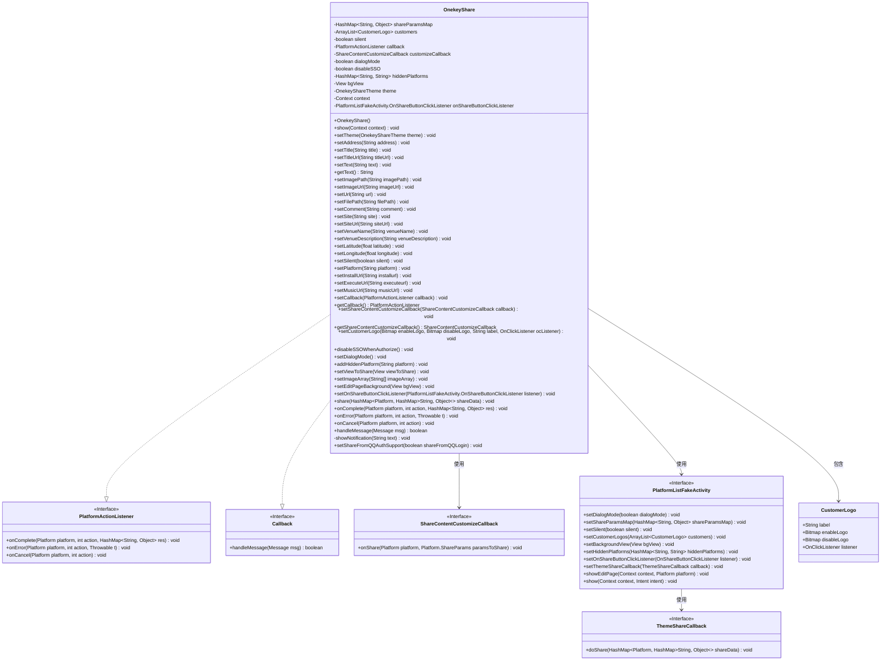
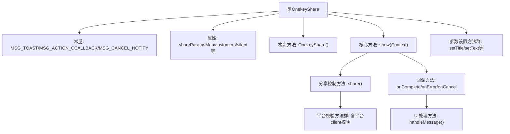
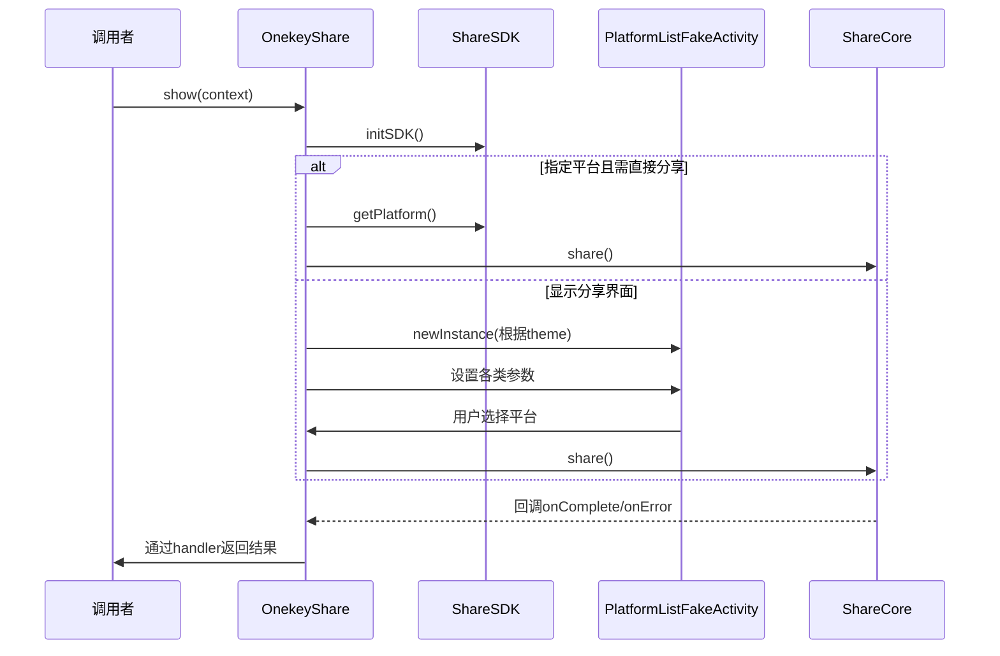

# 基础信息

|      |      |
|------|------|
| 名称 | OnekeyShare |
| 编码语言 | .java |
| 代码路径 | happycat/src/cn/sharesdk/onekeyshare/OnekeyShare.java |
| 包名 | cn.sharesdk.onekeyshare |
| 依赖项 | ['com.mob.tools.utils.BitmapHelper.captureView', 'com.mob.tools.utils.R.getStringRes', 'java.io.File', 'java.util.ArrayList', 'java.util.HashMap', 'java.util.Map.Entry', 'android.app.NotificationManager', 'android.content.Context', 'android.graphics.Bitmap', 'android.os.Handler.Callback', 'android.os.Message', 'android.text.TextUtils', 'android.view.View', 'android.view.View.OnClickListener', 'android.widget.Toast', 'cn.sharesdk.framework.CustomPlatform', 'cn.sharesdk.framework.Platform', 'cn.sharesdk.framework.PlatformActionListener', 'cn.sharesdk.framework.ShareSDK', 'com.mob.tools.utils.UIHandler'] |
| 概述说明 | OnekeyShare类实现一键分享功能，支持多平台（微信、微博等），可配置分享内容（文本、图片等），提供静默分享、自定义UI和回调处理。 |

# 说明

OnekeyShare类是一个实现一键分享功能的工具类，支持多种社交平台分享。它包含分享参数设置、平台选择、分享内容定制等功能。类中定义了多种分享类型（文本、图片、网页等），并支持静默分享、自定义图标、隐藏平台等特性。通过PlatformActionListener处理分享结果回调，包括成功、失败和取消情况。还包含客户端有效性检查、通知提示及分享统计等功能。整体设计灵活，可适应不同平台的分享需求。

# 类列表 Class Summary

| 名称   | 类型  | 说明 |
|-------|------|-------------|
| OnekeyShare | class | OnekeyShare类实现一键分享功能，支持多平台分享，可自定义分享内容、主题和回调，包含静默分享、编辑页面和错误处理。 |

## 类 OnekeyShare

|      |      |
|------|------|
| 访问范围 | public |
| 类型 | class |
| 名称 | OnekeyShare |
| 说明 | OnekeyShare类实现一键分享功能，支持多平台分享，可自定义分享内容、主题和回调，包含静默分享、编辑页面和错误处理。 |

### UML类图

这段代码定义了一个名为OnekeyShare的类，它实现了PlatformActionListener和Callback接口，用于处理一键分享功能。该类包含了分享参数设置、平台选择、分享内容定制等功能，支持多种社交平台的分享操作。通过PlatformListFakeActivity展示分享平台列表，并根据不同平台的特性和用户设置执行相应的分享操作。类图中展示了OnekeyShare与相关接口和辅助类之间的关系，包括参数传递、回调处理和界面展示等交互方式。

### 内部方法调用关系图

该流程图展示了OnekeyShare核心架构，包含三个主要模块：1)参数设置模块提供20+种set方法配置分享内容；2)show方法实现双路径处理：直接分享或通过PlatformListFakeActivity显示UI；3)分享过程采用责任链模式，通过ShareCore执行实际分享操作并处理各平台特性校验。时序图重点展示show方法的两种执行路径和回调机制，体现平台校验、内容类型判断等关键控制逻辑。

### 字段列表 Field List

| 名称  | 类型  | 说明 |
|-------|-------|------|
| MSG_CANCEL_NOTIFY = 3 | int | 私有静态常量MSG_CANCEL_NOTIFY值为3，用于取消通知。 |
| MSG_ACTION_CCALLBACK = 2 | int | 私有静态常量MSG_ACTION_CCALLBACK值为2，用于回调操作标识。 |
| shareParamsMap | HashMap<String, Object> | 私有哈希映射，键为字符串，值为对象。 |
| onShareButtonClickListener | PlatformListFakeActivity.OnShareButtonClickListener | 私有成员变量，类型为PlatformListFakeActivity的内部接口OnShareButtonClickListener，用于处理分享按钮点击事件。 |
| silent | boolean | 布尔型变量silent，表示静默状态。 |
| context | Context | 私有上下文对象。 |
| customers | ArrayList<CustomerLogo> | 私有客户标志列表。 |
| MSG_TOAST = 1 | int | 定义私有静态常量MSG_TOAST，值为1，用于消息标识。 |
| hiddenPlatforms | HashMap<String, String> | 隐藏平台映射表，键值均为字符串类型。 |
| disableSSO | boolean | 禁用单点登录标志，布尔类型。 |
| dialogMode = false | boolean | 变量dialogMode用于控制对话框模式，默认值为false。 |
| theme | OnekeyShareTheme | 私有成员变量theme，类型为OnekeyShareTheme。 |
| customizeCallback | ShareContentCustomizeCallback | 私有成员变量customizeCallback，类型为ShareContentCustomizeCallback接口。 |
| callback | PlatformActionListener | 私有平台动作监听器回调。 |
| bgView | View | 私有视图变量bgView。 |

### 方法列表

| 名称  | 类型  | 说明 |
|-------|-------|------|
| setImageUrl | void | 方法setImageUrl接收字符串imageUrl，非空时将其存入shareParamsMap，键为"imageUrl"。 |
| setCallback | void | 设置回调函数，将传入的PlatformActionListener赋值给当前对象的callback属性。 |
| setLongitude | void | 方法setLongitude接收float参数longitude，将其存入shareParamsMap中，键为"longitude"。 |
| disableSSOWhenAuthorize | void | 方法disableSSOWhenAuthorize设置disableSSO为true，用于禁用单点登录。 |
| setVenueName | void | 方法setVenueName将输入参数venueName存入shareParamsMap中，键为"venueName"。 |
| handleMessage | boolean | 处理消息的方法：显示Toast、处理分享回调（成功、失败、取消）并显示通知，或取消通知。失败时检查异常类型并显示对应提示。 |
| showNotification | void | 这是一个Java方法，用于在Android应用中显示短暂的通知消息（Toast）。它接收字符串参数text作为显示内容，使用Toast.makeText创建并展示短时提示。 |
| setShareFromQQAuthSupport | void | 设置QQ授权分享支持，将参数存入分享映射表。 |
| getText | String | 获取分享参数中的文本值，若无则返回空。 |
| setSiteUrl | void | 方法setSiteUrl接收字符串siteUrl，将其存入shareParamsMap中，键为"siteUrl"。 |
| setShareContentCustomizeCallback | void | 设置分享内容自定义回调函数，将传入的callback赋值给customizeCallback。 |
| setPlatform | void | 方法setPlatform接收字符串参数platform，将其存入shareParamsMap中，键为"platform"。 |
| setText | void | 这是一个Java方法，功能是将输入的字符串text存入shareParamsMap中，键为"text"。 |
| setTitleUrl | void | 设置标题链接URL，存入分享参数字典。 |
| setUrl | void | 方法setUrl接收字符串url参数，将其存入shareParamsMap中，键为"url"。 |
| setSilent | void | 设置静默状态的方法，参数为布尔值silent，用于控制对象是否静默。 |
| setDialogMode | void | 方法设置对话框模式为真，并将该状态存入共享参数映射。 |
| setOnShareButtonClickListener | void | 设置分享按钮点击监听器，传入自定义监听接口实例。 |
| onCancel | void | 方法onCancel处理取消操作：创建MSG_ACTION_CCALLBACK消息，设置参数并发送，最后记录分享失败统计。 |
| getCallback | PlatformActionListener | 获取回调函数实例。 |
| show | void | 该方法初始化分享SDK并处理分享逻辑。若指定平台且满足静默、客户端分享或自定义平台条件，则直接分享；否则根据主题创建分享页面，配置参数后显示编辑页或九宫格界面。 |
| setViewToShare | void | 该方法捕获指定视图的位图并存入共享参数映射，异常时打印堆栈。 |
| setTitle | void | 方法setTitle接收字符串title，将其存入shareParamsMap中，键为"title"。 |
| setEditPageBackground | void | 方法setEditPageBackground接收View参数bgView，并将其赋值给当前对象的bgView属性。 |
| setCustomerLogo | void | 设置客户Logo，包含启用和禁用状态的图片、标签及点击事件监听器，并添加到客户列表中。 |
| addHiddenPlatform | void | 添加隐藏平台方法：将平台名存入hiddenPlatforms映射。 |
| setAddress | void | 方法setAddress将输入的address字符串存入shareParamsMap中，键为"address"。 |
| onError | void | 方法onError处理平台操作错误：打印异常，封装错误信息（类型2、操作action和异常对象）发送到UIHandler，并记录分享失败统计。 |
| setSite | void | 这是一个Java方法，功能是将参数site存入shareParamsMap中，键为"site"。 |
| setImagePath | void | 方法setImagePath接收字符串imagePath，非空时存入shareParamsMap的"imagePath"键。 |
| setExecuteUrl | void | 方法setExecuteUrl将传入的executeurl字符串存入shareParamsMap中，键为"executeurl"。 |
| setComment | void | 方法setComment接收字符串comment，将其存入shareParamsMap中，键为"comment"。 |
| setMusicUrl | void | 方法setMusicUrl接收musicUrl参数，将其存入shareParamsMap中，键为"musicUrl"。 |
| setLatitude | void | 方法setLatitude接收浮点数参数latitude，将其存入shareParamsMap中，键为"latitude"。 |
| setImageArray | void | 方法setImageArray接收字符串数组参数，将其存入shareParamsMap中，键为"imageArray"。 |
| getShareContentCustomizeCallback | ShareContentCustomizeCallback | 获取分享内容自定义回调函数的方法，返回customizeCallback对象。 |
| setTheme | void | 方法setTheme用于设置OnekeyShare主题，参数theme赋值给当前对象属性。 |
| onComplete | void | 方法onComplete处理平台操作完成回调，创建消息并设置参数，通过UIHandler发送消息。 |
| setFilePath | void | 方法setFilePath接收字符串参数filePath，将其存入shareParamsMap中，键为"filePath"。 |
| setInstallUrl | void | 方法setInstallUrl将传入的installurl字符串存入shareParamsMap中，键为"installurl"。 |
| setVenueDescription | void | 方法setVenueDescription接收字符串venueDescription，将其存入shareParamsMap中，键为"venueDescription"。 |
| share | void | 该方法遍历分享平台数据，检查各平台客户端是否有效，无效则发送提示消息。根据数据类型设置分享类型（文本、图片、网页等），最后调用分享核心功能进行分享。 |

