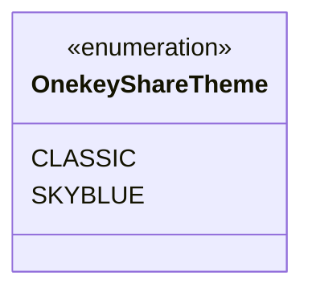
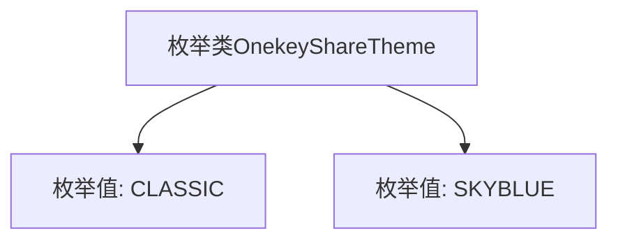

# 基础信息

|      |      |
|------|------|
| 名称 | OnekeyShareTheme |
| 编码语言 | .java |
| 代码路径 | happycat/src/cn/sharesdk/onekeyshare/OnekeyShareTheme.java |
| 包名 | cn.sharesdk.onekeyshare |
| 依赖项 | [] |
| 概述说明 | OnekeyShareTheme枚举包含两种主题：经典风格（CLASSIC）和天蓝风格（SKYBLUE）。 |

# 说明

OnekeyShareTheme是一个枚举类型，包含两个可选值：CLASSIC和SKYBLUE，分别代表经典主题和天蓝色主题。

# 类列表 Class Summary

| 名称   | 类型  | 说明 |
|-------|------|-------------|
| OnekeyShareTheme | enum | OnekeyShareTheme枚举包含两种主题：经典风格（CLASSIC）和天蓝风格（SKYBLUE）。 |

## 类 OnekeyShareTheme

|      |      |
|------|------|
| 访问范围 | public |
| 类型 | enum |
| 名称 | OnekeyShareTheme |
| 说明 | OnekeyShareTheme枚举包含两种主题：经典风格（CLASSIC）和天蓝风格（SKYBLUE）。 |

### UML类图

这段类图描述了一个名为OnekeyShareTheme的枚举类型，它包含两个枚举常量：CLASSIC和SKYBLUE。枚举在Java中是一种特殊的类，用于定义一组固定的常量值。该枚举可能用于表示一键分享功能的不同主题风格，其中CLASSIC代表经典主题，SKYBLUE代表天蓝主题。枚举类型通过<<enumeration>>标记明确标识，清晰地展示了其结构和可用选项。

### 内部方法调用关系图

该流程图展示了OnekeyShareTheme枚举类的结构，包含两个枚举值CLASSIC和SKYBLUE。枚举类是一种特殊的类，用于定义一组固定的常量，这里表示一键分享功能的两种主题风格。通过这种结构化的方式，可以确保代码中使用的主题值始终是预定义的合法选项，提高了代码的可读性和安全性。

### 字段列表 Field List

| 名称  | 类型  | 说明 |
|-------|-------|------|

### 方法列表

| 名称  | 类型  | 说明 |
|-------|-------|------|

