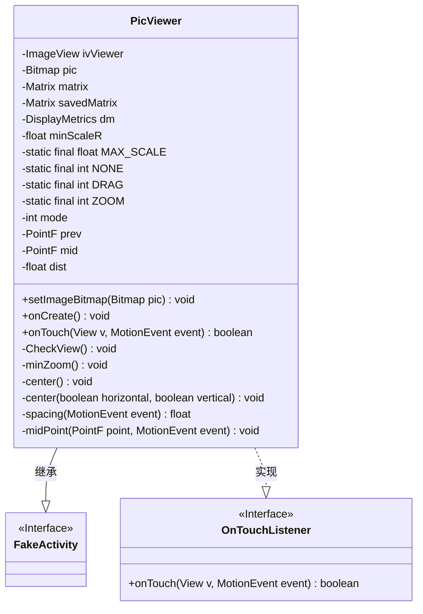
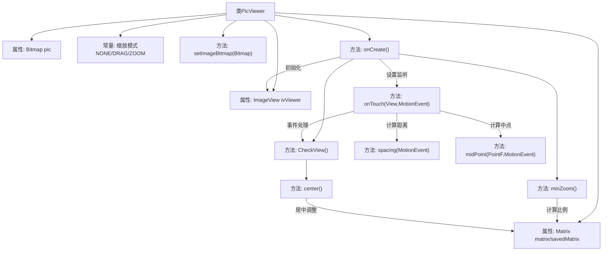

# 基础信息

|      |      |
|------|------|
| 名称 | PicViewer |
| 编码语言 | .java |
| 代码路径 | happycat/src/cn/sharesdk/onekeyshare/PicViewer.java |
| 包名 | cn.sharesdk.onekeyshare |
| 依赖项 | ['android.graphics.Bitmap', 'android.graphics.Matrix', 'android.graphics.PointF', 'android.graphics.RectF', 'android.util.DisplayMetrics', 'android.util.FloatMath', 'android.view.MotionEvent', 'android.view.View', 'android.view.View.OnTouchListener', 'android.widget.ImageView', 'android.widget.ImageView.ScaleType', 'com.mob.tools.FakeActivity'] |
| 概述说明 | PicViewer类实现图片浏览功能，支持拖动和缩放操作，自动调整居中，限制最小和最大缩放比例。 |

# 说明

PicViewer是一个继承自FakeActivity并实现OnTouchListener接口的图片浏览类。它包含ImageView控件和Bitmap对象，支持图片的拖动和缩放功能。类中定义了最小和最大缩放比例，以及三种操作模式：NONE、DRAG和ZOOM。通过Matrix对象处理图片的变换，包括平移和缩放。onTouch方法监听触摸事件，根据不同的手势切换操作模式并更新图片的显示。CheckView方法限制缩放范围并确保图片居中显示。minZoom方法计算最小缩放比例以适应屏幕。center方法实现图片在水平和垂直方向上的居中。此外，还提供了计算两点距离和中点的方法。整个类实现了图片浏览的基本功能，包括手势操作和自适应显示。

# 类列表 Class Summary

| 名称   | 类型  | 说明 |
|-------|------|-------------|
| PicViewer | class | PicViewer类实现图片浏览功能，支持触摸拖动和双指缩放，自动计算最小缩放比例并限制最大缩放为10倍，确保图片居中显示。 |

## 类 PicViewer

|      |      |
|------|------|
| 访问范围 | public |
| 类型 | class |
| 名称 | PicViewer |
| 说明 | PicViewer类实现图片浏览功能，支持触摸拖动和双指缩放，自动计算最小缩放比例并限制最大缩放为10倍，确保图片居中显示。 |

### UML类图

类图描述：
PicViewer是一个图片查看器类，继承自FakeActivity并实现了OnTouchListener接口，用于处理触摸事件。该类包含图片显示(ImageView)、位图处理(Bitmap)、矩阵变换(Matrix)等核心成员，提供图片设置、触摸缩放/拖动、视图居中校正等功能。通过维护缩放比例、触摸模式等状态变量，实现了对图片的多点触控缩放和单指拖动操作，同时确保图片始终保持在合理显示范围内。

### 内部方法调用关系图

这段代码实现了一个支持多点触控缩放和拖动的图片查看器。核心功能包括：1) 通过Matrix实现图片的矩阵变换；2) 处理触摸事件区分拖动(DRAG)和缩放(ZOOM)模式；3) 通过CheckView方法限制缩放范围并自动居中；4) 使用minZoom计算初始适配屏幕的缩放比例。流程图展示了从初始化到触摸事件处理的完整调用链，重点突出了矩阵变换与触摸状态的协同控制机制。

### 字段列表 Field List

| 名称  | 类型  | 说明 |
|-------|-------|------|
| savedMatrix = new Matrix() | Matrix | 创建名为savedMatrix的新Matrix对象实例。 |
| ivViewer | ImageView | 私有ImageView控件ivViewer。 |
| pic | Bitmap | 私有位图变量pic |
| matrix = new Matrix() | Matrix | 创建名为matrix的Matrix类新实例。 |
| dm | DisplayMetrics | 定义DisplayMetrics对象dm，用于存储屏幕显示参数。 |
| dist = 1f | float | 定义一个浮点变量dist，初始值为1.0。 |
| mid = new PointF() | PointF | 创建PointF类的mid对象实例。 |
| MAX_SCALE = 10f | float | 定义静态常量MAX_SCALE，值为10.0，不可修改。 |
| ZOOM = 2 | int | 定义静态常量ZOOM，值为2。 |
| mode = NONE | int | 变量mode初始化为NONE。 |
| prev = new PointF() | PointF | 创建名为prev的PointF类型变量并初始化为默认值。 |
| minScaleR = 1f | float | 定义最小缩放比例为1。 |
| NONE = 0 | int | 定义静态常量NONE，值为0。 |
| DRAG = 1 | int | 定义静态常量DRAG，值为1。 |

### 方法列表

| 名称  | 类型  | 说明 |
|-------|-------|------|
| onCreate | void | 创建ImageView并初始化，设置缩放类型、背景色和触摸监听。若图片有效则加载，获取屏幕分辨率后调整最小缩放，检查视图并应用矩阵变换，最后设置为活动视图。 |
| center | void | 该方法用于居中图片，根据水平和垂直方向参数调整位置。若图片小于屏幕则居中，大于屏幕则调整留空部分。通过矩阵变换实现平移。 |
| spacing | float | 计算两点间距离：获取两触点坐标差，平方和后开方返回。 |
| midPoint | void | 计算两点触摸事件的中点坐标并存储到PointF对象中。 |
| center | void | 这是一个私有方法，调用带两个布尔参数的center方法，默认参数均为true。 |
| minZoom | void | 计算图片最小缩放比例，使其适应屏幕宽度或高度，并以该比例设置矩阵缩放。 |
| CheckView | void | 检查视图缩放级别，若小于最小值则设为最小，若大于最大值则恢复原矩阵，最后居中。 |
| setImageBitmap | void | 方法setImageBitmap接收Bitmap参数pic，赋值给成员变量pic，若ivViewer非空则调用其setImageBitmap方法显示图片。 |
| onTouch | boolean | 处理触摸事件：主点按下触发拖动模式，副点按下且距离大于10触发缩放模式，移动时根据模式执行拖动或缩放操作，最后更新图像矩阵并检查视图。 |

