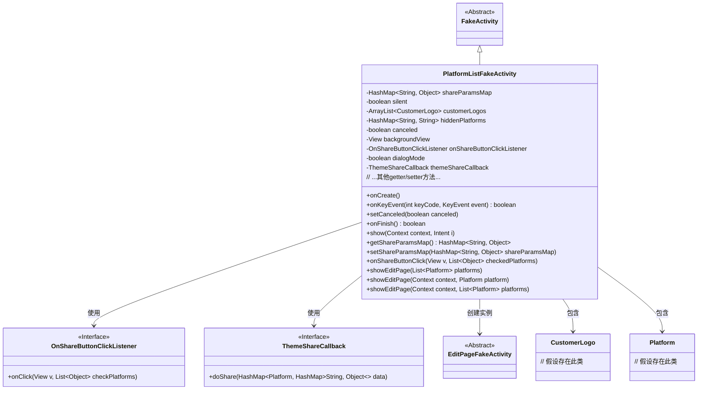

# 基础信息

|      |      |
|------|------|
| 名称 | PlatformListFakeActivity |
| 编码语言 | .java |
| 代码路径 | happycat/src/cn/sharesdk/onekeyshare/PlatformListFakeActivity.java |
| 包名 | cn.sharesdk.onekeyshare |
| 依赖项 | ['android.content.Context', 'android.content.Intent', 'android.view.KeyEvent', 'android.view.View', 'java.util.ArrayList', 'java.util.HashMap', 'java.util.List', 'com.mob.tools.FakeActivity', 'cn.sharesdk.framework.Platform', 'cn.sharesdk.framework.ShareSDK'] |
| 概述说明 | PlatformListFakeActivity是用于分享功能的类，包含分享参数、客户logo、隐藏平台等属性，支持静默分享和编辑页面分享，提供按钮点击回调及主题分享回调。 |

# 说明

PlatformListFakeActivity是一个继承自FakeActivity的类，主要用于处理分享平台列表相关功能。它包含多个成员变量，如shareParamsMap用于存储分享参数，silent控制静默分享，customerLogos存储客户Logo，hiddenPlatforms记录隐藏平台等。类提供了多种设置和获取这些变量的方法。核心功能包括处理分享按钮点击事件onShareButtonClick，根据条件执行静默分享或跳转编辑页面showEditPage。在onCreate中检查themeShareCallback为空则结束活动，onKeyEvent处理返回键事件并标记取消状态，onFinish在取消时记录统计事件。该类还支持对话框模式，并通过回调接口处理分享结果。

# 类列表 Class Summary

| 名称   | 类型  | 说明 |
|-------|------|-------------|
| PlatformListFakeActivity | class | PlatformListFakeActivity是分享功能基类，管理分享参数、平台列表及点击事件，支持静默分享和编辑页分享，包含取消逻辑和回调处理。 |

## 类 PlatformListFakeActivity

|      |      |
|------|------|
| 访问范围 | public |
| 类型 | class |
| 名称 | PlatformListFakeActivity |
| 说明 | PlatformListFakeActivity是分享功能基类，管理分享参数、平台列表及点击事件，支持静默分享和编辑页分享，包含取消逻辑和回调处理。 |

### UML类图

这段类图展示了PlatformListFakeActivity的完整结构，它继承自FakeActivity，包含多个成员变量如分享参数、客户Logo列表等，实现了界面展示、按键处理和分享逻辑。通过OnShareButtonClickListener接口处理按钮点击，依赖ThemeShareCallback执行分享操作，并能创建EditPageFakeActivity实例进行内容编辑。类图清晰地反映了代码中各个组件之间的继承、实现和依赖关系，包括6个主要类和2个接口的交互方式。

### 内部方法调用关系图

```mermaid
graph TD
    A["类PlatformListFakeActivity"]
    B["属性: HashMap<String,Object> shareParamsMap"]
    C["属性: boolean silent"]
    D["属性: ArrayList<CustomerLogo> customerLogos"]
    E["属性: HashMap<String,String> hiddenPlatforms"]
    F["属性: boolean canceled"]
    G["属性: View backgroundView"]
    H["属性: OnShareButtonClickListener"]
    I["属性: boolean dialogMode"]
    J["属性: ThemeShareCallback"]
    K["接口: OnShareButtonClickListener"]
    L["方法: onCreate()"]
    M["方法: onKeyEvent(int,KeyEvent)"]
    N["方法: setCanceled(boolean)"]
    O["方法: onFinish()"]
    P["方法: show(Context,Intent)"]
    Q["方法: getter/setter方法群"]
    R["方法: onShareButtonClick(View,List<Object>)"]
    S["方法: showEditPage重载方法群"]
    T["内部类: FakeActivity匿名类"]

    A --> B
    A --> C
    A --> D
    A --> E
    A --> F
    A --> G
    A --> H
    A --> I
    A --> J
    A --> K
    A --> L
    A --> M
    A --> N
    A --> O
    A --> P
    A --> Q
    A --> R
    A --> S
    S --> T
    L -->|super.onCreate| A
    M -->|super.onKeyEvent| A
    O -->|super.onFinish| A
    P -->|super.show| A
    R -->|onClick| K
    R -->|doShare| J
    S -->|logDemoEvent| ShareSDK
    S -->|setBackgroundView| EditPageFakeActivity
    S -->|setShareData| EditPageFakeActivity
    S -->|setPlatforms| EditPageFakeActivity
    S -->|showForResult| EditPageFakeActivity
    T -->|doShare| J
```

该流程图展示了PlatformListFakeActivity类的完整结构，包含9个主要属性、1个内部接口和10个核心方法。重点描述了onShareButtonClick事件处理流程和showEditPage页面跳转逻辑，其中涉及3层方法调用关系和4个外部组件交互。匿名内部类处理编辑结果回调，通过themeShareCallback实现跨组件通信。整个流程严格遵循Android生命周期管理和事件传递机制。

### 字段列表 Field List

| 名称  | 类型  | 说明 |
|-------|-------|------|
| backgroundView | View | 背景视图保护声明 |
| hiddenPlatforms | HashMap<String, String> | 隐藏平台映射表，键值均为字符串类型。 |
| silent | boolean | 受保护的布尔变量，控制静默状态。 |
| shareParamsMap | HashMap<String, Object> | 这是一个受保护的HashMap变量，键为String类型，值为Object类型，用于存储共享参数。 |
| dialogMode = false | boolean | 对话框模式开关，默认关闭。 |
| onShareButtonClickListener | OnShareButtonClickListener | 定义了一个受保护的分享按钮点击监听器变量。 |
| canceled = false | boolean | 变量canceled初始为false，表示未取消状态。 |
| customerLogos | ArrayList<CustomerLogo> | 保护类型的CustomerLogo对象动态数组，用于存储客户标识。 |
| themeShareCallback | ThemeShareCallback | 主题分享回调函数。 |

### 方法列表

| 名称  | 类型  | 说明 |
|-------|-------|------|
| showEditPage | void | 方法showEditPage接收上下文和平台参数，创建包含该平台的列表，并调用重载方法处理多平台编辑页显示。 |
| showEditPage | void | 方法展示编辑页，记录统计，初始化编辑页实例，设置背景、分享数据和平台，支持对话框模式，处理分享结果回调。 |
| setBackgroundView | void | 设置背景视图的方法，将输入视图赋值给当前对象的backgroundView属性。 |
| isSilent | boolean | 方法isSilent返回布尔值silent，表示静默状态。 |
| isDialogMode | boolean | 这是一个Java方法，返回布尔值dialogMode，表示是否为对话框模式。 |
| getOnShareButtonClickListener | OnShareButtonClickListener | 获取分享按钮点击监听器的方法，返回已设置的监听器对象。 |
| onCreate | void | 方法onCreate执行父类逻辑，初始化canceled为false。若themeShareCallback为空则结束当前活动。 |
| getShareParamsMap | HashMap<String, Object> | 获取共享参数字典的方法，返回HashMap类型，键为String，值为Object。 |
| getHiddenPlatforms | HashMap<String, String> | 方法getHiddenPlatforms返回一个HashMap，键值均为String类型，存储隐藏平台信息。 |
| setCustomerLogos | void | 设置客户Logo列表的方法，将输入列表赋值给类成员变量customerLogos。 |
| onFinish | boolean | 方法onFinish在取消分享时记录统计事件，并调用父类方法返回结果。 |
| onKeyEvent | boolean | 处理返回键事件，设置取消标志并调用父类方法。 |
| getBackgroundView | View | 获取背景视图的方法，返回backgroundView对象。 |
| getCustomerLogos | ArrayList<CustomerLogo> | 方法返回客户Logo列表。 |
| setHiddenPlatforms | void | 设置隐藏平台的方法，参数为HashMap类型，键值对均为String。 |
| show | void | 重写show方法，调用父类实现并传入上下文和意图参数。 |
| setCanceled | void | 方法设置取消状态，更新内部布尔变量canceled的值。 |
| setOnShareButtonClickListener | void | 设置分享按钮点击监听器，传入自定义监听接口实例。 |
| setShareParamsMap | void | 定义公有方法setShareParamsMap，接收HashMap类型参数shareParamsMap，并将其赋值给当前对象的同名成员变量。 |
| setSilent | void | 设置静音状态的方法，参数为布尔值silent，用于控制静音开关。 |
| setDialogMode | void | 设置对话框模式的方法，通过布尔参数控制dialogMode状态。 |
| getThemeShareCallback | ThemeShareCallback | 方法返回主题分享回调对象themeShareCallback。 |
| setThemeShareCallback | void | 设置主题分享回调接口，将传入的themeShareCallback赋值给当前对象的同名属性。 |
| onShareButtonClick | void | 点击分享按钮时处理分享逻辑：触发监听器，区分直接分享和编辑页分享平台，执行对应操作后结束。 |
| showEditPage | void | 显示编辑页面，传入上下文和平台列表参数。 |

