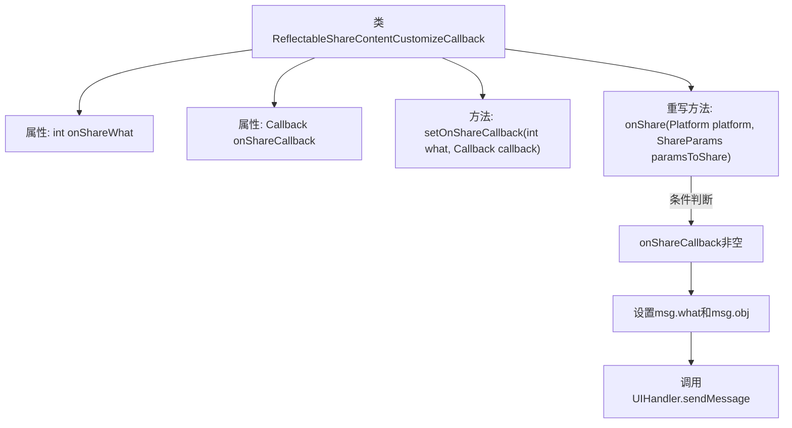

# 基础信息

|      |      |
|------|------|
| 名称 | ReflectableShareContentCustomizeCallback |
| 编码语言 | .java |
| 代码路径 | happycat/src/cn/sharesdk/onekeyshare/ReflectableShareContentCustomizeCallback.java |
| 包名 | cn.sharesdk.onekeyshare |
| 依赖项 | ['android.os.Handler.Callback', 'android.os.Message', 'cn.sharesdk.framework.Platform', 'cn.sharesdk.framework.Platform.ShareParams', 'com.mob.tools.utils.UIHandler'] |
| 概述说明 | ReflectableShareContentCustomizeCallback类实现ShareContentCustomizeCallback接口，通过setOnShareCallback设置回调，在onShare时发送包含平台和分享参数的消息给UIHandler处理。 |

# 说明

这是一个名为ReflectableShareContentCustomizeCallback的类，实现了ShareContentCustomizeCallback接口。它包含两个私有成员变量：onShareWhat（整型）和onShareCallback（Callback类型）。提供了setOnShareCallback方法用于设置回调参数，接收一个整型what值和Callback回调对象。重写了onShare方法，当onShareCallback不为空时，会创建包含平台信息和分享参数的Message对象，并通过UIHandler发送消息触发回调。该类主要用于处理分享内容时的回调逻辑。

# 类列表 Class Summary

| 名称   | 类型  | 说明 |
|-------|------|-------------|
| ReflectableShareContentCustomizeCallback | class | ReflectableShareContentCustomizeCallback类实现ShareContentCustomizeCallback接口，通过setOnShareCallback设置回调，在onShare时通过UIHandler发送消息触发回调。 |


## 类 ReflectableShareContentCustomizeCallback

|      |      |
|------|------|
| 访问范围 | public |
| 类型 | class |
| 名称 | ReflectableShareContentCustomizeCallback |
| 说明 | ReflectableShareContentCustomizeCallback类实现ShareContentCustomizeCallback接口，通过setOnShareCallback设置回调，在onShare时通过UIHandler发送消息触发回调。 |


### UML类图

```mermaid
classDiagram
    class ReflectableShareContentCustomizeCallback {
        -int onShareWhat
        -Callback onShareCallback
        +setOnShareCallback(int what, Callback callback) void
        +onShare(Platform platform, ShareParams paramsToShare) void
    }

    <<Interface>> ShareContentCustomizeCallback {
        <<interface>>
        +onShare(Platform platform, ShareParams paramsToShare) void
    }

    ReflectableShareContentCustomizeCallback ..|> ShareContentCustomizeCallback : 实现
    ReflectableShareContentCustomizeCallback --> Callback : 依赖
    ReflectableShareContentCustomizeCallback --> Platform : 依赖
    ReflectableShareContentCustomizeCallback --> ShareParams : 依赖
    ReflectableShareContentCustomizeCallback --> Message : 依赖
    ReflectableShareContentCustomizeCallback --> UIHandler : 依赖
```

这段代码定义了一个`ReflectableShareContentCustomizeCallback`类，实现了`ShareContentCustomizeCallback`接口，用于处理分享内容的回调逻辑。类中包含两个私有字段：`onShareWhat`标识分享类型，`onShareCallback`存储回调函数。通过`setOnShareCallback`方法设置回调参数，当触发`onShare`方法时，会构造包含平台和分享参数的`Message`对象，并通过`UIHandler`发送给回调处理器。该设计实现了分享事件与UI层的解耦，通过消息机制传递数据。


### 内部方法调用关系图



该流程图展示了ReflectableShareContentCustomizeCallback类的结构和核心逻辑。类包含两个属性和两个方法，其中onShare方法实现了分享内容回调功能。当onShareCallback有效时，会创建消息对象并填充平台和分享参数数据，最后通过UIHandler发送消息。整个过程体现了条件判断和消息传递机制，用于实现可定制的分享回调处理。

### 字段列表 Field List

| 名称  | 类型  | 说明 |
|-------|-------|------|
| onShareWhat | int | 私有整型变量onShareWhat |
| onShareCallback | Callback | 私有回调函数onShareCallback，用于处理分享操作。 |

### 方法列表

| 名称  | 类型  | 说明 |
|-------|-------|------|
| setOnShareCallback | void | 设置分享回调函数，参数为事件类型和回调方法。 |
| onShare | void | 重写分享方法，若回调存在则发送平台和参数消息给UI处理程序。 |


