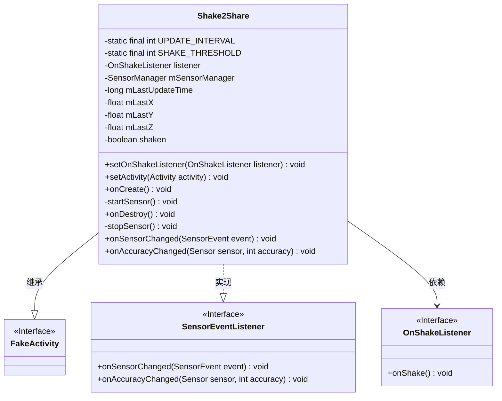
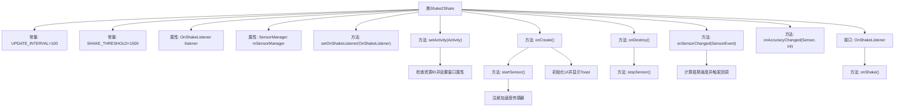
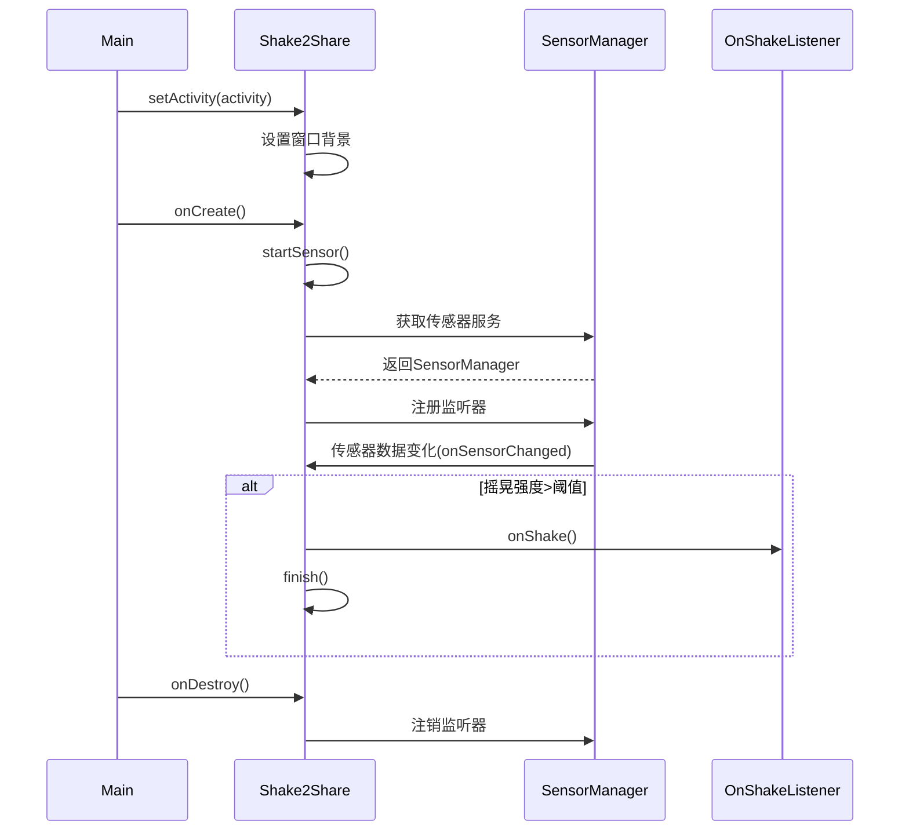

# 基础信息

|      |      |
|------|------|
| 名称 | Shake2Share |
| 编码语言 | .java |
| 代码路径 | happycat/src/cn/sharesdk/onekeyshare/Shake2Share.java |
| 包名 | cn.sharesdk.onekeyshare |
| 依赖项 | ['com.mob.tools.utils.R', 'android.app.Activity', 'android.content.Context', 'android.hardware.Sensor', 'android.hardware.SensorEvent', 'android.hardware.SensorEventListener', 'android.hardware.SensorManager', 'android.util.FloatMath', 'android.view.Window', 'android.widget.ImageView', 'android.widget.Toast', 'android.widget.ImageView.ScaleType', 'com.mob.tools.FakeActivity'] |
| 概述说明 | Shake2Share类实现摇一摇分享功能，通过加速度传感器检测摇晃动作，触发回调事件，包含界面设置和传感器管理。 |

# 说明

Shake2Share类继承FakeActivity并实现SensorEventListener接口，用于检测手机摇晃动作。主要功能包括：设置100毫秒的检测间隔和1500的摇晃敏感阈值；通过传感器管理器注册加速度计监听；在onCreate时启动传感器并设置摇一摇分享界面；当检测到摇晃动作超过阈值时触发OnShakeListener回调并结束活动；包含完整的生命周期管理，在销毁时注销传感器监听。界面方面会设置对话框样式背景和摇一摇图标，并显示提示文字。

# 类列表 Class Summary

| 名称   | 类型  | 说明 |
|-------|------|-------------|
| Shake2Share | class | Shake2Share类实现摇晃检测功能，通过加速度传感器监听手机摇晃动作，触发OnShakeListener回调。设置界面主题和背景，检测间隔100ms，阈值1500决定灵敏度。 |

## 类 Shake2Share

|      |      |
|------|------|
| 访问范围 | public |
| 类型 | class |
| 名称 | Shake2Share |
| 说明 | Shake2Share类实现摇晃检测功能，通过加速度传感器监听手机摇晃动作，触发OnShakeListener回调。设置界面主题和背景，检测间隔100ms，阈值1500决定灵敏度。 |

### UML类图

这段代码定义了一个`Shake2Share`类，继承自`FakeActivity`并实现了`SensorEventListener`接口，用于检测手机摇晃事件。类中包含传感器管理、摇晃检测阈值等私有常量，以及记录传感器数据的私有变量。通过`OnShakeListener`接口回调摇晃事件，并在检测到摇晃时触发相应操作。代码还处理了Activity的生命周期方法，如`onCreate`和`onDestroy`，用于初始化和释放传感器资源。整体设计实现了摇晃检测与界面交互的解耦，通过监听器模式提供扩展性。

### 内部方法调用关系图

这段代码实现了一个基于加速度传感器的摇晃检测功能，主要用于实现"摇一摇分享"的交互场景。流程图展示了类结构关系，包含常量定义、属性声明、主要方法调用链和内部接口；时序图则描述了从初始化到检测摇晃的完整过程，包括传感器注册、数据监听和回调触发机制。代码通过计算三轴加速度变化量来判断摇晃动作，当超过设定阈值时触发回调并结束活动。

### 字段列表 Field List

| 名称  | 类型  | 说明 |
|-------|-------|------|
| UPDATE_INTERVAL = 100 | int | 定义私有静态常量UPDATE_INTERVAL，值为100毫秒的更新间隔。 |
| listener | OnShakeListener | 私有摇动事件监听器对象。 |
| mSensorManager | SensorManager | 私有传感器管理器变量mSensorManager。 |
| mLastY | float | 私有浮点型变量，记录上一次的Y坐标值。 |
| mLastUpdateTime | long | 私有长整型变量，记录最后更新时间。 |
| SHAKE_THRESHOLD = 1500 | int | 定义静态常量SHAKE_THRESHOLD，值为1500，用于判断摇晃动作的阈值。 |
| mLastX | float | 私有浮点型变量，记录上一次的X坐标值。 |
| mLastZ | float | 私有浮点型变量，记录上一次的Z值。 |
| shaken | boolean | 布尔型变量，表示是否被摇动。 |

### 方法列表

| 名称  | 类型  | 说明 |
|-------|-------|------|
| startSensor | void | 该方法用于启动传感器，获取加速度计并注册监听器，失败时抛出异常。 |
| onCreate | void | 方法onCreate启动传感器，加载指定图片并设为视图内容，若存在字符串资源则显示短暂提示。 |
| setActivity | void | 该方法设置活动，继承父类设置，获取资源ID后若有效则设置对话框主题、隐藏标题栏，并设置窗口背景为指定资源。 |
| stopSensor | void | 停止传感器：若传感器管理器存在，注销监听并置空管理器。 |
| onSensorChanged | void | 传感器数据变化时计算时间差和位移差，若超过阈值则触发摇晃事件并调用监听器。更新最后记录的数据和时间。 |
| onAccuracyChanged | void | 传感器精度变化时的空回调方法，参数为传感器对象和精度值。 |
| onDestroy | void | 方法onDestroy调用stopSensor停止传感器。 |
| setOnShakeListener | void | 设置手机摇动事件的监听器，当摇动时触发回调。 |

