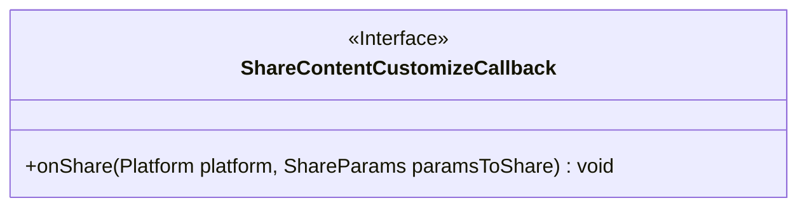
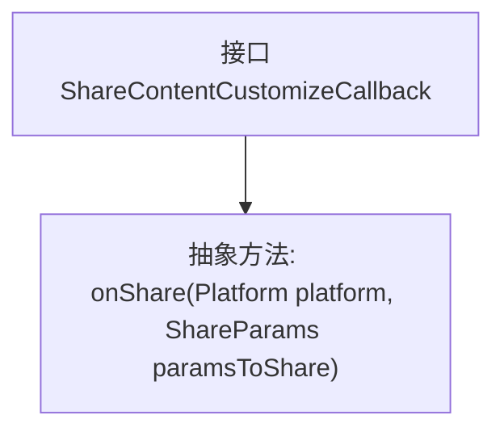

# 基础信息

|      |      |
|------|------|
| 名称 | ShareContentCustomizeCallback |
| 编码语言 | .java |
| 代码路径 | happycat/src/cn/sharesdk/onekeyshare/ShareContentCustomizeCallback.java |
| 包名 | cn.sharesdk.onekeyshare |
| 依赖项 | ['cn.sharesdk.framework.Platform', 'cn.sharesdk.framework.Platform.ShareParams'] |
| 概述说明 | 接口ShareContentCustomizeCallback定义分享内容回调方法onShare，接收平台和分享参数。 |

# 说明

这是一个名为ShareContentCustomizeCallback的Java接口，定义了一个回调方法onShare。该方法接收两个参数：Platform类型的platform对象和ShareParams类型的paramsToShare对象。该接口的主要功能是提供内容分享时的自定义回调机制，允许开发者在分享操作发生时执行特定逻辑。接口设计简洁，仅包含一个方法声明，体现了单一职责原则。

# 类列表 Class Summary

| 名称   | 类型  | 说明 |
|-------|------|-------------|
| ShareContentCustomizeCallback | interface | 分享内容自定义回调接口，定义onShare方法，接收平台和分享参数。 |

## 类 ShareContentCustomizeCallback

|      |      |
|------|------|
| 访问范围 | public |
| 类型 | interface |
| 名称 | ShareContentCustomizeCallback |
| 说明 | 分享内容自定义回调接口，定义onShare方法，接收平台和分享参数。 |

### UML类图

这段代码定义了一个名为`ShareContentCustomizeCallback`的接口，其中包含一个抽象方法`onShare`，该方法接收`Platform`和`ShareParams`两个参数且无返回值。该接口用于实现分享内容的自定义回调逻辑，允许不同平台通过实现此接口来定义具体的分享行为。接口设计简洁明确，符合单一职责原则，便于扩展和实现多平台分享功能。

### 内部方法调用关系图

这段代码定义了一个名为ShareContentCustomizeCallback的接口，其中包含一个抽象方法onShare。该接口用于实现分享内容的自定义回调功能，当调用分享操作时会触发onShare方法，接收平台类型(Platform)和分享参数(ShareParams)作为输入参数。这种设计允许外部实现具体的分享逻辑，体现了面向接口编程的思想。

### 字段列表 Field List

| 名称  | 类型  | 说明 |
|-------|-------|------|

### 方法列表

| 名称  | 类型  | 说明 |
|-------|-------|------|
| onShare | void | 方法onShare用于分享内容，接收平台参数和分享参数。 |

