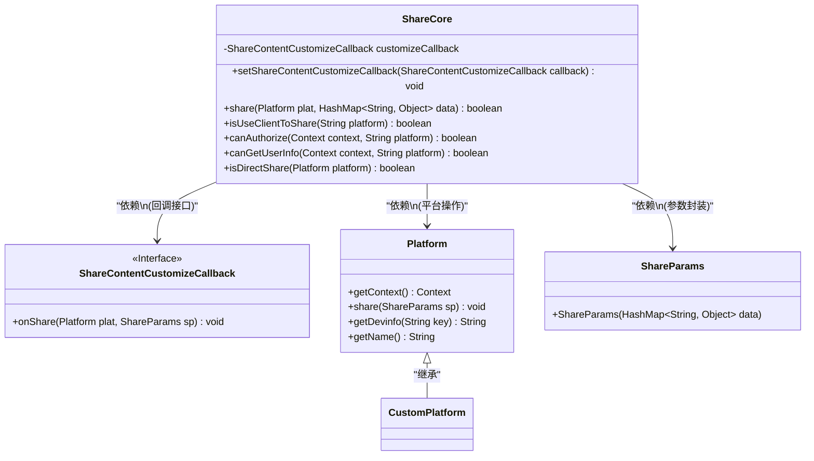
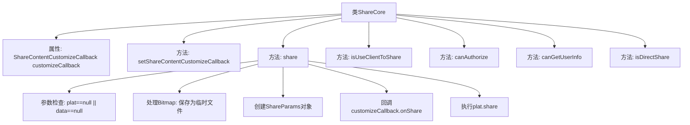

# 基础信息

|      |      |
|------|------|
| 名称 | ShareCore |
| 编码语言 | .java |
| 代码路径 | happycat/src/cn/sharesdk/onekeyshare/ShareCore.java |
| 包名 | cn.sharesdk.onekeyshare |
| 依赖项 | ['java.io.File', 'java.io.FileOutputStream', 'java.util.HashMap', 'android.content.Context', 'android.content.Intent', 'android.content.pm.ResolveInfo', 'android.graphics.Bitmap', 'android.graphics.Bitmap.CompressFormat', 'android.text.TextUtils', 'cn.sharesdk.framework.CustomPlatform', 'cn.sharesdk.framework.Platform', 'cn.sharesdk.framework.Platform.ShareParams', 'cn.sharesdk.framework.ShareSDK', 'com.mob.tools.utils.R'] |
| 概述说明 | ShareCore类提供分享功能，支持自定义回调，处理图片路径转换，判断平台是否支持客户端分享、授权及获取用户信息。 |

# 说明

ShareCore类提供社交平台分享功能的核心实现。主要功能包括：1. 通过setShareContentCustomizeCallback设置分享内容自定义回调；2. share方法处理分享逻辑，支持将Bitmap转换为图片文件后分享，并调用自定义回调；3. 提供多个静态方法判断平台特性：isUseClientToShare检查是否使用客户端分享，canAuthorize判断平台是否支持授权，canGetUserInfo判断能否获取用户信息，isDirectShare判断是否直接分享。类中包含了微信、QQ等20多个主流社交平台的判断逻辑，并处理了新浪微博等平台的特殊情况。

# 类列表 Class Summary

| 名称   | 类型  | 说明 |
|-------|------|-------------|
| ShareCore | class | ShareCore类提供分享功能核心逻辑，包括设置回调、分享内容处理、平台判断及授权与用户信息获取能力检查。支持多平台，处理图片路径转换，并包含多种静态方法用于平台特性判断。 |

## 类 ShareCore

|      |      |
|------|------|
| 访问范围 | public |
| 类型 | class |
| 名称 | ShareCore |
| 说明 | ShareCore类提供分享功能核心逻辑，包括设置回调、分享内容处理、平台判断及授权与用户信息获取能力检查。支持多平台，处理图片路径转换，并包含多种静态方法用于平台特性判断。 |

### UML类图

该代码实现了一个社交分享核心类ShareCore，主要功能包括：通过回调接口自定义分享内容、处理不同平台的分享逻辑（含图片缓存处理）、判断平台是否支持客户端分享/授权/获取用户信息等。类图中清晰展示了ShareCore与Platform、ShareParams的依赖关系，以及通过ShareContentCustomizeCallback接口实现扩展点设计。其中Platform作为基类可被CustomPlatform继承扩展，体现了良好的开闭原则。

### 内部方法调用关系图

流程图描述：该流程图展示了ShareCore类的结构和主要方法调用关系。核心方法share()首先进行参数检查，然后处理Bitmap图像保存为临时文件，创建ShareParams对象并触发自定义回调，最后执行平台分享。其他静态方法包括判断平台是否使用客户端分享、授权能力、获取用户信息能力等。类通过回调接口支持分享内容的自定义处理。

### 字段列表 Field List

| 名称  | 类型  | 说明 |
|-------|-------|------|
| customizeCallback | ShareContentCustomizeCallback | 私有成员变量：ShareContentCustomizeCallback类型的customizeCallback，用于自定义分享内容。 |

### 方法列表

| 名称  | 类型  | 说明 |
|-------|-------|------|
| isUseClientToShare | boolean | 该方法判断指定平台是否使用客户端分享。若平台为微信等常见社交应用直接返回true；Evernote和微博需检查配置或客户端是否存在；其他情况返回false。 |
| setShareContentCustomizeCallback | void | 设置分享内容自定义回调函数，将传入的callback赋值给customizeCallback。 |
| canAuthorize | boolean | 方法判断指定平台是否不支持授权，返回布尔值。 |
| share | boolean | 检查平台和数据有效性，若无效返回false。处理图片路径和位图，保存未回收的位图为截图文件并更新路径。创建分享参数，执行自定义回调后调用平台分享方法，成功返回true，异常返回false。 |
| canGetUserInfo | boolean | 检查平台是否支持获取用户信息，排除微信朋友圈等16种平台。 |
| isDirectShare | boolean | 静态方法检查平台是否支持直接分享：判断条件是平台为CustomPlatform实例或通过名称调用isUseClientToShare返回true。 |

