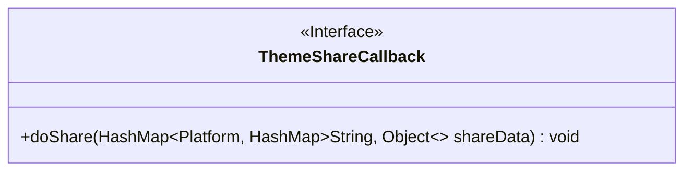
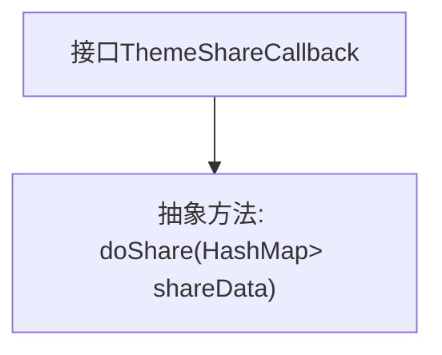

# 基础信息

|      |      |
|------|------|
| 名称 | ThemeShareCallback |
| 编码语言 | .java |
| 代码路径 | happycat/src/cn/sharesdk/onekeyshare/ThemeShareCallback.java |
| 包名 | cn.sharesdk.onekeyshare |
| 依赖项 | ['java.util.HashMap', 'cn.sharesdk.framework.Platform'] |
| 概述说明 | 接口ThemeShareCallback定义分享方法doShare，参数为平台与分享数据的映射。 |

# 说明

这是一个名为ThemeShareCallback的Java接口，定义了一个名为doShare的方法。该方法接受一个HashMap参数，其中键为Platform类型，值为另一个HashMap，其键为String类型，值为Object类型。该接口用于实现主题分享功能，通过回调机制处理不同平台的分享数据。

# 类列表 Class Summary

| 名称   | 类型  | 说明 |
|-------|------|-------------|
| ThemeShareCallback | interface | 接口ThemeShareCallback定义分享方法doShare，参数为平台与分享数据的映射。 |

## 类 ThemeShareCallback

|      |      |
|------|------|
| 访问范围 | public |
| 类型 | interface |
| 名称 | ThemeShareCallback |
| 说明 | 接口ThemeShareCallback定义分享方法doShare，参数为平台与分享数据的映射。 |

### UML类图

这段代码定义了一个名为`ThemeShareCallback`的接口，其中包含一个`doShare`方法，该方法接收一个泛型参数`HashMap<Platform, HashMap<String, Object>>`作为输入，用于处理主题分享的数据。接口通过`<<Interface>>`标记明确表示其接口特性，方法使用`+`表示公有访问权限，泛型参数使用`~`符号标注，清晰地展示了类型参数的结构。该接口可能用于实现不同平台的主题分享功能回调。

### 内部方法调用关系图

这段代码定义了一个名为ThemeShareCallback的接口，其中包含一个抽象方法doShare。该方法接收一个复杂参数：以Platform为键、嵌套HashMap为值的HashMap，用于处理多平台分享数据。接口作为回调机制的核心，强制实现类必须处理分享逻辑，适用于需要支持微信、微博等多平台分享功能的场景。参数结构设计允许灵活传递不同平台所需的差异化分享参数。

### 字段列表 Field List

| 名称  | 类型  | 说明 |
|-------|-------|------|

### 方法列表

| 名称  | 类型  | 说明 |
|-------|-------|------|
| doShare | void | 方法doShare接收一个嵌套HashMap参数shareData，键为Platform类型，值为包含字符串键和对象值的HashMap，用于平台分享数据。 |

