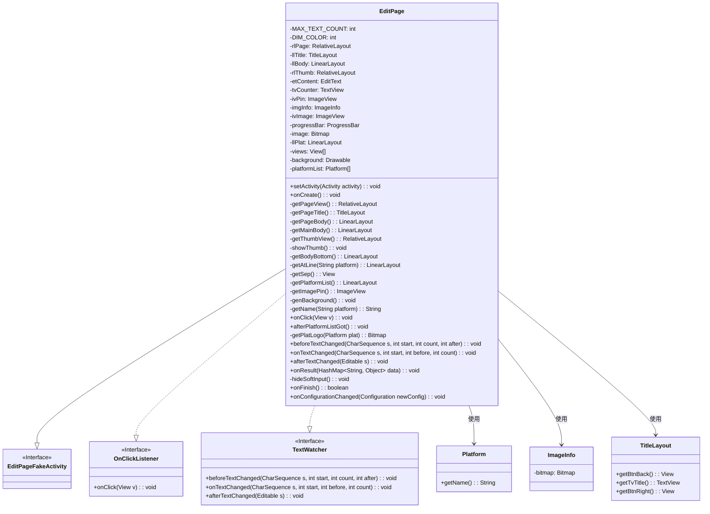
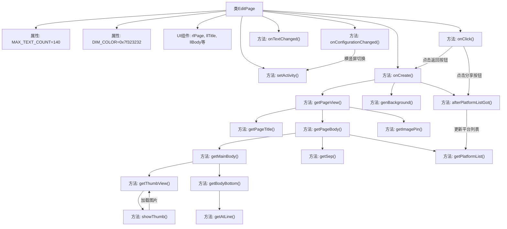

# 基础信息

|      |      |
|------|------|
| 名称 | EditPage |
| 编码语言 | .java |
| 代码路径 | happycat/src/cn/sharesdk/onekeyshare/theme/classic/EditPage.java |
| 包名 | cn.sharesdk.onekeyshare.theme.classic |
| 依赖项 | ['com.mob.tools.utils.BitmapHelper.blur', 'com.mob.tools.utils.BitmapHelper.captureView', 'com.mob.tools.utils.R.dipToPx', 'com.mob.tools.utils.R.getBitmapRes', 'com.mob.tools.utils.R.getScreenWidth', 'com.mob.tools.utils.R.getStringRes', 'java.util.ArrayList', 'java.util.HashMap', 'android.app.Activity', 'android.content.Context', 'android.content.res.Configuration', 'android.graphics.Bitmap', 'android.graphics.BitmapFactory', 'android.graphics.Typeface', 'android.graphics.drawable.BitmapDrawable', 'android.graphics.drawable.ColorDrawable', 'android.graphics.drawable.Drawable', 'android.graphics.drawable.LayerDrawable', 'android.os.Handler.Callback', 'android.os.Message', 'android.text.Editable', 'android.text.TextWatcher', 'android.util.TypedValue', 'android.view.Gravity', 'android.view.View', 'android.view.View.OnClickListener', 'android.view.Window', 'android.view.WindowManager', 'android.view.inputmethod.InputMethodManager', 'android.widget.Button', 'android.widget.EditText', 'android.widget.FrameLayout', 'android.widget.HorizontalScrollView', 'android.widget.ImageView', 'android.widget.ImageView.ScaleType', 'android.widget.LinearLayout', 'android.widget.LinearLayout.LayoutParams', 'android.widget.ProgressBar', 'android.widget.RelativeLayout', 'android.widget.TextView', 'android.widget.Toast', 'cn.sharesdk.framework.CustomPlatform', 'cn.sharesdk.framework.Platform', 'cn.sharesdk.framework.ShareSDK', 'cn.sharesdk.framework.TitleLayout', 'com.mob.tools.utils.UIHandler', 'cn.sharesdk.onekeyshare.EditPageFakeActivity', 'cn.sharesdk.onekeyshare.PicViewer', 'cn.sharesdk.onekeyshare.ShareCore'] |
| 概述说明 | EditPage类是一个Android分享编辑页面，包含标题栏、内容编辑区、图片缩略图、字数统计和平台选择功能。支持多平台分享，提供图片预览和@好友功能，最大输入140字。 |

# 说明

EditPage类是一个用于多平台分享的编辑页面，继承自EditPageFakeActivity并实现了点击和文本监听接口。主要功能包括：1) 提供140字限制的文本编辑框及字数统计；2) 支持图片预览和删除功能；3) 根据屏幕方向调整软键盘显示模式；4) 动态加载分享平台列表并处理平台选择逻辑；5) 实现@好友功能（支持微博等平台）；6) 包含分享取消和提交按钮。页面布局采用RelativeLayout和LinearLayout组合，包含标题栏、编辑区、平台选择区和图片缩略图区域，支持对话框模式和全屏模式两种显示方式。

# 类列表 Class Summary

| 名称   | 类型  | 说明 |
|-------|------|-------------|
| EditPage | class | EditPage类是一个Android分享编辑页面，包含标题栏、内容编辑框、图片缩略图、字数统计和平台选择功能，支持多平台分享和横竖屏适配。 |

## 类 EditPage

|      |      |
|------|------|
| 访问范围 | public |
| 类型 | class |
| 名称 | EditPage |
| 说明 | EditPage类是一个Android分享编辑页面，包含标题栏、内容编辑框、图片缩略图、字数统计和平台选择功能，支持多平台分享和横竖屏适配。 |

### UML类图

这段类图描述了EditPage类的结构及其与相关接口和类的关系。EditPage是一个用于编辑和分享内容的页面，继承自EditPageFakeActivity并实现了OnClickListener和TextWatcher接口。它包含多个UI组件（如EditText、TextView、ImageView等）和平台相关逻辑，用于处理用户输入、字数统计、图片显示和平台选择等功能。类图清晰地展示了EditPage的成员变量、方法及其与外部组件的交互关系，体现了该类的复杂性和多功能性。

### 内部方法调用关系图

这段代码实现了一个社交媒体分享编辑页面，主要功能包括：初始化UI组件（标题栏、内容编辑区、图片缩略图、平台选择区）、处理用户输入（文本计数和@功能）、管理分享平台列表、响应横竖屏切换事件。核心流程从onCreate()开始，依次构建页面布局，其中getPageView()作为总入口调用各子组件构建方法，最后通过onClick()处理用户交互事件。代码通过异步线程获取平台数据，并使用观察者模式处理文本变化和配置变更。

### 字段列表 Field List

| 名称  | 类型  | 说明 |
|-------|-------|------|
| llPlat | LinearLayout | 私有线性布局组件llPlat。 |
| background | Drawable | 私有背景可绘制对象 |
| rlThumb | RelativeLayout | 私有相对布局控件rlThumb。 |
| progressBar | ProgressBar | 进度条控件实例。 |
| llBody | LinearLayout | 私有线性布局变量llBody |
| MAX_TEXT_COUNT = 140 | int | 定义常量MAX_TEXT_COUNT，值为140，表示最大文本长度限制。 |
| etContent | EditText | 私有EditText控件变量etContent |
| imgInfo | ImageInfo | 私有图像信息对象 |
| ivPin | ImageView | 私有图片视图控件ivPin。 |
| ivImage | ImageView | 私有ImageView控件ivImage。 |
| image | Bitmap | 私有位图图像变量。 |
| rlPage | RelativeLayout | 私有相对布局控件rlPage。 |
| tvCounter | TextView | 私有文本视图控件tvCounter |
| DIM_COLOR = 0x7f323232 | int | 定义私有静态常量DIM_COLOR，值为十六进制颜色码0x7f323232。 |
| llTitle | TitleLayout | 私有标题布局控件llTitle |
| platformList | Platform[] | 私有平台数组变量platformList。 |
| views | View[] | 私有视图数组变量views。 |

### 方法列表

| 名称  | 类型  | 说明 |
|-------|-------|------|
| getImagePin | ImageView | 创建ImageView控件，设置图片资源为"pin"，宽高80x36dp，顶部边距6dp，右对齐且顶部对齐llBody，初始状态为隐藏。 |
| onResult | void | 方法onResult接收HashMap参数data，调用getJoinSelectedUser获取atText，非空时将其追加到etContent。 |
| onTextChanged | void | 文本变化时更新剩余字数显示，超限变红色。 |
| afterTextChanged | void | 方法afterTextChanged在文本变化后执行，参数s为编辑后的文本内容。 |
| hideSoftInput | void | 隐藏软键盘方法：获取输入法管理器并隐藏当前窗口的软键盘，捕获异常打印日志。 |
| onFinish | boolean | 方法onFinish执行隐藏软键盘操作并返回父类同名方法的结果。 |
| onConfigurationChanged | void | 方法在屏幕方向改变时执行：横屏隐藏软键盘并设置背景，竖屏显示软键盘并设置背景，均延迟1秒更新背景。 |
| onCreate | void | 方法onCreate检查参数后初始化界面，后台线程获取平台列表并过滤，完成后通知UI更新。 |
| showThumb | void | 方法showThumb初始化图片列表，回调处理获取的首张图片，显示缩略图并隐藏进度条。 |
| beforeTextChanged | void | 方法beforeTextChanged在文本变化前触发，参数包括字符序列s、起始位置start、被替换字符数count和新增字符数after。 |
| afterPlatformListGot | void | 方法afterPlatformListGot初始化视图列表，设置布局参数和边距，循环创建平台图标和遮罩视图，处理点击事件，最后延迟滚动到选中平台位置。 |
| onClick | void | 点击事件处理：返回按钮触发取消分享统计并结束；右按钮验证输入并分享非可见平台内容，无选择则提示；FrameLayout触发子项点击；其他情况切换可见性。 |
| getSep | View | 创建分隔线视图，背景黑色，高度1dp，宽度填满父布局。 |
| getAtLine | LinearLayout | 创建线性布局，包含点击事件和两个文本视图，用于显示用户和平台信息。 |
| getName | String | 该方法根据平台参数获取对应名称字符串。若平台为空返回空字符串，否则通过资源ID获取本地化字符串并返回。 |
| getBodyBottom | LinearLayout | 创建底部布局，包含平台名称行和字数计数器，计数器显示最大文本数并设置样式。 |
| getPlatformList | LinearLayout | 创建水平布局，包含分享文本和横向滚动视图，设置边距和样式后返回布局。 |
| getPageTitle | TitleLayout | 创建标题布局，设置返回按钮点击事件，标题文本和右侧分享按钮，并定义布局参数。 |
| getPageView | RelativeLayout | 创建RelativeLayout页面视图，根据dialogMode设置背景和子视图布局，包含标题、正文和固定图像。 |
| genBackground | void | 方法genBackground生成模糊背景：创建暗色背景，若backgroundView存在则捕获其视图，模糊处理后与暗色背景叠加，异常时打印错误。 |
| getThumbView | RelativeLayout | 创建缩略图视图，包含图片、进度条和删除按钮，支持点击查看大图和移除图片功能。 |
| getPageBody | LinearLayout | 创建垂直布局llBody，设置背景、对齐标题布局，添加边距和子视图。 |
| setActivity | void | 方法setActivity设置关联Activity，根据屏幕方向调整软键盘模式：横屏时隐藏，竖屏时显示，均使用PAN调整模式。 |
| getMainBody | LinearLayout | 创建垂直布局的LinearLayout，设置边距和权重，包含内容编辑框和底部视图。 |
| getPlatLogo | Bitmap | 该方法根据平台名称获取对应LOGO的位图。若平台或名称为空返回null，否则拼接资源名并查找，找到则解码返回位图，否则返回null。 |

