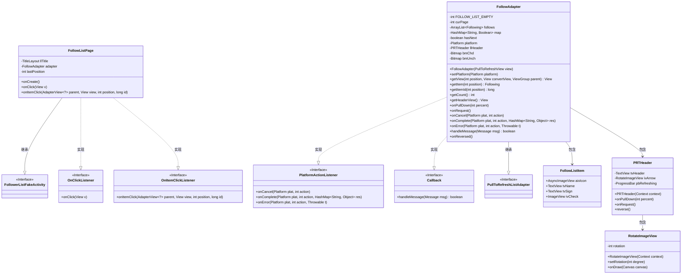

# 基础信息

|      |      |
|------|------|
| 名称 | FollowListPage |
| 编码语言 | .java |
| 代码路径 | happycat/src/cn/sharesdk/onekeyshare/theme/classic/FollowListPage.java |
| 包名 | cn.sharesdk.onekeyshare.theme.classic |
| 依赖项 | ['android.app.Activity', 'android.content.Context', 'android.graphics.Bitmap', 'android.graphics.BitmapFactory', 'android.graphics.Canvas', 'android.os.Handler.Callback', 'android.os.Message', 'android.util.TypedValue', 'android.view.Gravity', 'android.view.View', 'android.view.View.OnClickListener', 'android.view.ViewGroup', 'android.widget.AdapterView', 'android.widget.AdapterView.OnItemClickListener', 'android.widget.FrameLayout', 'android.widget.ImageView', 'android.widget.LinearLayout', 'android.widget.LinearLayout.LayoutParams', 'android.widget.ProgressBar', 'android.widget.TextView', 'java.util.ArrayList', 'java.util.HashMap', 'cn.sharesdk.framework.Platform', 'cn.sharesdk.framework.PlatformActionListener', 'cn.sharesdk.framework.TitleLayout', 'com.mob.tools.gui.AsyncImageView', 'com.mob.tools.gui.BitmapProcessor', 'com.mob.tools.gui.PullToRefreshListAdapter', 'com.mob.tools.gui.PullToRefreshView', 'com.mob.tools.utils.UIHandler', 'cn.sharesdk.onekeyshare.FollowerListFakeActivity', 'com.mob.tools.utils.R.dipToPx', 'com.mob.tools.utils.R.getBitmapRes', 'com.mob.tools.utils.R.getStringRes'] |
| 概述说明 | FollowListPage类实现关注列表页面，包含标题栏、下拉刷新列表和复选框功能，支持单选多选模式，适配不同平台显示样式。 |

# 说明

该代码定义了一个社交平台的关注列表页面类FollowListPage，继承自FollowerListFakeActivity并实现了点击监听接口。页面包含标题栏、下拉刷新列表和阴影效果。标题栏有返回按钮和完成按钮，列表使用自定义适配器FollowAdapter加载关注用户数据，支持单选/多选模式。适配器处理分页加载、异步图片显示和状态更新，列表项包含头像、用户名、简介和勾选框。下拉刷新功能由PRTHeader实现，包含箭头动画和进度条。RotateImageView提供旋转动画效果。整体实现了关注列表的展示、选择和刷新功能。

# 类列表 Class Summary

| 名称   | 类型  | 说明 |
|-------|------|-------------|
| FollowListPage | class | FollowListPage类实现关注列表页面，包含标题栏、下拉刷新列表和适配器逻辑，支持单选/多选功能。适配器处理数据加载、列表项渲染及用户交互。 |

## 类 FollowListPage

|      |      |
|------|------|
| 访问范围 | public |
| 类型 | class |
| 名称 | FollowListPage |
| 说明 | FollowListPage类实现关注列表页面，包含标题栏、下拉刷新列表和适配器逻辑，支持单选/多选功能。适配器处理数据加载、列表项渲染及用户交互。 |

### UML类图

这段代码展示了一个社交应用中关注列表页面的实现。FollowListPage作为主类，继承自FollowerListFakeActivity并实现了点击监听接口，负责页面布局和用户交互。核心组件FollowAdapter继承自PullToRefreshListAdapter，实现了下拉刷新功能，并处理关注列表数据的获取与展示。PRTHeader和RotateImageView共同实现了下拉刷新时的动画效果。整个设计采用了组合模式，通过多个嵌套类协同工作，实现了关注列表的完整功能，包括数据加载、列表展示、选择操作和下拉刷新等特性。

### 内部方法调用关系图

这段代码实现了一个社交关注列表页面，主要包含页面布局构建、下拉刷新功能、列表项选择交互以及数据分页加载等核心功能。流程图展示了类结构关系，其中FollowListPage作为主类，通过内部类FollowAdapter处理复杂的数据绑定和分页逻辑，PRTHeader实现自定义下拉刷新头部，RotateImageView提供箭头旋转动画。整个流程从页面初始化开始，通过适配器管理数据加载和视图更新，最终实现完整的关注列表交互功能。

### 字段列表 Field List

| 名称  | 类型  | 说明 |
|-------|-------|------|
| lastPosition = -1 | int | 变量lastPosition初始值为-1，用于记录最后位置。 |
| llTitle | TitleLayout | 私有标题布局变量llTitle |
| adapter | FollowAdapter | 私有成员变量adapter，类型为FollowAdapter。 |

### 方法列表

| 名称  | 类型  | 说明 |
|-------|-------|------|
| onClick | void | 点击右按钮时，收集选中项名称并返回结果，最后关闭界面。 |
| onCreate | void | 创建垂直布局页面，设置标题栏和返回按钮，添加可刷新列表视图并加载数据。 |
| onItemClick | void | 点击列表项时，若为单选模式则取消上次选中项并记录当前位置；切换当前项选中状态并刷新列表。 |

