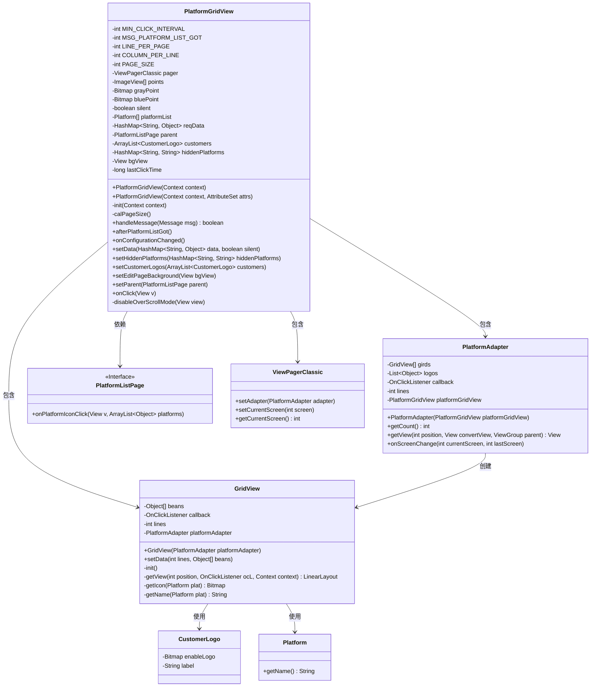
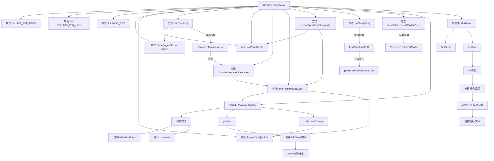

# 基础信息

|      |      |
|------|------|
| 名称 | PlatformGridView |
| 编码语言 | .java |
| 代码路径 | happycat/src/cn/sharesdk/onekeyshare/theme/classic/PlatformGridView.java |
| 包名 | cn.sharesdk.onekeyshare.theme.classic |
| 依赖项 | ['com.mob.tools.utils.R.getBitmapRes', 'java.lang.reflect.Method', 'java.util.ArrayList', 'java.util.Arrays', 'java.util.HashMap', 'java.util.List', 'android.content.Context', 'android.graphics.Bitmap', 'android.graphics.BitmapFactory', 'android.os.Build', 'android.os.Handler.Callback', 'android.os.Message', 'android.util.AttributeSet', 'android.util.TypedValue', 'android.view.Gravity', 'android.view.View', 'android.view.View.OnClickListener', 'android.view.ViewGroup', 'android.widget.ImageView', 'android.widget.ImageView.ScaleType', 'android.widget.LinearLayout', 'android.widget.TextView', 'cn.sharesdk.framework.Platform', 'cn.sharesdk.framework.ShareSDK', 'com.mob.tools.gui.ViewPagerAdapter', 'com.mob.tools.gui.ViewPagerClassic', 'com.mob.tools.utils.UIHandler', 'cn.sharesdk.onekeyshare.CustomerLogo'] |
| 概述说明 | PlatformGridView是一个自定义网格视图，用于显示分享平台图标。它支持分页、自定义布局、点击事件和隐藏平台功能，适配不同屏幕尺寸。 |

# 说明

PlatformGridView是一个自定义网格视图组件，用于展示社交平台图标和自定义图标。它继承自LinearLayout并实现点击回调接口，主要功能包括：根据屏幕宽高比动态计算每页显示的行列数（3x3或3x2等布局）；通过ViewPagerClassic实现分页滑动；使用灰色/蓝色圆点作为分页指示器；支持隐藏特定平台和添加自定义图标；通过后台线程异步获取平台列表数据；包含防重复点击机制（1000毫秒间隔）；提供屏幕旋转后的布局重计算功能。内部类PlatformAdapter处理分页数据，GridView类负责单个网格项的图标和标签渲染。

# 类列表 Class Summary

| 名称   | 类型  | 说明 |
|-------|------|-------------|
| PlatformGridView | class | PlatformGridView是一个自定义网格视图组件，用于展示社交平台图标。它支持分页显示、屏幕旋转适配、点击事件防抖，并包含指示器和自定义图标功能。通过异步加载平台列表，动态计算页面布局，适配不同屏幕尺寸。 |

## 类 PlatformGridView

|      |      |
|------|------|
| 访问范围 | @SuppressWarnings("deprecation");public |
| 类型 | class |
| 名称 | PlatformGridView |
| 说明 | PlatformGridView是一个自定义网格视图组件，用于展示社交平台图标。它支持分页显示、屏幕旋转适配、点击事件防抖，并包含指示器和自定义图标功能。通过异步加载平台列表，动态计算页面布局，适配不同屏幕尺寸。 |

### UML类图

类图描述：该图展示了PlatformGridView及其相关类的结构关系。PlatformGridView是一个自定义网格视图控件，继承自LinearLayout并实现了OnClickListener和Callback接口，主要用于展示社交平台图标。它包含PlatformAdapter作为ViewPager的适配器，而PlatformAdapter又创建GridView来显示具体内容。GridView处理平台图标(CustomerLogo/Platform)的渲染和点击事件，通过PlatformListPage接口回调点击事件。ViewPagerClassic用于分页展示多个GridView。整体构成一个可配置、支持分页的社交平台选择界面。

### 内部方法调用关系图

流程图描述：
该流程图展示了PlatformGridView类的核心结构和交互逻辑。PlatformGridView是一个用于显示社交平台图标的网格视图组件，主要功能包括：通过异步线程获取平台列表、计算页面布局参数、处理平台点击事件、管理分页指示器等。关键流程包含初始化时的页面尺寸计算、平台列表异步获取后的UI更新、屏幕旋转时的配置变更处理，以及内部类PlatformAdapter和GridView的协作机制。防抖机制确保点击事件的有效性，反射调用禁用ViewPager边缘效果。整体采用分层设计，通过消息机制协调异步操作与UI更新。

### 字段列表 Field List

| 名称  | 类型  | 说明 |
|-------|-------|------|
| reqData | HashMap<String, Object> | 私有哈希映射，键为字符串，值为对象，存储请求数据。 |
| platformList | Platform[] | 私有平台数组变量platformList。 |
| lastClickTime | long | 私有长整型变量，记录最后一次点击时间。 |
| points | ImageView[] | 定义图片视图数组points。 |
| pager | ViewPagerClassic | 私有视图翻页控件pager |
| LINE_PER_PAGE | int | 每页行数配置变量 |
| customers | ArrayList<CustomerLogo> | 私有客户标志对象列表。 |
| grayPoint | Bitmap | 私有位图变量grayPoint |
| bgView | View | 私有视图变量bgView。 |
| PAGE_SIZE | int | 私有整型变量，表示页面大小。 |
| bluePoint | Bitmap | 私有位图变量bluePoint，用于存储蓝色点图像数据。 |
| parent | PlatformListPage | 父级平台列表页对象。 |
| MSG_PLATFORM_LIST_GOT = 1 | int | 定义了私有静态常量MSG_PLATFORM_LIST_GOT，值为1，用于标识平台列表获取消息。 |
| MIN_CLICK_INTERVAL = 1000 | int | 定义最小点击间隔为1000毫秒，防止快速重复点击。 |
| hiddenPlatforms | HashMap<String, String> | 私有哈希映射，键值均为字符串类型，存储隐藏平台信息。 |
| silent | boolean | 布尔型私有变量，表示静默状态。 |
| COLUMN_PER_LINE | int | 私有整型变量，表示每行的列数。 |

### 方法列表

| 名称  | 类型  | 说明 |
|-------|-------|------|
| setHiddenPlatforms | void | 设置隐藏平台的方法，接收HashMap参数并赋值给成员变量hiddenPlatforms。 |
| handleMessage | boolean | 处理消息的方法，当收到MSG_PLATFORM_LIST_GOT消息时调用afterPlatformListGot()，默认返回false。 |
| init | void | 初始化方法：设置垂直方向，创建ViewPager并禁用滚动溢出。启动线程异步获取平台列表，获取失败则置空，通过UIHandler发送消息通知。 |
| afterPlatformListGot | void | 方法afterPlatformListGot初始化平台适配器，计算分页数并创建对应指示点。若页数大于1则显示指示点布局，设置灰点和蓝点图标，当前页指示为蓝点。 |
| setData | void | 方法setData接收HashMap类型参数data和布尔值silent，分别赋值给类变量reqData和silent。 |
| onClick | void | 方法处理点击事件：记录当前时间，若与上次点击间隔过短则忽略；否则更新点击时间，创建包含标签的列表并触发父级点击回调。 |
| disableOverScrollMode | void | 禁用视图的过度滚动效果，适用于Android 9及以上版本，通过反射调用setOverScrollMode方法设置值为2，异常时打印日志。 |
| setEditPageBackground | void | 设置编辑页面背景视图的方法，将输入视图赋给类变量bgView。 |
| setParent | void | 设置当前对象的父级为指定PlatformListPage实例。 |
| calPageSize | void | 根据屏幕宽高比设置每行列数和每页行数，计算总页大小。宽高比小于0.63时3x3，0.63-0.75时3x2，大于0.75时1行，列数按宽高比1.3/1.5/1.75分别设为4/5/6列。 |
| setCustomerLogos | void | 方法setCustomerLogos用于设置客户标识列表，接收一个CustomerLogo类型的ArrayList参数并赋值给成员变量customers。 |
| onConfigurationChanged | void | 方法处理配置变更：计算当前页首项位置，调整分页大小，确定新页码，移除视图后刷新列表，最后设置新页码。 |

