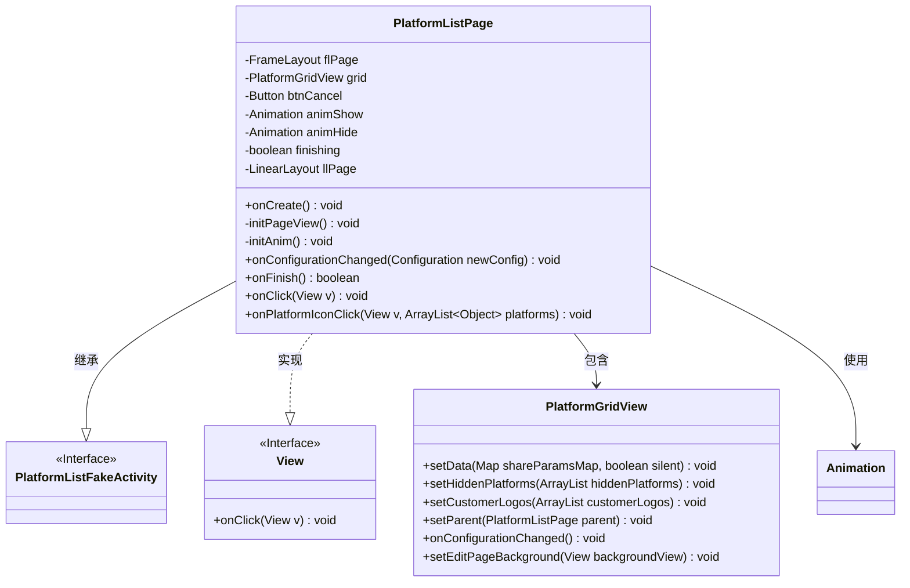
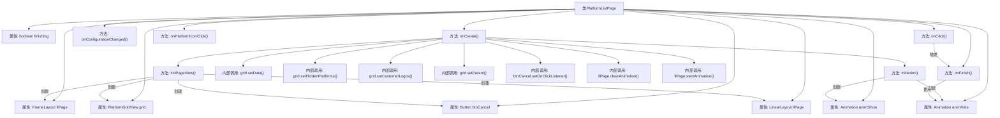

# 基础信息

|      |      |
|------|------|
| 名称 | PlatformListPage |
| 编码语言 | .java |
| 代码路径 | happycat/src/cn/sharesdk/onekeyshare/theme/classic/PlatformListPage.java |
| 包名 | cn.sharesdk.onekeyshare.theme.classic |
| 依赖项 | ['com.mob.tools.utils.R.getStringRes', 'com.mob.tools.utils.R.getBitmapRes', 'java.util.ArrayList', 'android.content.res.Configuration', 'android.graphics.drawable.ColorDrawable', 'android.util.TypedValue', 'android.view.Gravity', 'android.view.MotionEvent', 'android.view.View', 'android.view.animation.Animation', 'android.view.animation.TranslateAnimation', 'android.widget.Button', 'android.widget.FrameLayout', 'android.widget.LinearLayout', 'cn.sharesdk.onekeyshare.PlatformListFakeActivity'] |
| 概述说明 | PlatformListPage类实现了一个平台列表页面，包含网格视图、取消按钮和滑动动画。初始化时设置视图和动画，网格视图展示平台数据，点击取消按钮或页面背景可关闭页面，关闭时播放下滑动画。 |

# 说明

PlatformListPage是一个继承自PlatformListFakeActivity的类，实现了View.OnClickListener接口。它包含页面容器FrameLayout、平台列表网格视图PlatformGridView、取消按钮Button以及滑动动画animShow和animHide。在onCreate方法中，初始化页面视图和动画，设置网格视图数据并绑定点击事件。initPageView方法创建页面布局，包括半透明背景、垂直排列的LinearLayout、网格视图和取消按钮。initAnim方法定义上下滑动动画。onFinish方法处理页面关闭逻辑，触发下滑动画并隐藏页面。点击事件处理页面或取消按钮的关闭操作，onPlatformIconClick方法处理平台图标点击事件。

# 类列表 Class Summary

| 名称   | 类型  | 说明 |
|-------|------|-------------|
| PlatformListPage | class | PlatformListPage类实现平台列表页面，包含网格视图、取消按钮和滑动动画，处理点击事件和分享功能。 |

## 类 PlatformListPage

|      |      |
|------|------|
| 访问范围 | public |
| 类型 | class |
| 名称 | PlatformListPage |
| 说明 | PlatformListPage类实现平台列表页面，包含网格视图、取消按钮和滑动动画，处理点击事件和分享功能。 |

### UML类图

类图描述：
PlatformListPage类继承自PlatformListFakeActivity并实现View.OnClickListener接口，主要负责平台列表页面的展示和交互。包含核心组件PlatformGridView用于显示平台网格，以及FrameLayout、LinearLayout等布局容器和Button控件。通过Animation实现滑动动画效果，提供onCreate初始化、onFinish关闭页面等生命周期方法，并处理点击事件和平台图标点击回调。PlatformGridView类负责具体网格视图的数据展示和配置变更处理。

### 内部方法调用关系图

这段代码描述了一个Android平台列表页面类PlatformListPage的实现细节。流程图展示了类属性之间的关联关系，以及主要方法调用链。核心流程包括页面初始化(onCreate)、视图构建(initPageView)、动画初始化(initAnim)和页面关闭处理(onFinish)。特别注意动画控制逻辑和点击事件处理(onClick)与平台图标点击(onPlatformIconClick)的分发机制，这些构成了该组件的核心交互功能。

### 字段列表 Field List

| 名称  | 类型  | 说明 |
|-------|-------|------|
| btnCancel | Button | 取消按钮的私有声明。 |
| llPage | LinearLayout | 私有线性布局控件llPage |
| animHide | Animation | 私有动画变量animHide，用于隐藏动画效果。 |
| animShow | Animation | 私有动画变量animShow |
| finishing | boolean | 私有布尔变量finishing，表示完成状态。 |
| flPage | FrameLayout | 私有FrameLayout控件flPage |
| grid | PlatformGridView | 私有网格视图对象grid。 |

### 方法列表

| 名称  | 类型  | 说明 |
|-------|-------|------|
| onPlatformIconClick | void | 方法onPlatformIconClick接收视图和平台列表参数，调用onShareButtonClick方法处理点击事件。 |
| onConfigurationChanged | void | 方法在配置变更时调用，若grid非空则触发其配置变更处理。 |
| onCreate | void | 代码执行流程：初始化页面视图和动画，设置平台网格数据，绑定取消按钮点击事件，显示网格视图并启动动画。 |
| onFinish | boolean | 方法onFinish处理结束逻辑：若finishing为真则调用父类方法；若无animHide动画则标记finishing并返回false；否则设置动画监听器，动画结束时隐藏视图并结束，返回true中断结束操作。 |
| initPageView | void | 初始化页面视图：创建半透明背景框架，添加垂直布局容器和平台网格视图，底部设置取消按钮并配置样式和边距。 |
| onClick | void | Android点击事件处理：点击flPage或btnCancel时取消并关闭当前活动。 |
| initAnim | void | 初始化两个平移动画：animShow从底部滑入，animHide从顶部滑出，时长均为300毫秒。 |

