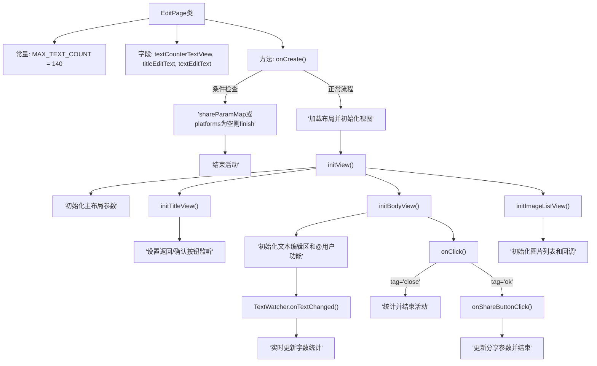

# 基础信息

|      |      |
|------|------|
| 名称 | EditPage |
| 编码语言 | .java |
| 代码路径 | happycat/src/cn/sharesdk/onekeyshare/theme/skyblue/EditPage.java |
| 包名 | cn.sharesdk.onekeyshare.theme.skyblue |
| 依赖项 | ['android.text.Editable', 'android.text.TextWatcher', 'android.view.LayoutInflater', 'android.view.View', 'android.view.View.OnClickListener', 'android.widget.EditText', 'android.widget.HorizontalScrollView', 'android.widget.ImageView', 'android.widget.LinearLayout', 'android.widget.RelativeLayout', 'android.widget.TextView', 'java.util.ArrayList', 'java.util.HashMap', 'cn.sharesdk.framework.Platform', 'cn.sharesdk.framework.ShareSDK', 'cn.sharesdk.onekeyshare.EditPageFakeActivity', 'cn.sharesdk.onekeyshare.PicViewer', 'com.mob.tools.utils.R.getIdRes', 'com.mob.tools.utils.R.getLayoutRes', 'com.mob.tools.utils.R.getStringRes'] |
| 概述说明 | EditPage类实现编辑页面功能，包含标题、正文编辑框，字数统计（上限140字），图片列表展示及用户@功能，支持取消和分享操作。 |

# 说明

EditPage类是一个继承自EditPageFakeActivity的编辑页面，实现了点击监听和文本变化监听接口。页面包含标题编辑框、正文编辑框和字数统计显示，最大输入限制为140字符。初始化时检查分享参数和平台数据，加载布局并初始化视图组件，包括返回按钮、确认按钮、关闭按钮和图片列表。支持@用户功能，点击可跳转至好友列表选择。图片列表以水平滚动方式展示，点击可查看大图或删除。点击确认按钮时保存标题和正文内容到分享参数，点击关闭按钮则结束页面。文本变化时实时更新剩余字数显示，超限时变红。页面关闭时释放资源。

# 类列表 Class Summary

| 名称   | 类型  | 说明 |
|-------|------|-------------|
| EditPage | class | EditPage类实现编辑页面功能，包含标题、正文编辑框，字数统计（上限140字），图片列表展示与删除，支持分享和取消操作，并处理用户@功能。 |


## 类 EditPage

|      |      |
|------|------|
| 访问范围 | public |
| 类型 | class |
| 名称 | EditPage |
| 说明 | EditPage类实现编辑页面功能，包含标题、正文编辑框，字数统计（上限140字），图片列表展示与删除，支持分享和取消操作，并处理用户@功能。 |


### UML类图

```mermaid
classDiagram
    class EditPage {
        -int MAX_TEXT_COUNT
        -TextView textCounterTextView
        -EditText titleEditText
        -EditText textEditText
        +void onCreate()
        -void initView()
        -void initTitleView()
        -void initBodyView()
        -void initAtUserView()
        -void initImageListView()
        -View makeImageItemView(ImageInfo imageInfo)
        +void onClick(View v)
        -void onShareButtonClick(View v)
        +void beforeTextChanged(CharSequence s, int start, int count, int after)
        +void onTextChanged(CharSequence s, int start, int before, int count)
        +void afterTextChanged(Editable s)
        +void onResult(HashMap~String, Object~ data)
        +boolean onFinish()
    }

    <<Interface>> EditPage {
        <<OnClickListener>>
        <<TextWatcher>>
    }

    class EditPageFakeActivity {
        // 父类方法未完全展示
    }

    class Platform {
        // 平台相关属性和方法
    }

    class ImageInfo {
        +Bitmap bitmap
    }

    class ImageListResultsCallback {
        <<Interface>>
        +void onFinish(ArrayList~ImageInfo~ results)
    }

    class FollowListPage {
        +void setPlatform(Platform platform)
        +void showForResult(Activity activity, Object param, EditPage callback)
    }

    class PicViewer {
        +void setImageBitmap(Bitmap bitmap)
        +void show(Activity activity, Object param)
    }

    EditPage --|> EditPageFakeActivity : 继承
    EditPage ..|> OnClickListener : 实现
    EditPage ..|> TextWatcher : 实现
    EditPage --> Platform : 使用
    EditPage --> ImageInfo : 使用
    EditPage --> ImageListResultsCallback : 依赖
    EditPage --> FollowListPage : 调用
    EditPage --> PicViewer : 调用
```

类图描述：
该图展示了EditPage类的继承关系和主要依赖。EditPage继承自EditPageFakeActivity，实现了OnClickListener和TextWatcher接口，主要负责编辑页面的功能实现。类中包含文本编辑、字数统计、图片列表管理等核心功能，与Platform、ImageInfo等类交互，并通过回调接口ImageListResultsCallback处理图片加载结果。同时依赖FollowListPage和PicViewer来实现用户选择和图片查看功能。整个设计体现了Android编辑页面的典型架构。


### 内部方法调用关系图



这段代码实现了一个编辑页面类，主要功能包括：初始化编辑界面布局、处理标题和正文输入、实现字数统计、@用户功能、图片列表展示以及分享操作。通过TextWatcher接口实时监控文本变化，使用OnClickListener处理按钮点击事件，并包含图片浏览和删除功能。流程图展示了从页面创建到各组件初始化的完整流程，以及事件处理的逻辑分支。

### 字段列表 Field List

| 名称  | 类型  | 说明 |
|-------|-------|------|
| MAX_TEXT_COUNT = 140 | int | 定义常量MAX_TEXT_COUNT，限制文本最大长度为140字符。 |
| titleEditText | EditText | 私有文本框控件，用于编辑标题。 |
| textEditText | EditText | 私有文本编辑框控件 |
| textCounterTextView | TextView | 声明一个私有TextView变量textCounterTextView。 |

### 方法列表

| 名称  | 类型  | 说明 |
|-------|-------|------|
| initBodyView | void | 初始化视图：设置关闭按钮标签和点击事件；若有标题则填充标题文本框；设置计数器初始值；填充文本内容并监听文本变化；初始化用户视图。 |
| onCreate | void | 方法onCreate检查shareParamMap和platforms是否为空，若为空则结束；否则加载布局并初始化视图。 |
| onTextChanged | void | 文本变化时更新剩余字数显示，超限变红色。 |
| onShareButtonClick | void | 点击分享按钮时，检查并更新标题和文本内容，最后返回结果并结束。 |
| initTitleView | void | 初始化标题视图，设置返回和确认按钮的标签及点击事件。 |
| beforeTextChanged | void | 方法beforeTextChanged在文本变化前触发，参数包括字符序列s、起始位置start、被替换字符数count和替换后字符数after。 |
| initAtUserView | void | 初始化用户@视图：遍历平台，若需显示则加载布局，设置文本和点击事件（跳转关注列表页），最后添加到线性布局。 |
| onClick | void | 点击事件处理：若标签为空则返回；标签为"close"时统计取消分享并结束；标签为"ok"时触发分享。 |
| initImageListView | void | 初始化图片列表视图：创建水平滚动视图，设置回调加载图片数据，若无数据则隐藏滚动视图。 |
| onResult | void | 方法onResult接收HashMap参数，提取选中用户信息并追加到文本编辑框。 |
| onFinish | boolean | 方法onFinish()清空三个UI组件引用并调用父类方法。 |
| initView | void | 初始化视图方法：非对话框模式时设置主布局参数为全屏，然后依次初始化标题、主体和图片列表视图。 |
| makeImageItemView | View | 创建图片项视图，包含图片显示和点击查看功能，以及删除按钮用于移除图片。 |
| afterTextChanged | void | 方法afterTextChanged在文本变化后被调用，参数s为编辑后的文本内容。 |


