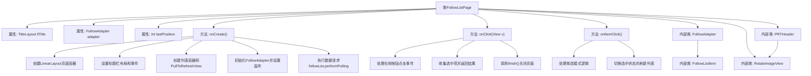

# 基础信息

|      |      |
|------|------|
| 名称 | FollowListPage |
| 编码语言 | .java |
| 代码路径 | happycat/src/cn/sharesdk/onekeyshare/theme/skyblue/FollowListPage.java |
| 包名 | cn.sharesdk.onekeyshare.theme.skyblue |
| 依赖项 | ['android.app.Activity', 'android.content.Context', 'android.graphics.Bitmap', 'android.graphics.BitmapFactory', 'android.graphics.Canvas', 'android.os.Handler.Callback', 'android.os.Message', 'android.util.TypedValue', 'android.view.Gravity', 'android.view.View', 'android.view.View.OnClickListener', 'android.view.ViewGroup', 'android.widget.AdapterView', 'android.widget.AdapterView.OnItemClickListener', 'android.widget.FrameLayout', 'android.widget.ImageView', 'android.widget.LinearLayout', 'android.widget.LinearLayout.LayoutParams', 'android.widget.ProgressBar', 'android.widget.TextView', 'java.util.ArrayList', 'java.util.HashMap', 'cn.sharesdk.framework.Platform', 'cn.sharesdk.framework.PlatformActionListener', 'cn.sharesdk.framework.TitleLayout', 'com.mob.tools.gui.AsyncImageView', 'com.mob.tools.gui.BitmapProcessor', 'com.mob.tools.gui.PullToRefreshListAdapter', 'com.mob.tools.gui.PullToRefreshView', 'com.mob.tools.utils.UIHandler', 'cn.sharesdk.onekeyshare.FollowerListFakeActivity', 'com.mob.tools.utils.R.dipToPx', 'com.mob.tools.utils.R.getBitmapRes', 'com.mob.tools.utils.R.getStringRes'] |
| 概述说明 | 这是一个社交应用关注列表页面类，包含标题栏、下拉刷新列表和关注项点击处理功能。列表适配器管理关注者数据，支持单选/多选模式，并处理网络请求和UI更新。 |

# 说明

这段代码描述了一个社交应用中关注列表页面的实现。页面继承自FollowerListFakeActivity，包含标题栏、下拉刷新列表和阴影效果。列表使用PullToRefreshView实现下拉刷新功能，适配器FollowAdapter负责数据加载和展示，支持单选和多选模式。标题栏包含返回按钮和完成按钮，点击完成按钮会返回选中的用户列表。列表项显示用户头像、名称、简介和勾选状态，适配器处理平台数据请求和回调。PRTHeader类实现下拉刷新动画效果，包含箭头旋转和进度条显示。整体实现了关注列表的展示、选择和刷新功能。

# 类列表 Class Summary

| 名称   | 类型  | 说明 |
|-------|------|-------------|
| FollowListPage | class | 关注列表页面类，包含标题栏、下拉刷新列表和适配器，支持点击选择和多选功能，适配器处理数据加载和显示。 |


## 类 FollowListPage

|      |      |
|------|------|
| 访问范围 | public |
| 类型 | class |
| 名称 | FollowListPage |
| 说明 | 关注列表页面类，包含标题栏、下拉刷新列表和适配器，支持点击选择和多选功能，适配器处理数据加载和显示。 |


### UML类图

```mermaid
classDiagram
    class FollowListPage {
        -TitleLayout llTitle
        -FollowAdapter adapter
        -int lastPosition
        +onCreate()
        +onClick(View v)
        +onItemClick(AdapterView~?~ parent, View view, int position, long id)
    }

    class FollowAdapter {
        -int FOLLOW_LIST_EMPTY
        -int curPage
        -ArrayList~Following~ follows
        -HashMap~String, Boolean~ map
        -boolean hasNext
        -Platform platform
        -PRTHeader llHeader
        -Bitmap bmChd
        -Bitmap bmUnch
        +FollowAdapter(PullToRefreshView view)
        +setPlatform(Platform platform)
        +getView(int position, View convertView, ViewGroup parent) View
        +getItem(int position) Following
        +getItemId(int position) long
        +getCount() int
        +getHeaderView() View
        +onPullDown(int percent)
        +onRequest()
        +onCancel(Platform plat, int action)
        +onComplete(Platform plat, int action, HashMap~String, Object~ res)
        +onError(Platform plat, int action, Throwable t)
        +handleMessage(Message msg) boolean
        +onReversed()
    }

    class FollowListItem {
        +AsyncImageView aivIcon
        +TextView tvName
        +TextView tvSign
        +ImageView ivCheck
    }

    class PRTHeader {
        -TextView tvHeader
        -RotateImageView ivArrow
        -ProgressBar pbRefreshing
        +PRTHeader(Context context)
        +onPullDown(int percent)
        +onRequest()
        +reverse()
    }

    class RotateImageView {
        -int rotation
        +RotateImageView(Context context)
        +setRotation(int degree)
        #onDraw(Canvas canvas)
    }

    class Following {
        +String screenName
        +String description
        +String icon
        +String atName
        +boolean checked
    }

    class TitleLayout {
        +Button btnBack
        +TextView tvTitle
        +Button btnRight
        +getBtnBack() Button
        +getTvTitle() TextView
        +getBtnRight() Button
    }

    interface OnClickListener {
        <<Interface>>
        +onClick(View v)
    }

    interface OnItemClickListener {
        <<Interface>>
        +onItemClick(AdapterView~?~ parent, View view, int position, long id)
    }

    interface PlatformActionListener {
        <<Interface>>
        +onCancel(Platform plat, int action)
        +onComplete(Platform plat, int action, HashMap~String, Object~ res)
        +onError(Platform plat, int action, Throwable t)
    }

    interface Callback {
        <<Interface>>
        +handleMessage(Message msg) boolean
    }

    FollowListPage --|> FollowerListFakeActivity
    FollowListPage ..|> OnClickListener
    FollowListPage ..|> OnItemClickListener
    FollowAdapter --* FollowListPage
    FollowAdapter ..|> PlatformActionListener
    FollowAdapter ..|> Callback
    FollowListItem --* FollowAdapter
    PRTHeader --* FollowAdapter
    RotateImageView --|> ImageView
    PRTHeader --* RotateImageView
    Following --* FollowAdapter
    TitleLayout --* FollowListPage
```

这段代码实现了一个社交平台的关注列表页面，主要包含FollowListPage页面类及其内部组件。类图展示了核心类之间的关系：FollowListPage继承自FollowerListFakeActivity并实现点击监听接口，包含标题栏、下拉刷新列表等UI组件；FollowAdapter处理列表数据展示，实现了平台动作监听和回调接口；PRTHeader实现下拉刷新头部动画，RotateImageView提供图片旋转功能。整体架构采用组合模式，通过多层嵌套实现复杂的列表交互功能。


### 内部方法调用关系图



这段代码实现了一个社交关注列表页面，包含标题栏、下拉刷新列表和好友选择功能。核心类FollowListPage继承自FollowerListFakeActivity，通过内部类FollowAdapter处理列表数据，PRTHeader实现下拉刷新动画效果。主要流程包括：初始化UI组件、处理用户点击事件、管理列表项选中状态。代码采用组合模式构建复杂界面，通过回调机制处理平台数据请求，支持单选/多选模式和异步图片加载。

### 字段列表 Field List

| 名称  | 类型  | 说明 |
|-------|-------|------|
| lastPosition = -1 | int | 声明一个私有整型变量lastPosition，初始值为-1。 |
| llTitle | TitleLayout | 私有标题布局控件llTitle。 |
| adapter | FollowAdapter | 私有成员变量adapter，类型为FollowAdapter。 |

### 方法列表

| 名称  | 类型  | 说明 |
|-------|-------|------|
| onClick | void | 点击右按钮时，收集选中项名称并返回结果，最后结束当前界面。 |
| onCreate | void | 创建垂直布局页面，设置标题栏和返回按钮，添加可下拉刷新的关注列表，最后请求数据。 |
| onItemClick | void | 点击列表项时，根据名称判断是否为单选模式。若是，取消上次选中项并记录当前位置；切换当前项选中状态并刷新适配器。 |


