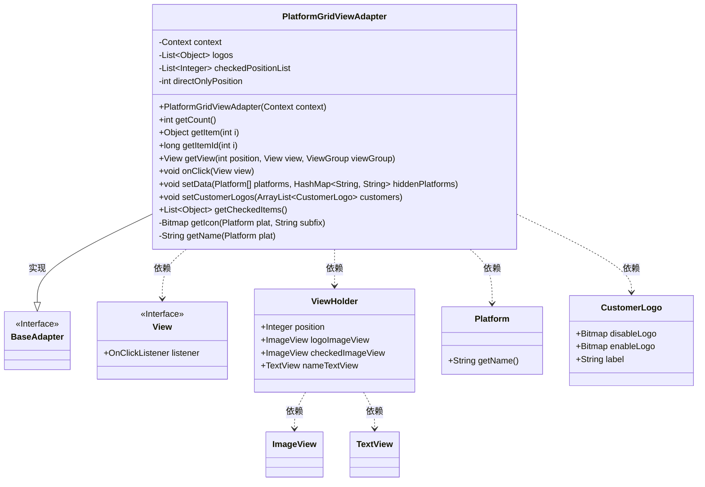

# 基础信息

|      |      |
|------|------|
| 名称 | PlatformGridViewAdapter |
| 编码语言 | .java |
| 代码路径 | happycat/src/cn/sharesdk/onekeyshare/theme/skyblue/PlatformGridViewAdapter.java |
| 包名 | cn.sharesdk.onekeyshare.theme.skyblue |
| 依赖项 | ['android.content.Context', 'android.graphics.Bitmap', 'android.graphics.BitmapFactory', 'android.view.LayoutInflater', 'android.view.View', 'android.view.ViewGroup', 'android.widget.BaseAdapter', 'android.widget.ImageView', 'android.widget.TextView', 'java.util.ArrayList', 'java.util.Arrays', 'java.util.HashMap', 'java.util.List', 'cn.sharesdk.framework.Platform', 'cn.sharesdk.onekeyshare.CustomerLogo', 'cn.sharesdk.onekeyshare.ShareCore', 'com.mob.tools.utils.R.getBitmapRes', 'com.mob.tools.utils.R.getIdRes', 'com.mob.tools.utils.R.getLayoutRes'] |
| 概述说明 | PlatformGridViewAdapter是用于显示平台图标的适配器，支持选中状态和直接分享功能，可自定义图标和隐藏特定平台。 |

# 说明

PlatformGridViewAdapter是一个继承自BaseAdapter的自定义适配器，用于管理平台图标网格视图的显示与交互。它包含两个数据列表：logos存储平台或自定义图标对象，checkedPositionList记录选中项位置。适配器通过ViewHolder优化视图性能，动态加载图标和文本，并处理点击事件。点击逻辑支持单选/多选模式，特别处理直接分享平台的独占选中情况。提供设置平台数据、自定义图标及获取选中项的方法，同时包含图标和名称的资源加载逻辑。整体实现了可配置、高性能的网格视图适配功能。

# 类列表 Class Summary

| 名称   | 类型  | 说明 |
|-------|------|-------------|
| PlatformGridViewAdapter | class | PlatformGridViewAdapter是用于显示平台图标列表的自定义适配器，支持选中状态管理和直接分享功能。包含数据设置、视图绑定和点击处理逻辑，支持平台和自定义图标两种类型。 |

## 类 PlatformGridViewAdapter

|      |      |
|------|------|
| 访问范围 | public |
| 类型 | class |
| 名称 | PlatformGridViewAdapter |
| 说明 | PlatformGridViewAdapter是用于显示平台图标列表的自定义适配器，支持选中状态管理和直接分享功能。包含数据设置、视图绑定和点击处理逻辑，支持平台和自定义图标两种类型。 |

### UML类图

这段代码描述了一个自定义的`PlatformGridViewAdapter`类，继承自`BaseAdapter`并实现了`View.OnClickListener`接口。主要用于管理平台图标网格视图的数据和交互逻辑，支持平台图标和自定义图标的混合显示，包含选中状态管理、直接分享模式控制等功能。通过ViewHolder模式优化视图性能，处理不同类型的平台数据（Platform和CustomerLogo），并提供了数据设置和获取选中项的方法。

### 内部方法调用关系图

```mermaid
graph TD
    A["类PlatformGridViewAdapter"]
    B["属性: Context context"]
    C["属性: List<Object> logos"]
    D["属性: List<Integer> checkedPositionList"]
    E["属性: int directOnlyPosition"]
    F["静态内部类: ViewHolder"]
    G["构造方法: PlatformGridViewAdapter(Context)"]
    H["重写方法: int getCount()"]
    I["重写方法: Object getItem(int)"]
    J["重写方法: long getItemId(int)"]
    K["重写方法: View getView(int, View, ViewGroup)"]
    L["重写方法: void onClick(View)"]
    M["方法: setData(Platform[], HashMap<String,String>)"]
    N["方法: setCustomerLogos(ArrayList<CustomerLogo>)"]
    O["方法: List<Object> getCheckedItems()"]
    P["私有方法: Bitmap getIcon(Platform, String)"]
    Q["私有方法: String getName(Platform)"]

    A --> B
    A --> C
    A --> D
    A --> E
    A --> F
    A --> G
    A --> H
    A --> I
    A --> J
    A --> K
    A --> L
    A --> M
    A --> N
    A --> O
    A --> P
    A --> Q

    K -->|"view==null"| K1["创建新视图"]
    K -->|"view!=null"| K2["复用已有视图"]
    K1 --> K3["初始化ViewHolder"]
    K --> K4["设置视图数据"]
    K4 --> K5["处理Platform类型"]
    K4 --> K6["处理CustomerLogo类型"]
    L --> L1["检查directOnlyPosition"]
    L --> L2["更新选中状态"]
    L2 --> L3["notifyDataSetChanged"]
```

这段代码是PlatformGridViewAdapter的实现，主要用于管理网格视图中的数据适配和点击事件处理。它继承自BaseAdapter并实现OnClickListener接口，包含核心功能如视图创建(getView)、数据绑定、点击处理(onClick)以及数据管理方法(setData/setCustomerLogos)。流程图展示了类结构、主要方法调用关系以及getView和onClick方法的关键处理逻辑，特别是视图复用机制和不同类型数据(Platform/CustomerLogo)的分支处理。适配器通过checkedPositionList和directOnlyPosition管理选中状态，支持单选/多选模式切换。

### 字段列表 Field List

| 名称  | 类型  | 说明 |
|-------|-------|------|
| directOnlyPosition = -1 | int | 私有整型变量directOnlyPosition，初始值为-1。 |
| logos = new ArrayList<Object>() | List<Object> | 声明一个私有列表变量logos，初始化为空ArrayList，存储Object类型元素。 |
| context | Context | 私有不可变的上下文对象。 |
| checkedPositionList = new ArrayList<Integer>() | List<Integer> | 声明一个私有整型列表变量checkedPositionList，初始化为空ArrayList。 |

### 方法列表

| 名称  | 类型  | 说明 |
|-------|-------|------|
| setData | void | 方法setData接收平台数组和隐藏平台映射，过滤掉隐藏平台后更新logos列表，清空选中项并通知数据更新。 |
| getItemId | long | 方法重写，返回输入参数i作为项目ID。 |
| onClick | void | 点击事件处理逻辑：获取视图位置，检查直接分享限制，处理平台或自定义图标选中状态，更新选中列表并刷新界面。 |
| getView | View | 自定义列表适配器getView方法，实现视图复用与动态数据绑定，处理平台和客户Logo的显示逻辑，包括选中状态、禁用状态及点击事件。 |
| setCustomerLogos | void | 方法setCustomerLogos接收客户logo列表，非空时将其添加到现有集合中。 |
| getIcon | Bitmap | 该方法根据平台名称和后缀生成资源名，获取对应位图资源ID并解码返回位图对象。 |
| getCount | int | 方法getCount返回logos集合的大小。 |
| getItem | Object | Java方法：返回列表logos中索引i对应的元素。 |
| getCheckedItems | List<Object> | 获取选中项列表：若无特定位置，返回所有勾选项；否则仅返回指定位置项。 |
| getName | String | 获取平台名称的方法：若平台或名称为空返回空字符串，否则尝试获取资源ID并返回对应字符串，无资源则返回null。 |

